# ASP.NET Startup, Configuration, and Middleware

# Overview

In ASP.NET, middleware is software that is assembled into an application pipeline to handle requests and responses. Each component chooses whether to pass the request on to the next component in the pipeline, and can perform certain actions before and after the next component is invoked in the pipeline. Request delegates are used to build the request pipeline. The request delegates handle each HTTP request.

In this Quick Start, you will create a new ASP.NET Core web app and review its startup and configuration. You will also insert custom middleware into the HTTP pipeline.

# Objectives

- Create an ASP.NET Core web app
- Review startup configuration
- Insert custom middleware into the HTTP pipeline

# Prerequisites

- Windows 10
- Visual Studio 2017

# Intended Audience

This Quick Start Challenge is intended for developers who are familiar with ASP.NET with C#. Experience with ASP.NET Core is not required.

# Task 1: Create an ASP.NET Core web application

1. Launch an instance of **Visual Studio**.
2. Select **File | New | Project**.
3. Select the **Visual C# | Web** category and the **ASP.NET Core Web Application** template. Leave the default name and click **OK**.

 

4. Select the **Web Application** template and make sure **Docker Support** is not selected. Click **OK**.

 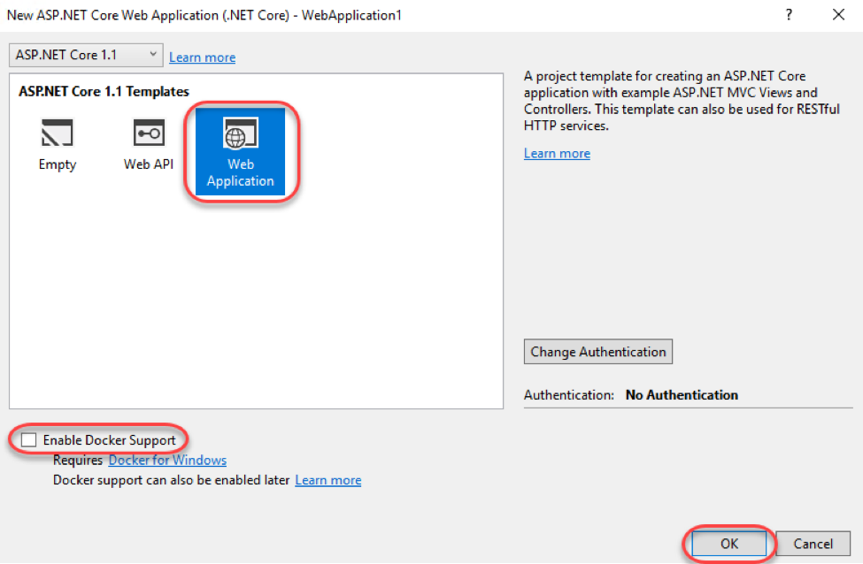

# Task 2: Review application startup configuration

1. From **Solution Explorer** , open **Startup.cs**. You may notice some red squiggles initially as NuGet packages are being restored in the background and the Roslyn compiler is building a complete picture of the project dependencies.

 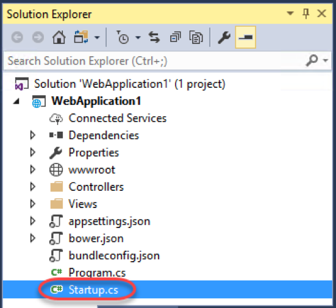

2. Locate the **Startup** method. This section defines the initial configuration for the application and is very densely packed. Let&#39;s break it down.

 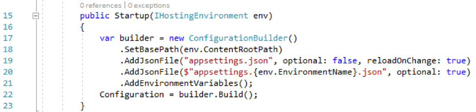

3. The method starts off by initializing a **ConfigurationBuilder** and setting its base path.

 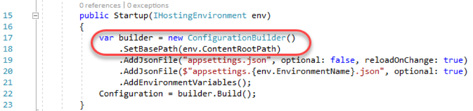

4. Next, it loads a required **appsettings.json** file.

 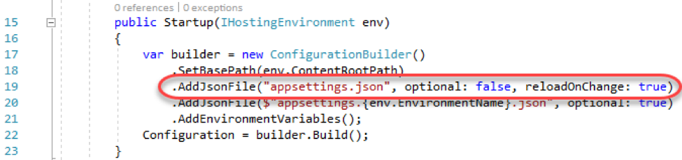

5. After that, it attempts to load an environment-specific **appsettings.json** file, which would override existing settings. For example, there might be an **appsettings.Development.json** file used for that specific environment.

 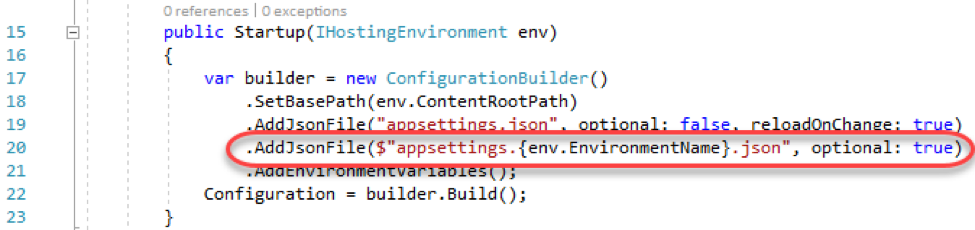

6. Finally, the environment variables are added to the configuration builder and the configuration is built and set for usage.

 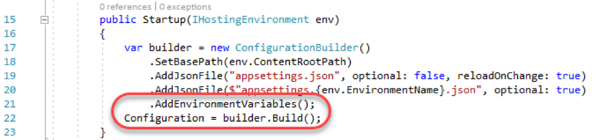

# Task 3: Review and insert application middleware

1. Locate the **Configure** method. This is where all of the middleware is configured so that it can be inserted into the HTTP pipeline and used to process every request to the server. Note that while this method is called only once, the contents of the methods (such as **UseStaticFiles** ) may be executed on every request.

 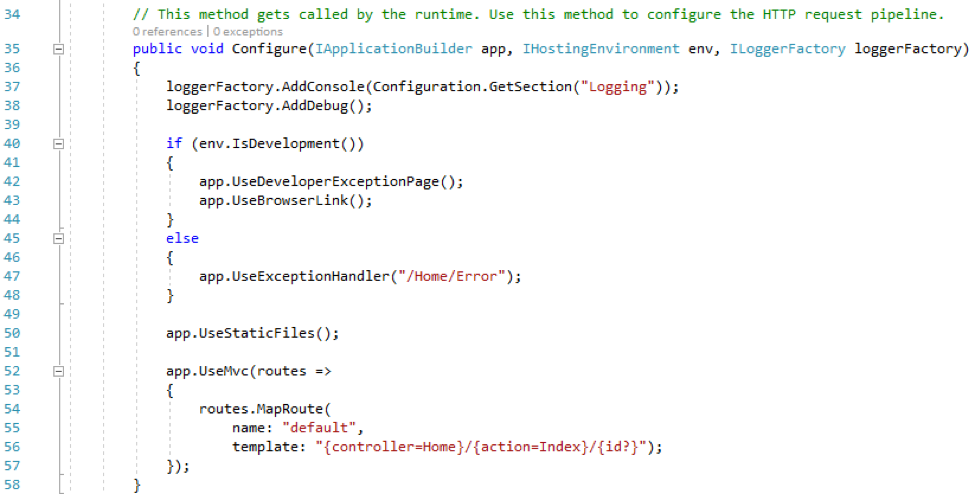

2. We can also add additional middleware to be executed as part of the pipeline. Add the code below after **app.UseStaticFiles** to automatically add an **X-Test** header to every outgoing response.
```
    app.Use(async (context, next) =>
    {
        context.Response.Headers.Add("X-Test", new[] { "Test value" });
        await next();
    });
```

3. Press **F5** to build and run the project.

4. Once the browser loads the site, press **F12** to launch the developer tools so we can review the headers.

 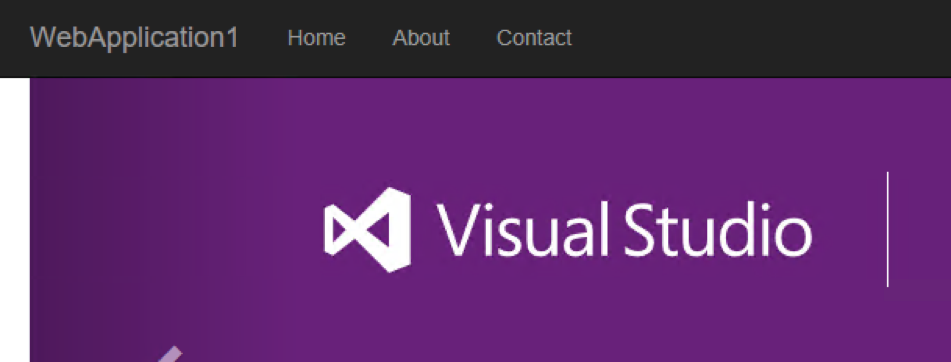

5. Select the **GET** request for the root HTML page. It should be something like **http://localhost:[port]/**. It will probably not be there when you first open the tools, so refresh the browser window if it&#39;s not there.

 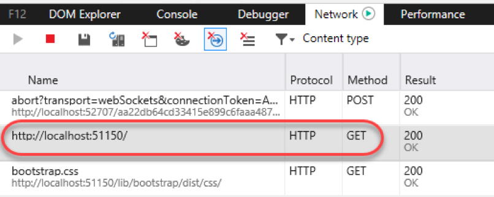

6. Scroll down through the **Headers** tab on the right side and locate the **X-Test** header that was inserted by our custom code.

 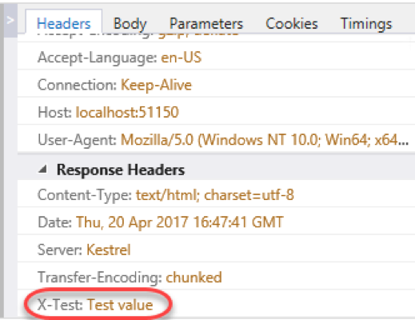

# Summary

Congratulations on completing this Quick Start Challenge! In this lab, you&#39;ve learned how to work with ASP.NET startup, configuration, and middleware.

# Additional Resources

If you are interested in learning more about this topic, you can refer to the following resources:

**Documentation** : [https://www.asp.net/core](https://www.asp.net/core)

**GitHub** : [https://github.com/aspnet](https://github.com/aspnet)

**Team blogs** : [https://weblogs.asp.net](https://weblogs.asp.net)
