# Consumer sign-up & sign-in with Azure Active Directory B2C

# Overview

Azure Active Directory (Azure AD) B2C is a cloud identity service for your consumer-facing web & mobile apps. It is highly-available, secure and scales to millions of consumer identities. Consumers can use their social accounts (Facebook, Google, Microsoft account, etc.) or create new credentials to access your apps. In this quick start challenge, you will develop a .NET Model-View-Controller (MVC) web app that allows consumers to sign-up & sign-in to your web app using email addresses and passwords. As a bonus step, you can also add support for Facebook sign-up & sign-in.

# Objectives

- How to create a new Azure AD B2C tenant.
- How to register your web application and create sign-up & sign-in experiences.
- How to integrate your .NET MVC web app with your B2C tenant using the OpenID Connect protocol.

# Prerequisites

- Windows 10
- Visual Studio 2017
- Azure subscription (Sign up for a free account [here](https://azure.microsoft.com/free/). Needs a Microsoft account)

# Intended Audience

This Quick Start Challenge is intended for developers who are familiar with C# and Visual Studio. It does not require prior experience with identity or Azure AD B2C.

# Task 1: Create a new Azure AD B2C tenant

Let's start by creating an Azure AD B2C tenant. A &quot;tenant&quot; (also called a &quot;directory&quot;) is a container for all of your consumers, apps, policies, groups and more.

1. First, sign in to the Azure portal at [https://portal.azure.com](https://portal.azure.com).
2. Click the **New** button and search for **&quot;b2c&quot;**.

 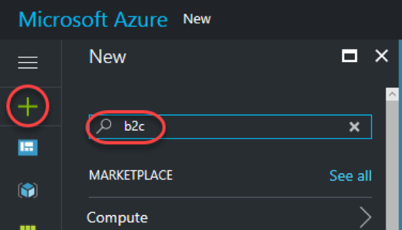

3. From the search results, click **Azure Active Directory B2C**.

 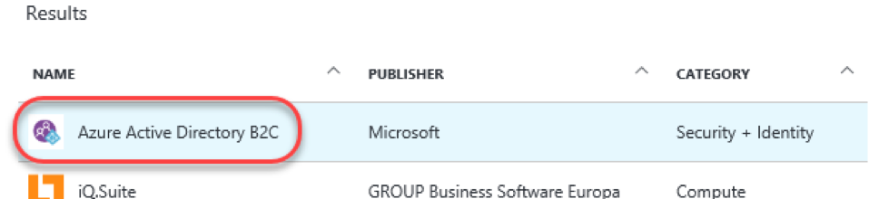

4. Click on the **Create a new B2C Tenant without a subscription** linkto create a new directory.

**Important Note** : Do NOT click on the blue Create button unless you have signed in with an account that has an Azure subscription.

 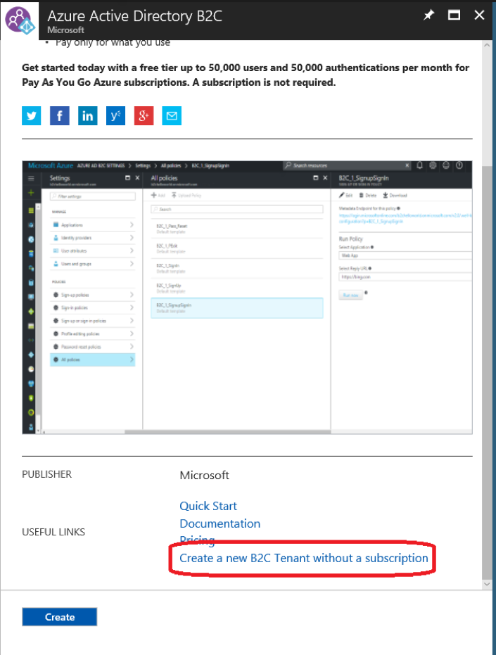

5. Enter an **Organization name** of **&quot;Contoso&quot;** and an **Initial domain name** that's globally unique. For example, you may want to include your name, such as **&quot;ContosoJohnDoe&quot;**. This will be the subdomain of the tenant, such as **&quot;ContosoJohnDoe.onmicrosoft.com&quot;** , and will be used to configure the client application later on. Click **Create**.

 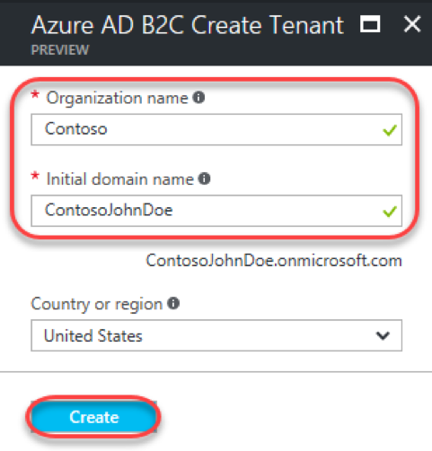

6. It will take a minute or so for the directory to be created. You can track progress using the notifications dropdown in the top right corner of the portal.

 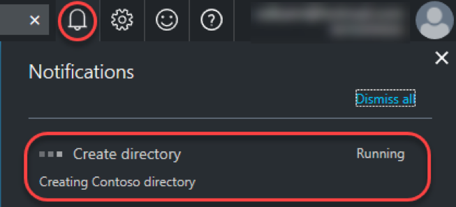

7. Once the directory has been created, click the **here** link to manage it.

 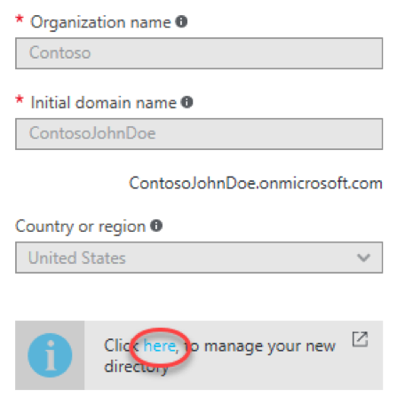

# Task 2: Register your web app

1. Select the **Applications** tab and click **Add**.

 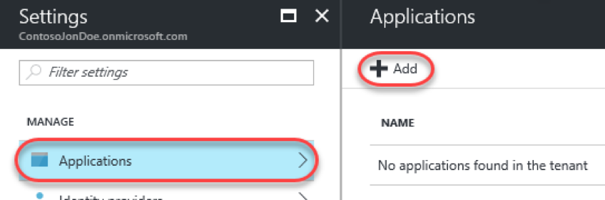

2. Enter **&quot;MyWebApp&quot;** as the **Name** of the application. Select **Yes** for **Include web app / web API**.
3. Add **&quot;https://localhost:44316/signin-oidc&quot;** as a **Redirect URI**. This is where Azure AD B2C will post tokens back on successful sign up or sign in. For this quick start challenge, we will be running the web app locally using Visual Studio.
4. Click **Create** to create the application.

 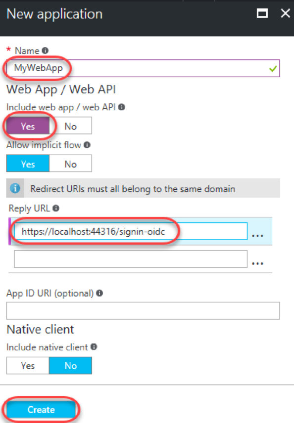

5. After creation, select the new app.

 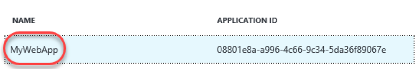

6. Click the **Copy to clipboard** button to copy the **Application ID**. This will be used to configure the client application later on.

 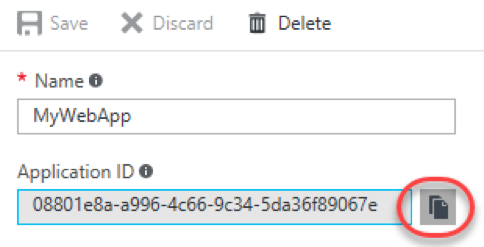

# Task 3: Create your sign-in/sign-up policy

Next, you need to create a sign-up policy. Policies are settings that fully describes consumer identity experiences such as sign-up, sign-in, profile editing and password reset. Your app can trigger the appropriate experience by invoking the right policy (as a query parameter 'p') as part of the authentication request.

1. Use the breadcrumb at the top of the portal to return to the **Settings** blade of your application.

 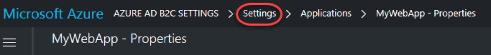
2. Select the **Sign-up or sign-in policies** tab and click **Add**.

 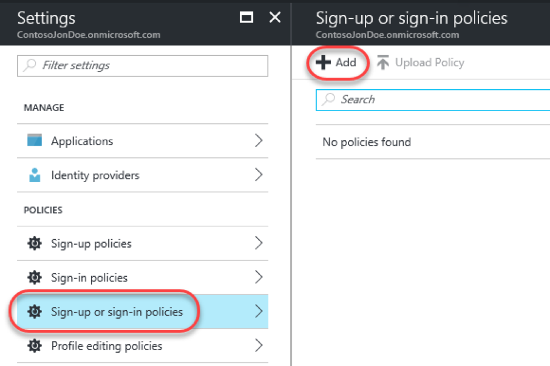

3. Enter **&quot;susi&quot;** as the **Name** for the policy. Once created, your policy name will be automatically prefixed with **&quot;B2C\_1\_&quot;**.

 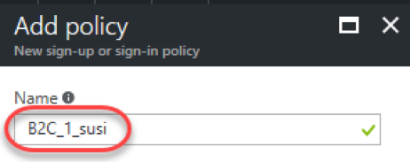

4. From the **Identity providers** tab check **Email**** signup **and click** OK**.

 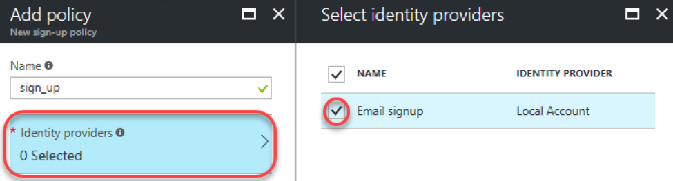

5. From the **Sign-up attributes** tab check **City, Country/Region, Display Name, and Postal Code** and click **OK**.

 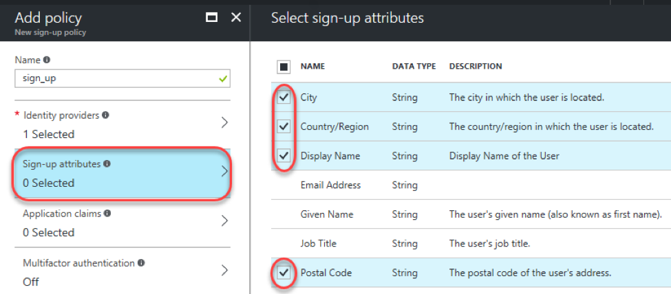

6. From the **Application claims** tab check **Display Name, Postal Code, User is new, and User's Object ID** and click **OK**.

 

7. You can ignore **Multifactor authentication** and **Page UI customization** for now. Click **Create**.

# Task 4: Integrate an ASP.NET app with your B2C tenant

You can use Microsoft's OWIN middleware library to send authentication requests to Azure AD B2C to execute sign-up & sign-in policies, manage consumer sessions using cookies, validating tokens from Azure AD B2C, and more. In this lab we'll work with a nearly complete app and configure it to work with your settings.

1. Open the **WebApp-OpenIdConnect-DotNet.sln** file from the **src/WebApp-OpenIDConnect-DotNet** folder.

2. From **Solution Explorer** , open **appsettings.json**. This file contains all necessary settings for authentication.

 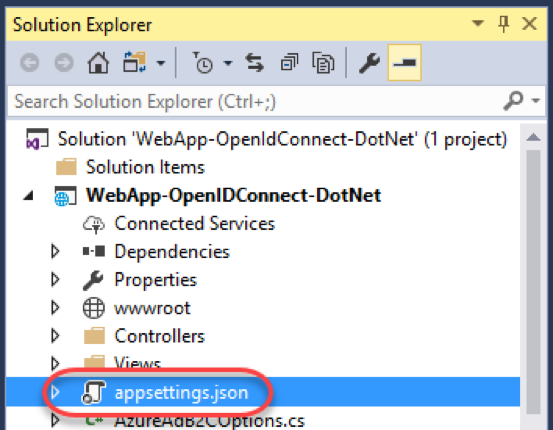

3. Update the **ClientId** and **Tenant** settings with your application's ID and subdomain, respectively. Note that this project is already configured to use the sign-up/sign-in policy of **&quot;B2C\_1\_susi&quot;**. If you happened to use a different name earlier, update that now.

 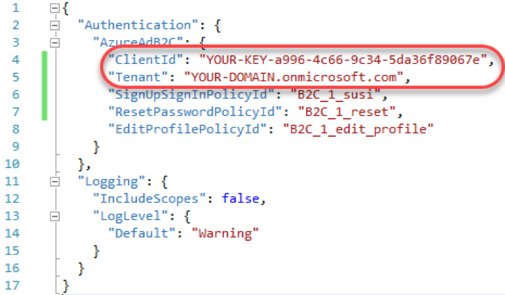

4. Press **F5** to build and run the app.
5. Click **Sign In**.

 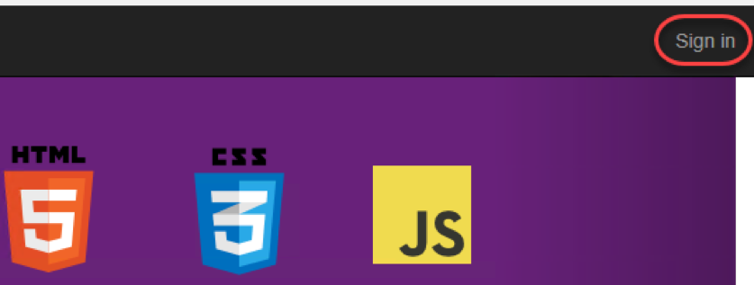

6. You'll need to register a new user before you can log in. Click **Sign up now**.

 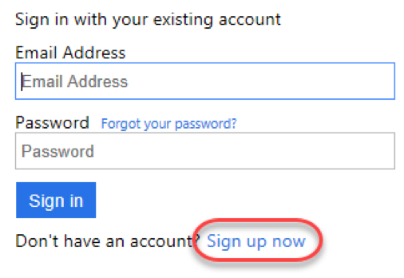

7. Enter your email address and complete the code verification. Then complete the rest of the form (which are all fields you configured the policy to require) and create the user.

 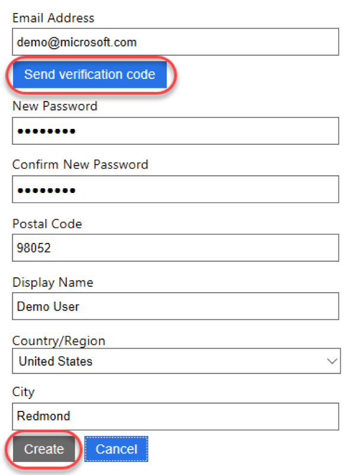

8. After the sign-in process has completed you will be returned to the site. Note now that you're logged in and the site has access to registered user data, such as the display name.

 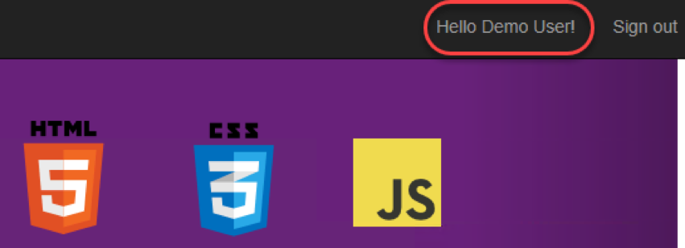

# Summary

Congratulations on completing this Quick Start Challenge! In this lab, you've learned how to use Azure AD B2C to add rich, secure & scalable consumer sign-up & sign-in experiences to your web app.

# Additional Resources

If you are interested in learning more about Azure AD B2C, you can refer to the following resources:

**Documentation** : [http://aka.ms/aadb2c](http://aka.ms/aadb2c)

**GitHub project** : [https://github.com/AzureADQuickStarts/B2C-WebApp-OpenIdConnect-DotNet](https://github.com/AzureADQuickStarts/B2C-WebApp-OpenIdConnect-DotNet)

**Team blog** : [https://blogs.technet.microsoft.com/ad/](https://blogs.technet.microsoft.com/ad/)
