# Getting started with the Azure CLI 2.0

# Overview

The Azure CLI enables you to create and manage resource in Azure through a command line interface.  Combining this capability with the new Azure Cloud Shell means you can manage your Azure resources through commands, through a web browser, never having to install a component on your machine.

If for some reason, writing code against a browser based shell isn&#39;t your thing, you can also [install the Azure CLI 2.0](https://docs.microsoft.com/en-us/cli/azure/install-azure-cli) on [MacOS](https://docs.microsoft.com/en-us/cli/azure/install-azure-cli#macos), [Linux](https://docs.microsoft.com/en-us/cli/azure/install-azure-cli#linux), and [Windows](https://docs.microsoft.com/en-us/cli/azure/install-azure-cli#windows).

# Objectives

To introduce you to the Azure CLI 2.0 and the Azure Cloud Shell, letting you see the power of the command-line from the cloud and to let you understand how to accomplish common tasks with the CLI.  No installation of any tooling is required to gain access to the power of the Azure CLI.

# Prerequisites

This challenge requires using the Azure CLI in the newly released Azure Cloud Shell. You will not need any other programs or tools besides:

- A web browser
- An Azure subscription
  - If you do not have an active Azure subscription, you can join [Visual Studio Dev Essentials](https://www.visualstudio.com/dev-essentials/) to receive a free monthly Azure credit to complete this lab

# **Intended Audience**

**This Quick Start is intended for anyone who uses Microsoft Azure and wishes to build scripts to accomplish common tasks and simplify their Azure management.**

# **Task 1: Open the Cloud Console**

1. **Open a web browser**
2. **Navigate to the Azure Portal (** [https://portal.azure.com](https://portal.azure.com)**)**
3. **Login to your Azure subscription**

4. **Locate the new icon for the &quot;Cloud Shell&quot; in the top Azure menu bar, between the notification bell and the settings gear.  Click the Cloud Shell icon to launch the Cloud Shell interface**

 

5. **Notice that the Azure Cloud Shell interface opens at the bottom of the browser**

 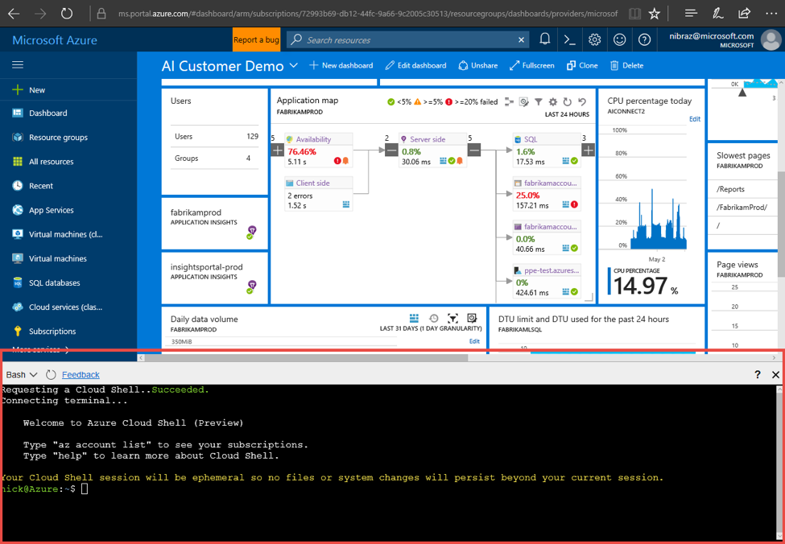

Now that the shell has loaded, you have access the Azure CLI 2.0 under the identity you used to log into Azure.  You can now begin to leverage the Azure CLI commands to script tasks within Azure.

# **Task 2: Check your default subscription**

1. Let&#39;s first make sure we are using the subscription you want.  To do this, let&#39;s look at the Azure subscriptions you have access to, and the different formats we can use to output data in the Cloud Shell using the Azure CLI.

We provide different outputs depending on your workflows and preferences.

```
// with the default JSON style output

$ az account list
```

```
// with Table style output

$ az account list -o table
```

```
// with GREP-able output

$ az account list -o tsv
```

2. [Optional] If you have more than one Azure subscription, you may wish to change the default subscription when you log in.  If you want to change your default subscription, use the following command
  1. If the subscription name contains spaces, put the subscription name in double quotes
```
$ az account set --subscription [name or id]
```

# **Task 3: Create a new resource group**

1. A good first step for exploring Azure is to create a new Resource Group to experiment in. Let&#39;s look at the resource group commands and find how to create a resource group:

```
// Using in-tool help

$ az group -h
```

You will see there is a &quot;Create&quot; command to &quot;Create a new resource group.&quot;

 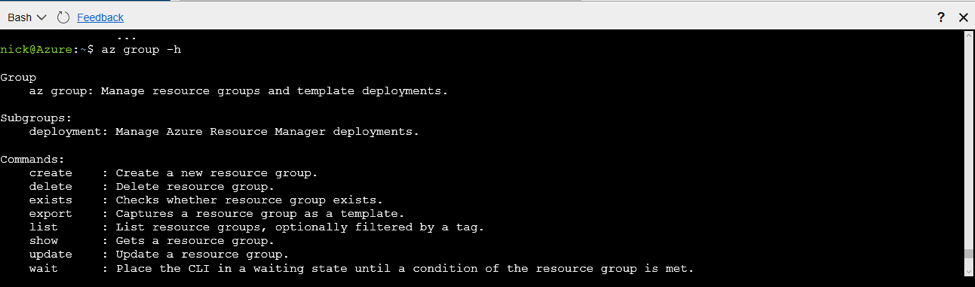

2. To determine what parameters the &quot;Create&quot; command expects, we can scope our help request to that command

```
$ az group create -h

[...]
```

Arguments
```
    --location -l [Required]: Location. You can configure the default location using 'az configure --defaults location=<location>'.

    --name -n     [Required]: Name of the new resource group.

[...]
```

3. Now that we what the command expects for parameters, we can create our resource group with the Azure CLI:
```
$ az group create -l westus -n Build17QS1
```

You will see a &quot;provisioningState&quot; of &quot;Succeeded&quot; once the Resource Group is provisioned

 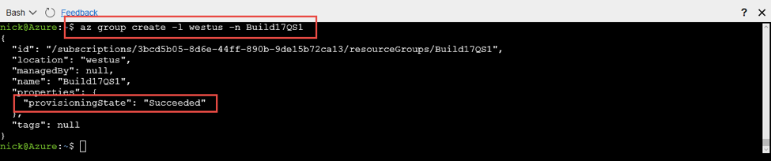

# **Task 4: Create a new Linux VM**

1. Each application uses different Azure services, but let&#39;s start with the common task of creating a VM. Let us first see what arguments are needed by the Azure CLI to create a VM

```
// Starting from an example

$ az vm create -h
```

Note that the required arguments are name (-n) and resource-group (-g).  For our scenario, we will provide an image, but note that per the argument descriptions you can also attach to an existing OS disk.

2. Now that we know the required arguments, let&#39;s create a VM using an Ubuntu image.  If we forget an argument along the way, we can use [tab][tab] command to look up arguments or to assist with auto-complete, if we know (or can guess!) the first letter of the argument, here are a few examples:

```
// Find a command

$ az vm c[tab, tab]

capture        convert        create
```

 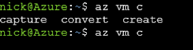

```
// Look up a resource value

$ az vm create -g [tab][tab]

Build17QS1      DemoResource
```

```
// Auto-complete a resource value

$ az vm create -g B[tab][tab]

Build17QS1      DemoResource
```

```
// Look up or auto-complete a parameter value

$ az vm create -g Build17QS1 --image [tab][tab]

CentOS               Debian               RHEL                 UbuntuLTS            Win2012Datacenter    Win2016Datacenter        CoreOS               openSUSE-Leap        SLES                 Win2008R2SP1         Win2012R2Datacenter
```

3. After you have provided all parameters, you will have a command similar to the follow.

```
// Enter our final VM create command

$ az vm create -g Build17QS1 --image ubuntults -n MyQS1VM
```

Now that our command is complete we can create our VM by pressing enter

4. OH NO!  We got an error:

 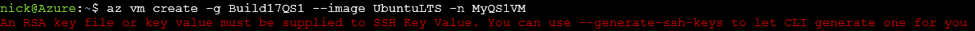

An RSA key file or key value must be supplied to SSH Key Value. You can use --generate-ssh-keys to let CLI generate one for you

This is because your Cloud Shell does not have credentials to share with the VM.

5. Let's have the CLI handle the creation of the SSH key. To do this, update the command to have the include the "--generate-ssh-keys";

```
//Have the CLI generate your ssh key for you

$ az vm create -g Build17QS1 --image ubuntults -n MyQS1VM --generate-ssh-keys
```

 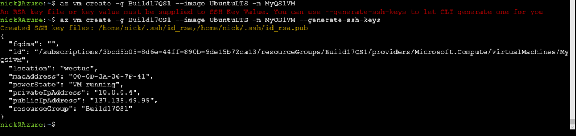

# **Task 5: SSH into your Linux VM**

1. Now that our machine is setup, let&#39;s get connected. We&#39;ll use SSH here, which is configured by default in the VM. You can change this during creation with the az vm create --authentication-type [password|ssh] parameter, or after creation with the az vm user

```
// Take the public ip address shown above and pass it into SSH

$ ssh 137135.49.95

The authenticity of host '23.99.91.60 (23.99.91.60)' can't be established.

ECDSA key fingerprint is SHA256:AJf3ga8IFK063SPKMhG7ZX/jnRPB88d2Gprr1DhKY5Y.

Are you sure you want to continue connecting (yes/no)? yes
```

 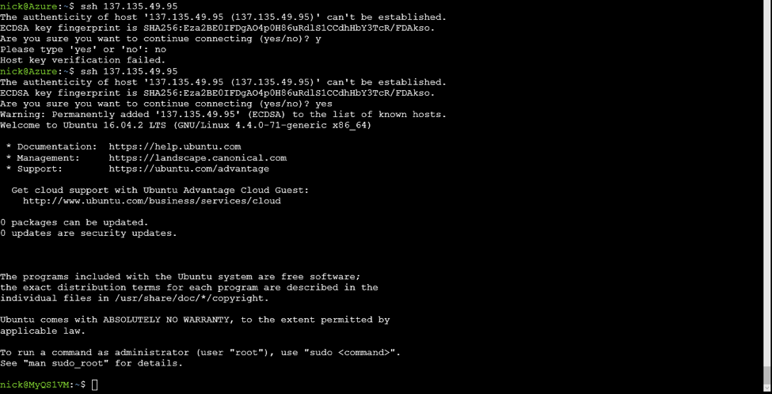

1. Note that now have an active SSH connection to our VM

 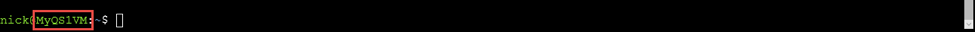

2. To return to our cloud console, simply type exit

 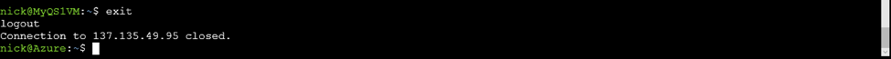

3. For those cases where you can't just type in the right IP address, you can extract this information in a script:

```
// Get the IP address for the machine

$ az vm list-ip-addresses -n MyQS1VM
```

 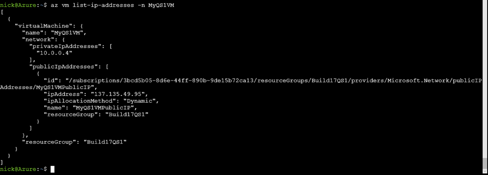

4. Use JMESPath to extract the public IP address only

```
$ az vm list-ip-addresses -n MyQS1VM --query '[0].virtualMachine.network.publicIpAddresses[0].ipAddress'
```

 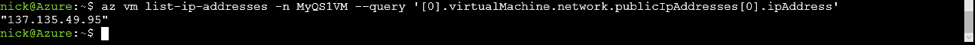

5. Use 'tsv' output to produce raw output of the IP address

$ az vm list-ip-addresses -n MyQS1VM --query '[0].virtualMachine.network.publicIpAddresses[0].ipAddress' -o tsv

 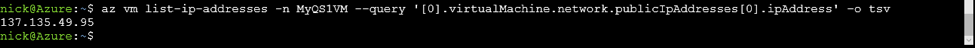

6. Combining the above together lets us create a VM, query for the IP address, and SSH to the newly created VM in one command:

```
MyIP=$(az vm create -g Build17QS1 -n mydemovm3 --image ubuntults --query publicIpAddress --out tsv) && ssh $MyIP
```

 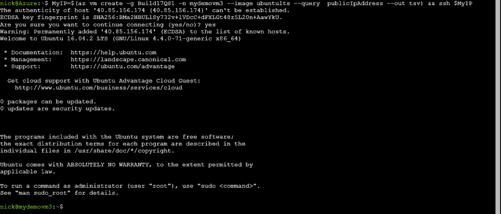

# **Task 6: Clean up your resource group**

Make sure you delete your resource group to clean up any resources created during this script.   **If you do not complete this step, you will continue to be billed for the resourced you created!**

```
$ az group delete -n Build17QS1
```

# **Task 7: Leave us feedback!**

Your final step to complete this challenge, provide us feedback with the following command:

```
$ az feedback
```

# Thank you!

For more information, visit us online:

- [Azure CLI 2.0 Install Guide](https://docs.microsoft.com/en-us/cli/azure/install-azure-cli)
- [Our GitHub Repo](http://github.com/azure/azure-cli)
