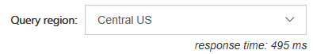
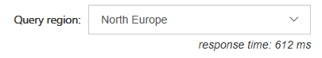

Azure Cosmos DB Lab
=================================================

## Overview

Azure Cosmos DB is Microsoft's globally distributed, multi-model database service designed for global scale-out.

This hands-on lab will step you through the following features:

1. **Deployment** - Provision a Cosmos server with DocumentDb database
1. **Inserting / Updating Documents** - Insert and update documents to the database.
1. **Querying** - Connect to a Azure Cosmos DB database using the DocumentDB API and execute a simple query
2. **Filtering** - Execute ad-hoc queries on schemaless JSON data.

## Deployment

To deploy the azure resouces needed for this lab, click the button below

<a href="https://portal.azure.com/#create/Microsoft.Template/uri/https%3A%2F%2Fraw.githubusercontent.com%2FMicrosoft%2Fcode-challenges%2Fmaster%2FLabs%2FAzure%20Cosmos%20DB%2Fdeployment%2Fazuredeploy.json" target="_blank">
    
</a>

Enter a resource group and a suitable (unique) name for your Azure Cosmos DB server. **This must be all lowercase** Set West US as the Location of the resource group.


Click Purchase.

Once the deployment has finished save the DocumentDBKey and DocumentDBEndpoint from the output.


### About the code

This lab uses a simple ASP.NET MVC website as a test application. This application allows you to
write arbitrary query commands and execute them against our test databases. Any result set will be
rendered automatically into the JSON response panel. There are arrows to navigate left and right through the results. 

## Configure the lab

Open the Microsoft.CodeChallenges.CosmosDB.Lab.sln in /src/Microsoft.CodeChallenges.CosmosDB.Lab and open `web.config`

Copy and paste all the DocumentDB:: settings from the Seed Project to this web.config

```XML
<add key="DocumentDB:Endpoint" value="https://docdbjoeblogslab.documents.azure.com:443/" />
<add key="DocumentDB:Key" value="uEEjfHPeUog9uYsLz3xL57ua93L7fuxkre9O9X0p65LhTJoGFUDywnbtLk9PWxPiFOadP49XMrs3lNDZcBFlwA" />
<add key="DocumentDB:DatabaseName" value="CodeChallenges" />
<add key="DocumentDB:CollectionName" value="CodeChallenges" />
```

## Seed Data

Run the Microsoft.CodeChallenges.CosmosDB.Lab project by pressing F5 (or play).

**Note:** The project will probably open and go to http://localhost:52925/ by default - this page will error becuase we haven't configured the Document Db database yet. This will be fixed in the following steps

Navigate to http://localhost:52925/Insert/Seed - this will take about 5 minutes to run. When it is finished you will see a page saying "Cosmos DB Database has been seeded." This is a seed of a selection of tweets from the Build 2017 Event.

While we are waiting for this to finish. Let's break down the seeding code and dicuss how are actually interacting with Cosmos DB.

Navigate to the InsertController, to the method called GetDocumentClient().

```csharp
_client = new DocumentClient(dbEndpoint, dbKey);
```

DocumentClient is the client to communicate to the Cosmos DB server.

The UriFactory should be used to create references to any entities within the Cosmos DB database. e.g. collections, documents, stored procedures and functions.

e.g. to get a uri for a Document Collection

```csharp
_collectionUri = UriFactory.CreateDocumentCollectionUri(databaseName, collectionName);
```

These Uri's are used when attempting to insert or update documents, stored procedures, collections etc.

You will see that we use it to create a user defined function (more on this later) for the collection.

```csharp
await _client.CreateUserDefinedFunctionAsync(_collectionUri, new UserDefinedFunction()
                    {
                        Id = "displayDate",
                        Body = @"function displayDate(inputDate) {
                                return inputDate.split('T')[0];
                            }"
                    });
```

It is also being used to Upsert a document 

```csharp
// uri = _collectionUri
await client.UpsertDocumentAsync(uri, document);
```

Since Cosmos DB is schema less, you can insert / update any object. You can even insert different objects with different schemas into the same collection!

Let's see this in action.

Assuming the application is still running and the seed has now finished. Navigate to http://localhost:52925/Insert - you should see a simple multiline text box to the left and an insert data button.


This will accept any JSON object and insert it into Cosmos DB. Let's give it a go. Try inserting two completely different JSON objects. There are two JSON objects below for you to use.

```json
{
    "isActive": true,
    "age": 26,
    "eyeColor": "blue",
    "name": "Joe Bloggs",
    "gender": "male",
    "company": "company",
    "email": "joebloggs@company",
    "phone": "+1 (909) 550-3302",
    "address": "778 Trucklemans Lane, Wolcott, Florida, 6808",
    "about": "Pariatur sit fugiat irure nisi nulla est sint mollit. Aliquip non sint ea deserunt tempor anim. Ex est irure eiusmod voluptate ullamco occaecat duis fugiat sit enim.\r\n",
    "registered": "2016-12-30T01:57:51 -13:00"
}
```

```json
{
    "isActive": false,
    "color": "white",
    "product_name": "Carton Milk",
    "description": "Carton of the bestest whole fat milk.",
    "price": 1.99,
    "supplier": "joebloggsupplies"
}
```


Did you notice how Cosmos DB added some extra fields for you? Such as Id, Etag etc. This is so you have a unique id to refer to your document and the etag is for concurrency.

If you copy the output and were to make some changes and "reinsert" it. It would actually do an update since you passed the id and etag back through with the document object.

Let's look at querying the data we have just seeded to the database.

-----

## Scenario 1

In this scenario. We will change the MVC application to send a query to the Azure Cosmos DB server.

### Part One

To begin, open the `Azure DocumentDB Lab.sln` solution in Visual Studio 2017 and press `F5` to 
compile and launch the web app on the local machine.

You should be presented with an application that looks like this:


This page is designed to take the query that the user writes and pass it to a Azure Cosmos DB server via the DocumentDB API that
we have set up for the purposes of this demo. 

Type this query into the query editor:

```SQL
SELECT *
FROM c
```

...and click on **Run It!**


Currently there are no results - we need to finish implementing the DocumentDB API call first.

### Part Two

In the visual studio solution navigate to the `HomeController` class in the `LabWeb` project.


Find the `Query` action method. There is a line of code that looks like this:

```csharp
IDocumentQuery<dynamic> docQuery = null;
```

We will modify it to create and send a DocumentDB SQL query. 

The query text from the page is passed into the action via the `query` variable. Change it to the following:

```csharp
var collectionUri = UriFactory.CreateDocumentCollectionUri(
    ConfigurationManager.AppSettings["CosmosDB:DatabaseName"],
    ConfigurationManager.AppSettings["CosmosDB:CollectionName"]);
var client = await GetReadOnlyClient(locationName);
var docQuery = client.CreateDocumentQuery(collectionUri, query, FeedOptions).AsDocumentQuery();
```

Notice in the FeedOptions, we are setting `MaxItemCount = 10`. This means we will get up to 10 results per execution of the query. The DocumentDB API has 
support for paging built in (We will see an example of this shortly).

Let's quickly inspect the rest of the Query Action:

```csharp
var results = await docQuery.ExecuteNextAsync();
```

This part is what actually uses the DocumentDB SDK to call Azure Cosmos DB and retrieve the results for
our query. Notice this will only return up to `MaxItemCount` results as above (In our case 10 items). 
This can also be set to -1 for dynamic sizing of the resulting set to the maximum response size.

If we wanted to get the next set of results we would have to call `docQuery.ExecuteNextAsync()` again.

In the interests of this demo, we are only retrieving the first ten results. However if this was a real-world application
where we need ALL of the results for a query. We would set the MaxItemCount to -1 and do something like the following:

```csharp
while (docQuery.HasMoreResults)
{
    //Can use strongly typed objects by using <T> on docQuery.ExecuteNextAsync<T>()
    var results = await docQuery.ExecuteNextAsync();

    //dynamic can also be T
    foreach (dynamic result in results)
    {
        //Do something with results
    }
}
```

> **Note:** We are deserializing the JSON string and serializing it back again so that we can format the JSON into human readable string.

Press `F5` to compile and launch the web app on the local machine.

Type this query into the query box:

```SQL
SELECT *
FROM c
```

...and click on **Run It!**


Progress! We have successfully returned results from Azure Cosmos DB.

> **Note** 
Due to the nature of this lab, we are showing examples of SQL Query format.
However you can also execute queries against Cosmos DB by using LINQ to DocumentDB API SQL adapter. More infomation at [https://docs.microsoft.com/en-us/azure/cosmos-db/documentdb-sql-query](https://docs.microsoft.com/en-us/azure/cosmos-db/documentdb-sql-query)


## Scenario 2

From now on, we will be working directly in the web browser.

In this scenario we will introduce the DocumentDB SQL syntax and show how we can use it to manipulate our results.

The dataset we are querying is a live stream of tweets from twitter with hashtags relating to //build/.

### Part One

In the query, the `FROM` name is simply an alias to the entire collection for the user to refer to in the query. It is not actually a table like in traditional SQL.

For example:

```SQL
SELECT *
FROM t
```

...is exactly the same as:

```SQL
SELECT *
FROM tweets
```

Give it a try!


## Part Two

Now that we know how to select some records, lets see how the different data centres affect our latency!

This project has been configured to allow the user to select which region to execute their DocumentDB SQL query against. By default the DocumentDB SDK will chose the primary region to perform read and write operations, however client applications can specify the ordered preference list of regions to be used to perform document operations. (We are using this so you can see the differences between regions)

Exceute this query and select a different region each time. Notice how the response time changes due to the location of the data center?

```SQL
SELECT *
FROM tweets
```







> **Note:** These response time here includes the time it takes to send a packet from the development environment over the wire in addition to the time it takes Azure Cosmos DB to run the query. Single document reads from Cosmos DB return in <10ms when performed from a VM co-located in the same region as the database region. There are also other underlying factors such as the initialization of the client, so you may have to run the query and take an average to determine the fastest server.

Try this out with the difference queries going forward!

## Part Three

When refering to fields you must use the alias you define in the `FROM` clause.

Execute this query:

```SQL
SELECT CreatedBy
FROM tweets
```


As you can see this resulted in an error.

To fix this error we have to provide the full "path" to the properties of the objects within the database.

Execute this query instead:

```SQL
SELECT tweets.CreatedBy
FROM tweets
```

> **Note** Depending on your seed data, you may get some "blank" results. We will be addressing this later on


### Part Four

Now that we know how to select a certain field, we can filter on them.

In Part Three you may have received some blank results. This is becuase during the seed process we added two documents/objects that are completely different to the rest of the collection. The two objects we inserted did not have a CreatedBy property. We can add a filter quite easily to only return documents with this property set.

```SQL
SELECT tweets.CreatedBy
FROM tweets
WHERE tweets.CreatedBy != null
```

We are no longer returning empty result sets!

In the same respect we can try and find our person and product documents by seeing if the field exists.. 

To find our products..

```SQL
SELECT *
FROM products
WHERE products.product_name != null
```


What if we had more than one person or product? It would be more likely you would query the actual property value. Let's try and find joe bloggs.

```SQL
SELECT *
FROM people
WHERE people.name = "Joe Bloggs"
```


Cosmos DB does not care that the property does not exist on the tweet or product objects. It will only execute the filter on documents where the property does exist. Cosmos DB has indexing on all the data on a document. So executing these kind of filters are very fast. 

## Scenario 3

In this scenario we are going to see how we can use joins to inspect child objects / arrays.

### Part One

We have been using DocumentDB SQL to inspect all the tweets in the database and for certain users.

Lets see how we can find out the hashtags that have been used in all the tweets. We can use the `JOIN` keyword to join to our hashtags array in each tweet. We can also give it an alias and inspect its properties.

Let's see the `JOIN` in action. Try this query:

```SQL
SELECT hashtags
FROM tweets
JOIN hashtags IN tweets.Hashtags
```

Inspect the results and you will see for each hashtag object in the array of each tweet/document has been returned as a seperate result set:


Now that we know how to join to our child array we can use it for filtering. Lets find all other hashtags that have been used along with the build hashtags (#MSBuild, #Azure, #CosmosDB):

```SQL
SELECT hashtags
FROM tweets
JOIN hashtags IN tweets.Hashtags
WHERE hashtags.text NOT IN ("MSBuild", "MsBuild", "CosmosDB", "Azure")
```


Imagine that we want to see hashtags where "#Tech" and "#Question" used. There two ways we can achieve this.

Using an `OR` predicate:

```SQL
SELECT hashtags
FROM tweets
JOIN hashtags IN tweets.Hashtags
WHERE (hashtags.text = "Tech" OR hashtags.text = "Question")
```

...or using an `IN` predicate: 

```SQL
SELECT hashtags
FROM tweets
JOIN hashtags IN tweets.Hashtags
WHERE hashtags.text IN ("Tech", "Question")
```


If there are properties that have whitespace, you can filter these results by the special index to address it:

```SQL
WHERE hashtags["Property With Spaces"] ...
```

This syntax will be familiar to users of JavaScript, or C# dictionary accessor syntax.

We can use the `BETWEEN` keyword to filter by a range of values. We are doing this on the indices property.

Try this query:

```SQL
SELECT indices
FROM tweets
JOIN hashtags IN tweets.Hashtags
JOIN indices IN hashtags.indices
WHERE indices BETWEEN 21 AND 28
```


Note that you can actually return the entire tweet where the indices of the hashtag is between 21 and 28 simply by selecting the tweets rather than the indices

e.g. :

```SQL
SELECT tweets
FROM tweets
JOIN hashtags IN tweets.Hashtags
JOIN indices IN hashtags.indices
WHERE indices BETWEEN 21 AND 28
```

We have used the `MaxItemCount` in the code to limit our results to 10 items. We can also restrict the amount 
of results returned by using a `TOP` clause in our query. 

Lets adjust our query to find the top result. Give this a try:

```SQL
SELECT TOP 1 tweets
FROM tweets
JOIN hashtags IN tweets.Hashtags
JOIN indices IN hashtags.indices
WHERE indices BETWEEN 21 AND 28
```


We can also order our query so we can find the most recent tweet(s). (use ASC for ascending and DESC for Descending) :

```SQL
SELECT TOP 5 tweets
FROM tweets
JOIN hashtags IN tweets.Hashtags
JOIN indices IN hashtags.indices
WHERE indices BETWEEN 21 AND 28
ORDER BY tweets.CreatedAt DESC
```

## Part Two

We can use a feature called **Projection** to create an entirely new result set. We could use this to create a common structure or to make it match a structure we already have.

Try this query:

```SQL
SELECT tweets.CreatedBy.Name,
		tweets.FullText,
		tweets.CreatedAt,
        tweets.TweetDTO.metadata.iso_language_code
FROM tweets
```


This query allowed us to combine all tweets into a flattened structure which could be useful, for example, when binding to a strongly typed dataset.

You can take this one step further by defining property names :

```SQL
SELECT tweets.CreatedBy.Name AS Name,
		tweets.FullText AS Text,
		tweets.CreatedAt AS CreatedTime,
        tweets.TweetDTO.metadata.iso_language_code AS LanguageCode
FROM tweets
```


## Part Three

Remember how we inserted the user defined function at the beginning of this lab, we are going to show how you would use it.

The DocumentDB API supports javascript User defined functions, there that you can use on this server called displayDate which removes the time parts of a UTC date string.

This is the function :

```javascript
function displayDate(inputDate) {
    return inputDate.split('T')[0];
}
```

Let's have a go at using it

```SQL
SELECT tweets.CreatedAt,
    udf.displayDate(tweets.CreatedAt) AS FormattedDate
FROM tweets
```


The DocumentDB API also supports stored procedures written in javascript which enables you to perform ACID transactions over multiple records. This allows scalable and almost unlimited expandablity on the functionality Azure Cosmos DB can offer.

### Further Reading 

[Get Started with Azure Cosmos DB - http://aka.ms/cosmosdb](http://aka.ms/cosmosdb)

[Documentation and Videos - http://aka.ms/acdbnqs](http://aka.ms/acdbnqs)

[How does pricing work? - http://aka.ms/acdbpricing](http://aka.ms/acdbpricing)

[Get help on Stack Overflow - http://stackoverflow.com/questions/tagged/azure-documentdb](http://stackoverflow.com/questions/tagged/azure-documentdb)

[DocumentDB SQL Query Syntax](https://azure.microsoft.com/en-us/documentation/articles/documentdb-sql-query)

[DocumentDB SQL Query Playground](https://www.documentdb.com/sql/demo)

## Appendix

The Azure Portal was used to create the Azure Cosmos DB server. The Azure Portal can be found at [https://portal.azure.com/](https://portal.azure.com/).

Some features that you can use in Azure Portal with Cosmos DB include:


#### Document Explorer

View the JSON  documents inside your collections.


#### Query Explorer

Test your queries and view the results.


#### Script Explorer

View, add and modify stored procedures, user functions and triggers.


