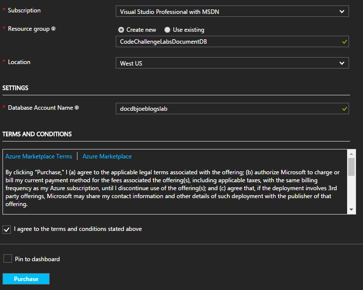
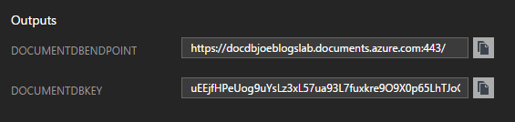
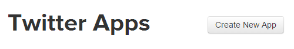
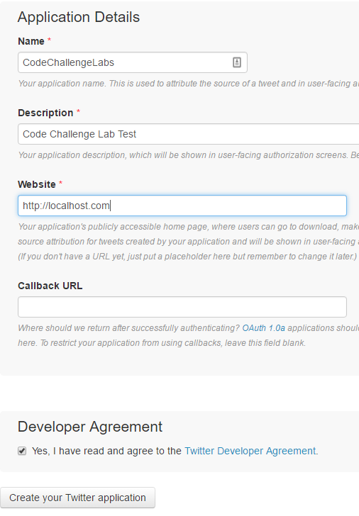

# Deployment Guide for Azure Cosmos DB Lab

## Azure Resources

To deploy the azure resouces needed for this lab, click the button below


Enter a resource group and a suitable (unique) name for your Azure Cosmos DB server. **This must be all lowercase** Set West US as the Location of the resource group.



Click Purchase.

Once the deployment has finished save the DocumentDBKey and DocumentDBEndpoint from the output.



## Seed Data

Open the Microsoft.CodeChallenges.DocumentDB.TweetSeed project found in the utilities directory.

Open the`app.config` and add the key and endpoint values from the output shown earlier.

e.g. (The key has been destroyed)

```XML
<add key="DocumentDB:Endpoint" value="https://docdbjoeblogslab.documents.azure.com:443/" />
<add key="DocumentDB:Key" value="uEEjfHPeUog9uYsLz3xL57ua93L7fuxkre9O9X0p65LhTJoGFUDywnbtLk9PWxPiFOadP49XMrs3lNDZcBFlwA" />
```

We need to add our twitter credentials so we can search/stream tweets from twitter.

Navigate to (https://apps.twitter.com/)[https://apps.twitter.com/] and Login with your user account. Once you are at the home page, click the Create New App button.



Fill out the basic information

e.g.



Click on `Create your Twitter application`

Navigate to 'Keys and Access Tokens'


Copy the Consumer Key (API Key) and Consumer Secret (API Secret) to the`app.config`.

e.g. (The keys in this example have been destroyed)

```XML
<add key="Twitter:ConsumerKey" value="DUzBFBfqr1RQGGFH3BWlbtt1n" />
<add key="Twitter:ConsumerSecret" value="pEzdV7ksFxSDmxhK344uu97Ey5eW8uiDDn8nlrCBNQS9NjoY3M" />
```

Navigate down the page and click 'Create my Access Token'

Copy the Access Token and Access Token Secret to the`app.config`


e.g. (The keys in this example have been destroyed)

```XML
<add key="Twitter:AccessToken" value="349776177-TNxIlTJLXJKWkEm6i5PsRyLesBIJi6Px6UyBmKEU" />
<add key="Twitter:AccessTokenSecret" value="bmwuB4HuSWSutrGK7xYyqjefXO0GBWIQDCZqmsKEo4AZE" />
```

There are two ways to seed data in your Azure Cosmos DB, you can either search for tags or use a live stream of tweets that are using the hashtags that are specified in the`app.config`.

Firstly add the tags that you want to use in the`app.config` by comma seperating some hash tags

e.g.

```XML
<add key="Twitter:Tags" value="#MSBuild,#CosmosDB,#Azure"/>
```

Open `Program.cs`

You will see this snippet of code

```csharp
TwitterLiveStream(credentials, tags);
//TwitterSearch(credentials, tags);
```

If you want to use a live stream of data to seed your data, then leave it as it is.
If you want execute a search of past tweets (will seed your Azure Cosmos DB faster) then swap the commented out line so that it looks like this.

```csharp
//TwitterLiveStream(credentials, tags);
TwitterSearch(credentials, tags);
```

Run the application and you will see it seeding your Azure Cosmos DB database!

(Note if you are seeding from the live stream then you will have to manually close the application)

## Configure the lab

Open the Microsoft.CodeChallenges.DocumentDB.Lab.sln in /src/Microsoft.CodeChallenges.DocumentDB.Lab and open `web.config`

Copy and paste all the DocumentDB:: settings from the Seed Project to this web.config

```XML
<add key="DocumentDB:Endpoint" value="https://docdbjoeblogslab.documents.azure.com:443/" />
<add key="DocumentDB:Key" value="uEEjfHPeUog9uYsLz3xL57ua93L7fuxkre9O9X0p65LhTJoGFUDywnbtLk9PWxPiFOadP49XMrs3lNDZcBFlwA" />
<add key="DocumentDB:DatabaseName" value="tweets" />
<add key="DocumentDB:CollectionName" value="build" />
```

Go through the [code challenge](../hands-on-lab.md)


