# Azure Functions

# Overview

Azure Functions is a solution for easily running small pieces of code, or &quot;functions,&quot; in the cloud. You can write just the code you need for the problem at hand, without worrying about a whole application or the infrastructure to run it. Functions can make development even more productive, and you can use your development language of choice, such as C#, F#, Node.js, Python or PHP. Pay only for the time your code runs and trust Azure to scale as needed. Azure Functions lets you develop serverless applications on Microsoft Azure.

In this Quick Start you will create a simple Azure Function and explore the browser workspace.

# Objectives

- Build your first Azure Function

# Prerequisites

- Windows 10

# Intended Audience

This Quick Start Challenge is intended for developers who are familiar with C#, although deep experience is not required.

# Task 1: Creating a Hello World function

1. Open a browser window to [https://functions.azure.com](https://functions.azure.com).
2. Click **Try It For Free**.

 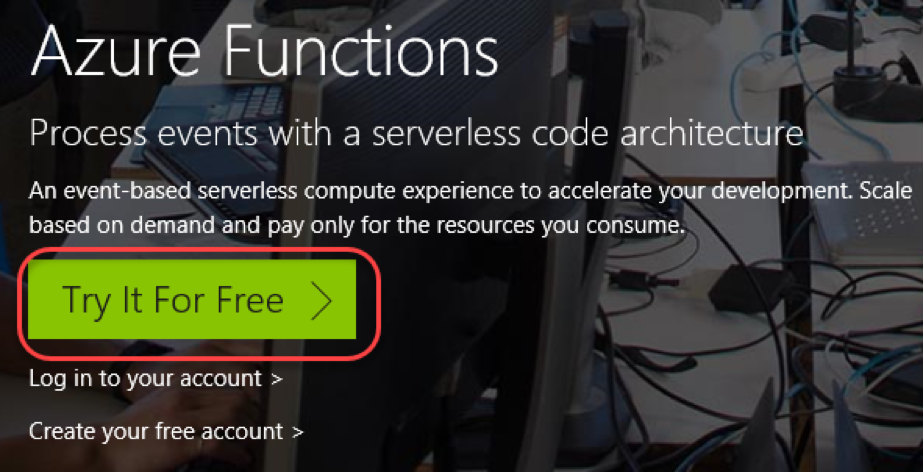

1. Select **Webhook + API** and **C#**. Click **Create this function** and sign in using one of the supported account types.

 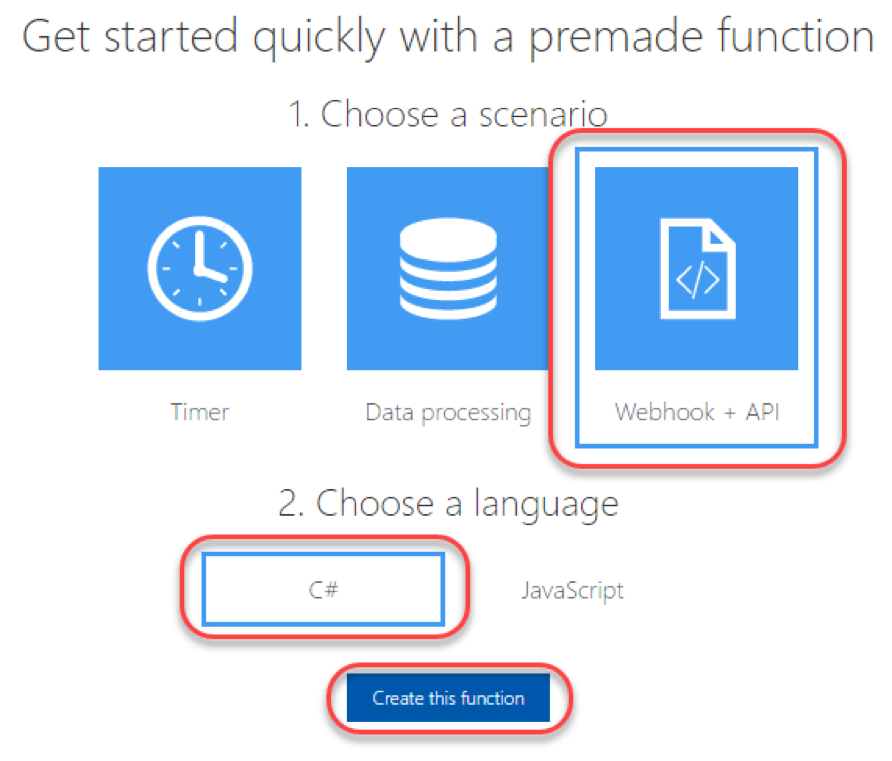

1. And that's all it takes to get your first function up and running.

 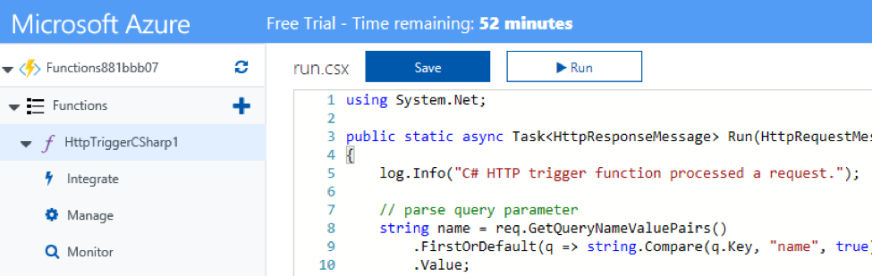

# Task 2: Reviewing the code

1. The code for this Azure function uses **C# Script**. It's almost the same as **C#** , but has subtle differences that are beyond the scope of this lab. The first thing you'll notice about the code is that it defines a **Run** method that takes in an **HttpRequestMessage** that wraps the request and a **TraceWriter** for logging.

 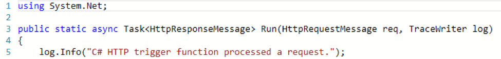

1. Next, the code tries to pull the value of a **name** parameter from the **query string** , if it exists.

 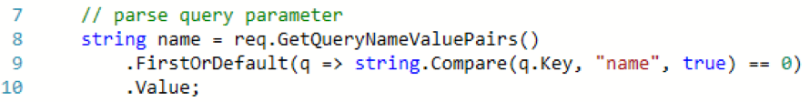

1. The code then reads the body of the request so it can access posted parameters.

 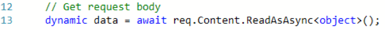

1. If there was no query string parameter for **name** , it tried to pull one from the body of the request.

 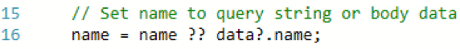

1. If there was no **name** in either the query or body, it returns a **Bad Request**. Otherwise, it returns **"Hello [name]"**.

 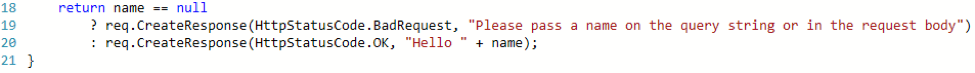

# Task 3: Exploring the workspace

1. Click the **View files** tab from the right side of the window to expand it.

 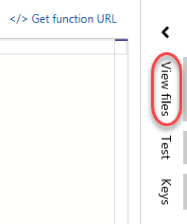

1. This tab includes a list of all files for this function. By default, there are three: **function.json** (defines the function and its bindings), **readme.md** (documentation about the function), and **run.csx** (the code file we just reviewed).

 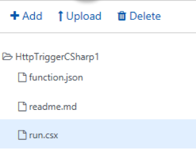

1. Select the **Test** tab.

 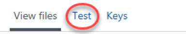

1. The **Test** tab provides an interface for you to craft requests to test the interface during development. You can modify the verb, query, and body to make sure the function is working the way you want it to.

 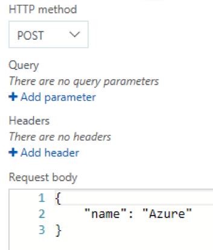

# Task 4: Testing the function

1. Click **Run** to test the function. This will send the parameters configured in the **Test** tab to the function.

 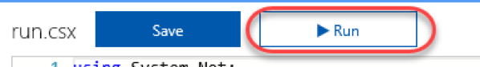

1. By default, the **name** is sent in the body as a **POST**. You can see the response from the function in the **Output** panel below.

 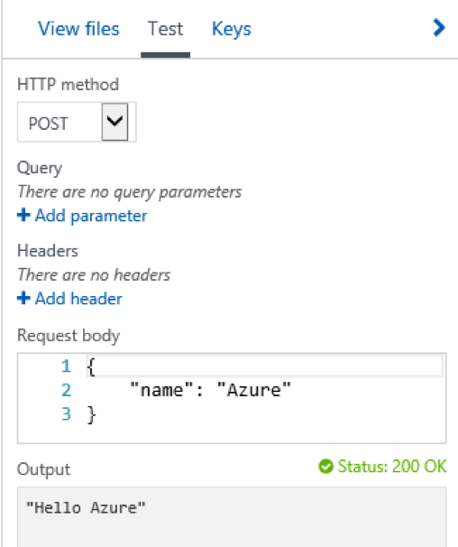

1. You can also review the trace of the function in the **Log** panel. This includes infrastructure messaging, as well as logging you perform directly from the function.

 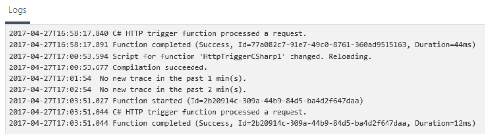

# Summary

Congratulations on completing this Quick Start Challenge! In this lab, you've learned how to create your first Azure Function.

# Additional Resources

If you are interested in learning more about this topic, you can refer to the following resources:

**Documentation** : [https://docs.microsoft.com/en-us/azure/azure-functions](https://docs.microsoft.com/en-us/azure/azure-functions)

**GitHub** : [https://github.com/Azure/Azure-Functions](https://github.com/Azure/Azure-Functions)

**Team blog** : [https://blogs.msdn.microsoft.com/appserviceteam/tag/azure-functions/](https://blogs.msdn.microsoft.com/appserviceteam/tag/azure-functions/)
