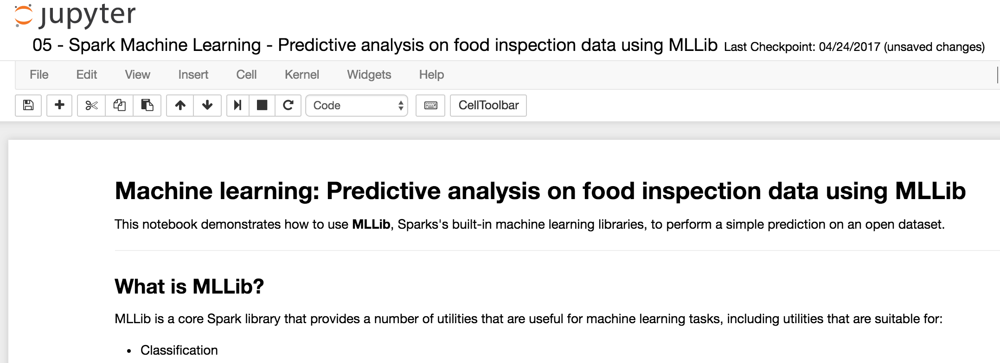
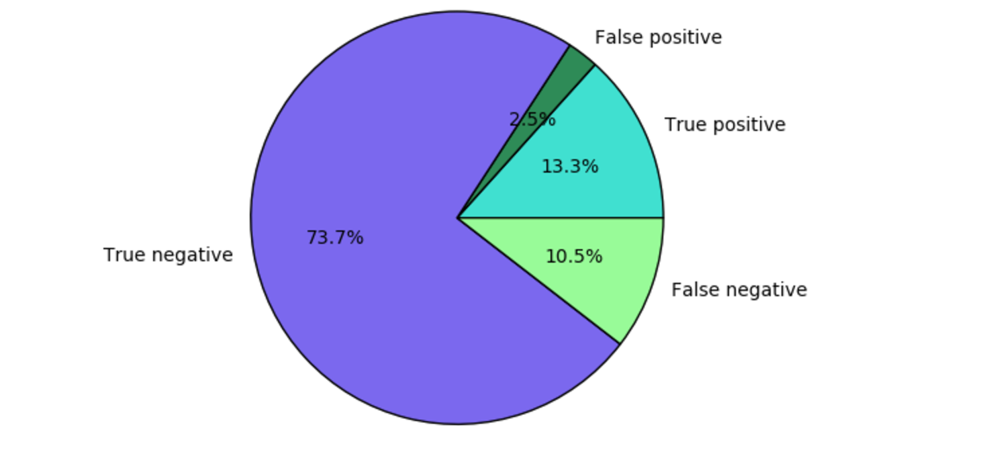
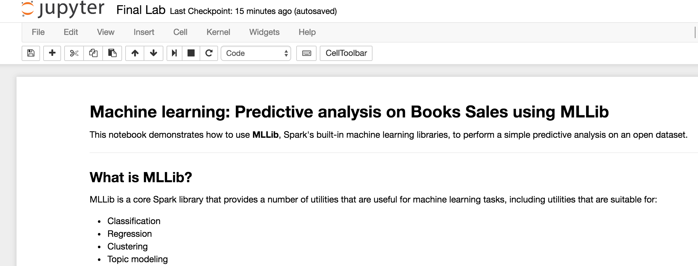

Overview
--------

Azure HDInsight is the only fully-managed cloud Apache Hadoop offering
that gives you optimized open-source analytic clusters for Spark, Hive,
MapReduce, HBase, Storm, Kafka, and Microsoft R Server backed by a 99.9%
SLA. Deploy these big data technologies and ISV applications as managed
clusters with enterprise-level security and monitoring.

This lab specifically focuses on Spark ML component of Spark and
highlights its value proposition in the Apache Spark Big Data processing
framework.

This hands-on lab will step you through the following features:

1.  **Notebook** – Connect to a Notebook and run the notebook

2.  **Basics of Spark** – Use Python to analyze data using Spark

3.  **Basics of Machine Learning –** This notebook demonstrates how to
    use MLLib, Sparks's built-in machine learning libraries, to perform
    a simple prediction on an open dataset.


Learn the basics of data science using Spark
--------------------------------------------

This notebook demonstrates how to use MLLib, Sparks's built-in machine
learning libraries, to perform a simple prediction on an open dataset.

### Launch Jupyter Notebook
 Navigate to this link and add your cluster name and username/password provided. https://<Fill_ME_IN>.azurehdinsight.net/jupyter/tree/PySpark

-   Username: &lt;FILL\_ME\_IN&gt;

-   Password: &lt;FILL\_ME\_IN&gt;


### Open [Spark Machine Learning - Predictive analysis on food inspection data using MLLib.ipynb](https://pranavsparkbuildlab.azurehdinsight.net/jupyter/notebooks/PySpark/05%20-%20Spark%20Machine%20Learning%20-%20Predictive%20analysis%20on%20food%20inspection%20data%20using%20MLLib.ipynb)

This is a sample notebook which will walk you through the steps of
interacting with a notebook, basics of machine learning of Spark. You
will apply these learnings in a new notebook to predict book sales



### Notebook Setup

-   Read the opening paragraph to understand about the scenario and the
    model to apply.

-   Run through all the steps in the notebook.

-   To run the cells below, place the cursor in the cell and then press
    \*\*SHIFT + ENTER\*\*.

### Initializing Spark - Construct an Input DataFrame

Read the dataset from a csv file stored in Azure Blob Storage.

```python
inspections =
spark.read.csv('wasb:///HdiSamples/HdiSamples/FoodInspectionData/Food_Inspections1.csv',
inferSchema=True)
```
#### Inspect Schema
```python
inspections.printSchema()
```
#### See a detailed record
```python
df.take(1)
```
#### Understand the dataset
Let's start to get a sense of what our dataset contains. For
    example, what are the different values in the \`results\` column?
```python
df.select('results').distinct().show()
```
#### A visualization can help us reason about the distribution of these outcomes.
```python
%%local

%matplotlib inline

import matplotlib.pyplot as plt

labels = count_results_df['results']

sizes = count_results_df['cnt']

colors = ['turquoise', 'seagreen', 'mediumslateblue', 'palegreen',
'coral']

plt.pie(sizes, labels=labels, autopct='%1.1f%%', colors=colors)

plt.axis('equal')
```


### Create a logistic regression model from the input dataframe

This will allow you to categorize the data which you can use to predict
the outcome in the next step

### Evaluate the model on a separate test dataset

We can use the model we created earlier to predict what the results of
new inspections will be, based on the violations that were observed.
```python
testData =
selectInterestingColumns(spark.read.csv('wasb:///HdiSamples/HdiSamples/FoodInspectionData/Food_Inspections2.csv',
inferSchema=True))

testDf = testData.where("results = 'Fail' OR results = 'Pass' OR results
= 'Pass w/ Conditions'")

predictionsDf = model.transform(testDf)

predictionsDf.registerTempTable('Predictions')

predictionsDf.columns
```
#### Look at the success rate.
```python
numSuccesses = predictionsDf.where("""(prediction = 0 AND results =
'Fail') OR

(prediction = 1 AND (results = 'Pass' OR

results = 'Pass w/ Conditions'))""").count()

numInspections = predictionsDf.count()

print("There were %d inspections and there were %d successful
predictions" % (numInspections, numSuccesses))

print("This is a %d%% success rate" % (float(numSuccesses) /
float(numInspections) * 100))
```
#### Final visualization to help us reason about the results of this test.



Scenario 2 – Apply the basics of machine learning to predict book sales.
------------------------------------------------------------------------

In this scenario, you will apply your learnings from Scenario 1.

**Scenario**: This notebook demonstrates how to use MLLib, Spark's
built-in machine learning libraries, to perform a simple predictive
analysis on an open dataset.

**Launch Jupyter Notebooks**
https://&lt;Fill\_ME\_IN&gt;.azurehdinsight.net/jupyter/tree/PySpark

-   Username: &lt;FILL\_ME\_IN&gt;

-   Password: &lt;FILL\_ME\_IN&gt;


### Open Final Lab.ipynb

This is the same notebook you learnt in Scenario 1. In this notebook,
you will apply the learnings to a different dataset.



### Notebook Setup

-   Read the opening paragraph to understand about the scenario and the
    model to apply.

-   Run through all the steps in the notebook.

-   To run the cells below, place the cursor in the cell and then press
    \*\*SHIFT + ENTER\*\*.

### Initializing Spark - Construct an Input DataFrame

Read the dataset along with headers from a csv file stored in Azure Blob
Storage.

-   Replace <FILL\_ME\_IN\_WITH\_header=True> with
    **header=True** in the following statement
```python
inspections = spark.read.csv('/sparklabs/Lab03/SaleTransactions1.csv',
inferSchema=True, <FILL_ME_IN_WITH_header=True>);
```
#### Inspect Schema
```python
inspections.printSchema()
```
#### See a detailed record
```python
df.take(1)
```
### Understand the dataset

Let's start to get a sense of what our dataset contains. For example,
what are the different values in the \`**CustomerAction**\` column?

-   Replace **&lt;FILL\_ME\_IN\_WITH\_ColName&gt;** with
    **CustomerAction**
```python
inspections.select('FILL_ME_IN_WITH_ColName').distinct().show()
```
#### A visualization can help us reason about the distribution of these outcomes.

-   Replace **&lt;FILL\_ME\_IN\_WITH\_ColName**&gt; with
    **CustomAction**
```python
%%local

%matplotlib inline

import matplotlib.pyplot as plt

labels = count_results_df['FILL_ME_IN_WITH_ColName']

sizes = count_results_df['cnt']

colors = ['turquoise', 'seagreen', 'mediumslateblue', 'palegreen',
'coral']

plt.pie(sizes, labels=labels, autopct='%1.1f%%', colors=colors)

plt.axis('equal')
```


Let us develop a model that can guess the outcome whether a book is
purchased based on customer action. From the previous visualization, a
**CustomerAction** could be one of the following :- ‘**Purchased’**,
**‘Added To Cart’** or **‘Browsed’**

Since logistic regression is a binary classification method, it makes
sense to group our data into two categories: \*\*Purchased\*\* and
\*\*Not purchased\*\*. A "Added To Cart" is not a purchase, so when we
train the model, we will consider the two results equivalent.

-   Replace **&lt;FILL\_ME\_IN&gt;** with the **highlighted**
```python
def labelForResults(s):

if s == 'Purchased':

return 1.0

elif s == 'Added To Cart' or s == 'Browsed':

return 0.0

else:

return -1.0

label = UserDefinedFunction(labelForResults, DoubleType())

labeledData =
inspections.select(label(inspections.CustomerAction).alias('label'),
inspections.Name ).where('label >= 0')
```
### Create a logistic regression model from the input dataframe

This will allow you to categorize the data which you can use to predict
the outcome in the next step

### Evaluate the model on a separate test dataset

We can use the model we created earlier to predict what the results of
new inspections will be, based on the violations that were observed.
```python
testData = spark.read.csv('/sparklabs/Lab03/SaleTransactions2.csv',
inferSchema=True, header=True)

testDf = testData.where("CustomerAction = 'Purchased' OR
CustomerAction = 'Added To Cart' OR CustomerAction = 'Browsed'")

predictionsDf = model.transform(testDf)

predictionsDf.registerTempTable('Predictions')

predictionsDf.columns
```
#### Look at the success rate.

-   Replace **&lt;FILL\_ME\_IN&gt;** with the **highlighted**
```python
numSuccesses = predictionsDf.where("""(prediction = 1 AND CustomerAction
= 'Purchased') OR

(prediction = 0 AND (CustomerAction = 'Added To Cart' OR

CustomerAction = 'Browsed'))""").count()

numInspections = predictionsDf.count()

print("There were %d User sessions and there were %d successful
predictions" % (numInspections, numSuccesses))

print("This is a %d%% success rate" % (float(numSuccesses) /
float(numInspections) * 100))
```
#### Final visualization to help us reason about the results of this test.


Learn more and get help
=======================

-   [Azure HDInsight
    Overview](https://azure.microsoft.com/en-us/services/hdinsight/)

-   [Getting started with Azure
    HDInsight](https://docs.microsoft.com/en-us/azure/hdinsight/)

-   [Use Hive on
    HDInsight](https://docs.microsoft.com/en-us/azure/hdinsight/hdinsight-hadoop-linux-tutorial-get-started)

-   [Use Spark on
    HDInsight](https://docs.microsoft.com/en-us/azure/hdinsight/hdinsight-apache-spark-overview)

-   [Use Interactive Hive on
    HDInsight](https://docs.microsoft.com/en-us/azure/hdinsight/hdinsight-hadoop-use-interactive-hive)

-   [Use HBase on
    HDInsight](https://docs.microsoft.com/en-us/azure/hdinsight/hdinsight-hbase-overview)

-   [Use Kafka on
    HDInsight](https://docs.microsoft.com/en-us/azure/hdinsight/hdinsight-apache-kafka-introduction)

-   [Use Storm on
    HDInsight](https://docs.microsoft.com/en-us/azure/hdinsight/hdinsight-storm-overview)

-   [Use R Server on
    HDInsight](https://docs.microsoft.com/en-us/azure/hdinsight/hdinsight-hadoop-r-server-overview)

-   [Open Source component guide on
    HDInsight](https://docs.microsoft.com/en-us/azure/hdinsight/hdinsight-component-versioning#hadoop-components-available-with-different-hdinsight-versions)

-   [Extend your cluster to install open source
    components](https://docs.microsoft.com/en-us/azure/hdinsight/hdinsight-hadoop-customize-cluster-linux#support-for-open-source-software-used-on-hdinsight-clusters)

-   [HDInsight release
    notes](https://docs.microsoft.com/en-us/azure/hdinsight/hdinsight-release-notes)

-   [HDInsight versioning and support
    guidelines](https://docs.microsoft.com/en-us/azure/hdinsight/hdinsight-component-versioning#supported-hdinsight-versions)

-   [How to upgrade HDInsight cluster to a new
    version](https://docs.microsoft.com/en-us/azure/hdinsight/hdinsight-upgrade-cluster)

-   [Ask HDInsight questions on
    stackoverflow](https://stackoverflow.com/questions/tagged/hdinsight)

-   [Ask HDInsight questions on Msdn
    forums](https://social.msdn.microsoft.com/forums/azure/en-us/home?forum=hdinsight)


