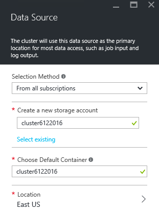
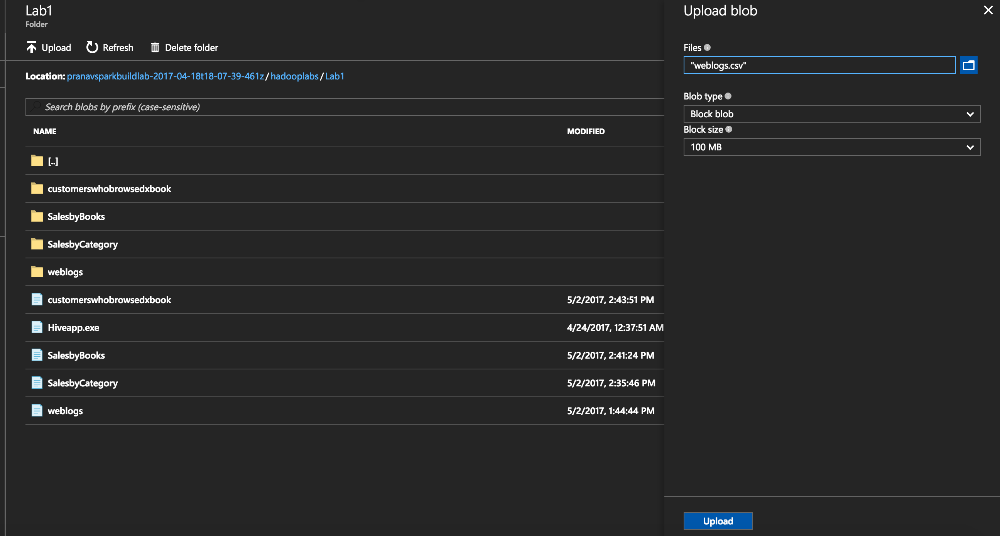

Provision HDInsight Linux Hadoop cluster with Azure Management Portal
---------------------------------------------------------------------

To provision HDInsight Hadoop cluster with Azure Management Portal,
perform the below steps.

1.  Go to the Azure Portal portal.azure.com. Login using your azure
    account credentials.

2.  Select **NEW -&gt; Data Analytics -&gt; HDInsight**

> 

1.  Enter or select the following values.

    1.  **Cluster Name:** Enter the cluster name. A green tick will
        appear if the cluster name is available.

    2.  **Cluster Type:** Select Hadoop as the cluster type.

    3.  **Cluster Operating System:** Select Linux as the cluster
        operating system

    4.  **Version:** Select 3.6 as the cluster version.

    5.  **Cluster Tier:** Select the **Standard** cluster tier

> 

1.  **Subscription:** Select the Azure subscription to create
    the cluster.

2.  **Resource Group:** Select an existing resource group or create a
    new resource group.

3.  **Credentials:** Configure the username and password for HDInsight
    cluster and the SSH connection. SSH connection is used to connect to
    HDInsight cluster through a SSH client such as Putty.

> 

1.  **Data Source:** Create a new storage account and a
    default container.

> 

1.  **Node Pricing Tiers:** Set the number of head node and worker nodes
    as shown below.

> 

**Note:** You can select lowest pricing tier A3 nodes or reduce the
number of worker nodes decrease the cluster cost.

1.  Leave other configuration options as default and click **Create** to
    provision HDInsight Hadoop cluster. It will take 15-20 minutes for
    cluster provisioning.

**The HDInsight Linux Hadoop cluster is now ready to work with.**

Copy lab data to the storage account
------------------------------------

In this section, you’ll copy the files required for the lab to your
storage account.

To copy the files, follow the below steps.

1.  Launch Azure Storage from your cluster dashboard

> 

1.  Select the **Blob container** for your cluster

2.  Create a container called **hadooplabs**

3.  Navigate to **hadooplabs** and create a container called **Lab1**

4.  Upload weblogs.csv to Lab1. Weblogs.csv can be found in
    **data\\hadooplabs\\Lab1** folder.

    

