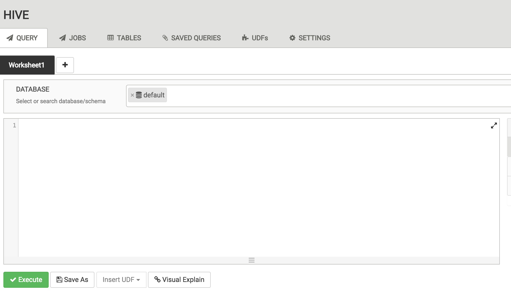
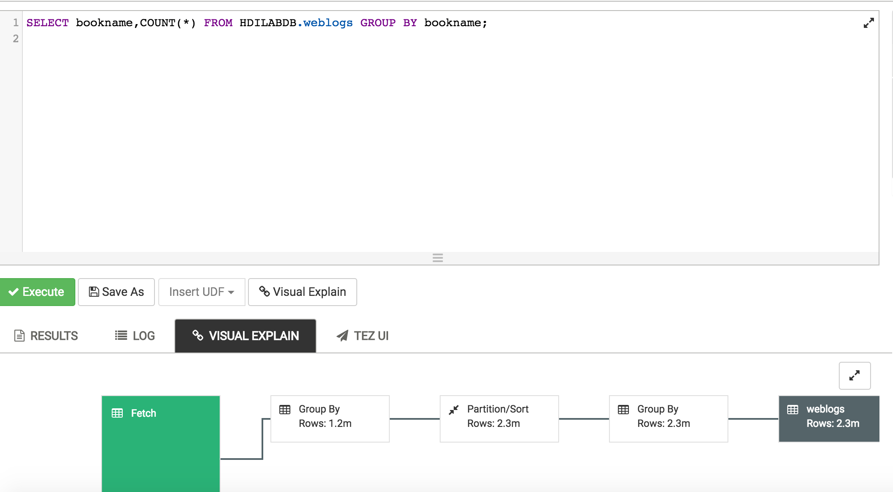

Overview
========

Azure HDInsight is the only fully-managed cloud Apache Hadoop offering
that gives you optimized open-source analytic clusters for Spark, Hive,
MapReduce, HBase, Storm, Kafka, and Microsoft R Server backed by a 99.9%
SLA. Deploy these big data technologies and ISV applications as managed
clusters with enterprise-level security and monitoring.

Hive is a data warehousing system that simplifies analyzing large
datasets stored in Hadoop clusters, using SQL-Like language known as
HiveQL. Hive converts queries to either map/reduce, Apache Tez or Apache
Spark jobs.

To highlight how customers can efficiently leverage HDInsight Hive to
analyze big data stored in Azure Blob Storage, this document provides an
end-to-end walkthrough of analyzing a web transaction log of an
imaginary book store using Hive.

<span id="about-the-code" class="anchor"></span>After completing this
lab, you will learn,

1.  Different ways to execute hive queries on an HDInsight cluster

2.  To use join, aggregates, analytic function, ranking function, group
    by and order by in Hive Query Language.

Learn the basics of querying with Hive
======================================

### Launch Hive Views in Ambari portal
Replace <FILL_ME_IN> with the cluster name and password provided or created.
-   [https://
    &lt;FILL\_ME\_IN&gt;/\#/main/view/HIVE/auto\_hive20\_instance](https://pranavsparkbuildlab.azurehdinsight.net/#/main/view/HIVE/auto_hive20_instance)

-   Username: &lt;FILL\_ME\_IN&gt;

-   Password: &lt;FILL\_ME\_IN&gt;



### Load Data into table

-   Copy and paste the following query in the **Query Editor.** *Do not
    execute yet.*
```sql
DROP DATABASE IF EXISTS HDILABDB CASCADE;

CREATE DATABASE HDILABDB;

Use HDILABDB;

CREATE EXTERNAL TABLE IF NOT EXISTS weblogs(

TransactionDate varchar(50) ,

CustomerId varchar(50) ,

BookId varchar(50) ,

PurchaseType varchar(50) ,

TransactionId varchar(50) ,

OrderId varchar(50) ,

BookName varchar(50) ,

CategoryName varchar(50) ,

Quantity varchar(50) ,

ShippingAmount varchar(50) ,

InvoiceNumber varchar(50) ,

InvoiceStatus varchar(50) ,

PaymentAmount varchar(50)

) ROW FORMAT DELIMITED FIELDS TERMINATED by ',' lines TERMINATED by
'\n'

STORED AS TEXTFILE LOCATION 'wasb:///hadooplabs/Lab1/weblogs/';

LOAD DATA INPATH 'wasb:///hadooplabs/Lab1/weblogs.csv' INTO TABLE HDILABDB.weblogs;
```
-   Click Execute to run the query. Once the query complete, the Query
    Process Results, status will change to **SUCCEEDED**.

### Select total count

-   Create a new Worksheet and execute the following query in the
    **Query Editor**.
```sql
SELECT COUNT(*) FROM HDILABDB.weblogs;
```

### View the data

-   Create a new Worksheet and execute the following query in the
    **Query Editor**.
```sql
SELECT * FROM HDILABDB.weblogs LIMIT 5;
```
### Where clause

-   Create a new Worksheet and execute the following query in the
    **Query Editor**.
```sql
SELECT * FROM HDILABDB.weblogs WHERE orderid='107';
```
### 

### Find DISTINCT

-   Create a new Worksheet and execute the following query in the
    **Query Editor**.
```sql
SELECT DISTINCT bookname FROM HDILABDB.weblogs WHERE orderid='107';
```
### GROUP BY

-   Create a new Worksheet and execute the following query in the
    **Query Editor**.
```sql
SELECT bookname,COUNT(*) FROM HDILABDB.weblogs GROUP BY bookname;
```
### Analyse query using “Visual Explain”



Scenario 2 – Apply the basics
=============================

<span id="_Toc465361432" class="anchor"><span id="_Toc465379292" class="anchor"></span></span>Perform book store sales analysis
-------------------------------------------------------------------------------------------------------------------------------

In this section, you’ll run hive queries to analyse the data in the
weblogs table. The weblogs table contains transactional data of an
imaginary online bookstore. You’ll have to analyse the sales data and
prepare a sales report.

All analysis is based on the weblogs table, created earlier in the lab.
The table description is given below

| **Column**      | **Description**                                                            |
|-----------------|----------------------------------------------------------------------------|
| TransactionDate | The date of the transaction                                                |
| CustomerId      | Unique Id assigned to the customer                                         |
| BookId          | Unique id assigned to a book in the book store                             |
| PurchaseType    | Purchased: Customer bought the book                                  Browsed: Customer browsed but not purchased the book. Added to Cart: Customer added the book to the shopping cart      |
| TransactionId   | Unique Id assigned to a transaction                                        |
| OrderId         | Unique order id                                                            |
| BookName        | The name of the book accessed by the customer                              |
| CategoryName    | The category of the book accessed by the customer                          |
| Quantity        | Quantity of the book purchased. Valid only for PurchaseType = Purchased    |
| ShippingAmount  | Shipping cost                                                              |
| InvoiceNumber   | Invoice number if a customer purchased the book                            |
| InvoiceStatus   | The status of the invoice                                                  |
| PaymentAmount   | Total amount paid by the customer. Valid only for PurchaseType = Purchased |

### Launch Hive Views in Ambari portal
Replace <FILL_ME_IN> with the cluster name and password provided or created.
-   [https://
    &lt;FILL\_ME\_IN&gt;/\#/main/view/HIVE/auto\_hive20\_instance](https://pranavsparkbuildlab.azurehdinsight.net/#/main/view/HIVE/auto_hive20_instance)

-   Username: &lt;FILL\_ME\_IN&gt;

-   Password: &lt;FILL\_ME\_IN&gt;

### Problem Statement \#1

Write a query to return the total payment amount for each category per
month. The output should look like this.

| **CategoryName**  | **QuantitySold** | **TotalAmount** |
|-------------------|------------------|-----------------|
| Drive\_books      | 211029           | 2064435         |
| Adventure         | 112470           | 1022195         |
| World\_History    | 112263           | 1048990         |
| Art               | 112105           | 1043190         |
| Non\_Fiction      | 111731           | 1046410         |
| Psychology        | 111555           | 1024255         |
| Romance           | 111316           | 1038265         |
| Automobile\_books | 110017           | 1030720         |
| Philosophy        | 109691           | 1042410         |
| Fiction           | 109460           | 1032795         |
| Drama             | 109246           | 1038565         |
| Management        | 108262           | 1030805         |
| Programming       | 108196           | 1013210         |
| Music             | 108121           | 998930          |
| Cook              | 108056           | 1051710         |
| Science           | 107706           | 1063445         |
| Religion          | 107513           | 999780          |
| Political         | 106000           | 1034820         |

#### Create a new Worksheet and execute the following query in the Query Editor.
```sql
-- Get top Selling Categories

DROP TABLE IF EXISTS HDILABDB.SalesbyCategory;

CREATE TABLE HDILABDB.SalesbyCategory ROW FORMAT DELIMITED FIELDS TERMINATED by '\1' lines TERMINATED by '\n'

STORED AS TEXTFILE LOCATION 'wasb:///hadooplabs/Lab1/SalesbyCategory'

AS
Select

categoryname,

Sum(Quantity) As quantitysold,

Sum(PaymentAmount) As totalamount

FROM HDILABDB.weblogs WHERE PurchaseType="Purchased"
GROUP BY CategoryName
ORDER BY QuantitySold Desc;

Select * from HDILABDB.SalesbyCategory LIMIT 10
```
### Problem Statement \#2

Write a query to return the total payment amount and the total quantity
sold per book. The output should look like this.

| **BookName**                         | **QuantitySold** | **TotalAmount** |
|--------------------------------------|------------------|-----------------|
| The voyages of Captain Cook          | 232414           | 2194890         |
| Advances in school psychology        | 231410           | 2193740         |
| Science in Dispute                   | 231408           | 2168425         |
| History of political economy         | 231255           | 2190040         |
| THE BOOK OF WITNESSES                | 230872           | 2145540         |
| The adventures of Arthur Conan Doyle | 230023           | 2191910         |
| Space fact and fiction               | 229908           | 2171820         |
| New Christian poetry                 | 228849           | 2185845         |
| Understanding American politics      | 228598           | 2182720         |

#### Create a new Worksheet and execute the following query in the Query Editor.
```sql
-- Top Selling Books

DROP TABLE IF EXISTS HDILABDB.SalesbyBooks;
CREATE TABLE HDILABDB.SalesbyBooks ROW FORMAT DELIMITED FIELDS TERMINATED by '\1' lines TERMINATED by '\n'

STORED AS TEXTFILE LOCATION 'wasb:///hadooplabs/Lab1/SalesbyBooks'

AS

Select

BookName,

Sum(Quantity) As QuantitySold,

Sum(PaymentAmount) As TotalAmount

FROM HDILABDB.weblogs

WHERE PurchaseType='Purchased'

GROUP BY BookName

ORDER BY QuantitySold Desc;

Select * from HDILABDB.SalesbyBooks LIMIT 10
```


### Problem Statement \#3

Write a query to return the top 3 books browsed by the customers who
also browsed the book, **THE BOOK OF WITNESSES**. Your output should
look like this

| **BookName**                 | **cnt** |
|------------------------------|---------|
| New Christian poetry         | 9445    |
| History of political economy | 9384    |
| Science in Dispute           | 9367    |

#### Create a new Worksheet and execute the following query in the Query Editor.
```sql
DROP TABLE IF EXISTS HDILABDB.customerswhobrowsedxbook;

CREATE TABLE HDILABDB.customerswhobrowsedxbook ROW FORMAT DELIMITED

FIELDS TERMINATED by '\1' lines TERMINATED by '\n'

STORED AS TEXTFILE LOCATION
'wasb:///hadooplabs/Lab1/customerswhobrowsedxbook'

AS

With Customerwhobrowsedbookx as

(

SELECT distinct customerid

from weblogs

WHERE PurchaseType="Browsed"

and BookName="THE BOOK OF WITNESSES"

)

SELECT w.BookName,count(*) as cnt from HDILABDB.weblogs w

JOIN Customerwhobrowsedbookx cte

on w.CustomerId=cte.CustomerId

WHERE w.PurchaseType="Browsed"

AND w.BookName Not in ("THE BOOK OF WITNESSES")

group by w.bookname having count(*) > 10

order by cnt desc

LIMIT 3;

Select * from HDILABDB.customerswhobrowsedxbook LIMIT 10
```
Learn more and get help
=======================

-   [Azure HDInsight
    Overview](https://azure.microsoft.com/en-us/services/hdinsight/)

-   [Getting started with Azure
    HDInsight](https://docs.microsoft.com/en-us/azure/hdinsight/)

-   [Use Hive on
    HDInsight](https://docs.microsoft.com/en-us/azure/hdinsight/hdinsight-hadoop-linux-tutorial-get-started)

-   [Use Spark on
    HDInsight](https://docs.microsoft.com/en-us/azure/hdinsight/hdinsight-apache-spark-overview)

-   [Use Interactive Hive on
    HDInsight](https://docs.microsoft.com/en-us/azure/hdinsight/hdinsight-hadoop-use-interactive-hive)

-   [Use HBase on
    HDInsight](https://docs.microsoft.com/en-us/azure/hdinsight/hdinsight-hbase-overview)

-   [Use Kafka on
    HDInsight](https://docs.microsoft.com/en-us/azure/hdinsight/hdinsight-apache-kafka-introduction)

-   [Use Storm on
    HDInsight](https://docs.microsoft.com/en-us/azure/hdinsight/hdinsight-storm-overview)

-   [Use R Server on
    HDInsight](https://docs.microsoft.com/en-us/azure/hdinsight/hdinsight-hadoop-r-server-overview)

-   [Open Source component guide on
    HDInsight](https://docs.microsoft.com/en-us/azure/hdinsight/hdinsight-component-versioning#hadoop-components-available-with-different-hdinsight-versions)

-   [Extend your cluster to install open source
    components](https://docs.microsoft.com/en-us/azure/hdinsight/hdinsight-hadoop-customize-cluster-linux#support-for-open-source-software-used-on-hdinsight-clusters)

-   [HDInsight release
    notes](https://docs.microsoft.com/en-us/azure/hdinsight/hdinsight-release-notes)

-   [HDInsight versioning and support
    guidelines](https://docs.microsoft.com/en-us/azure/hdinsight/hdinsight-component-versioning#supported-hdinsight-versions)

-   [How to upgrade HDInsight cluster to a new
    version](https://docs.microsoft.com/en-us/azure/hdinsight/hdinsight-upgrade-cluster)

-   [Ask HDInsight questions on
    stackoverflow](https://stackoverflow.com/questions/tagged/hdinsight)

-   [Ask HDInsight questions on Msdn
    forums](https://social.msdn.microsoft.com/forums/azure/en-us/home?forum=hdinsight)


