Elastic Database features with Azure SQL Database
=================================================


## Overview

The new Elastic Database features of Azure SQL Database allow you to introduce
distributed, transactional workloads to your application.


This hands-on lab will step you through the following features:

1.  **Cross-database queries:** Connect to a single "head" database and issue queries that
    may include multiple databases.
    
    This feature allows you to query *vertically partitioned* tables, where individual tables
    exist on different physical databases. 

2.  **Elastic queries across sharded databases:** Connect to a single "head" database and
    issue queries that execute across sharded databases.
    
    This feature allows you to query *horizontally partitioned* tables, where a single table
    is *sharded* across different physical databases.
    
3.  **Query sharded databases:** Using the Elastic Database client library, issue queries directly to
    database shards.
    
4.  **Distributed transactions:** Issue queries against separate databases under a single logical
    transaction.

> **Note:** In this hands-on lab we will be consuming data stored across an Azure SQL Database and
> 91 database shards managed by an [Azure Elastic Database Pool][elastic-db-pool]. The shards have
> been preconfigured with a shard map called "OrderShardMap".


[elastic-db-pool]: https://azure.microsoft.com/en-us/documentation/articles/sql-database-elastic-pool/


### About the code

This lab uses a simple ASP.NET MVC website as test application. This application allows you to
write arbitrary SQL commands and execute them against our test databases. Any result sets will be
rendered automatically into the HTML response. 

To begin, open the `Azure SQL DB Lab.sln` solution in Visual Studio 2015 and press `F5` to 
compile and launch the web app on the local machine.

The lab is broken into three **Scenarios**, each of which has its own MVC Controller.


-----

## Scenario 1

In this scenario we will introduce **cross-database queries**, which allow you to query tables across
physical database boundaries in Azure SQL Database.

### Part One

To begin, open the `Azure SQL DB Lab.sln` solution and navigate to the `Scenario1Controller` class
in the `LabWeb` project.

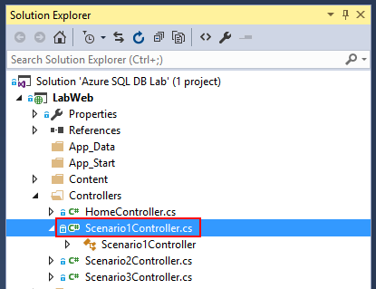


Press `F5` to compile and launch the web app. A browser window will appear. Navigate to "Scenario 1".
    
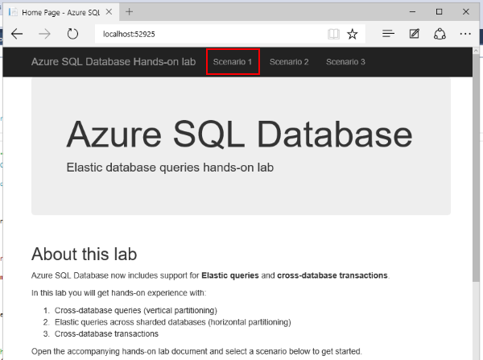 


Initially, the Scenario 1 page is hard-coded with the following query:

```sql
select 'external' as source, name from sys.external_tables;

select 'local' as source, name from sys.tables where schema_name(schema_id) = 'dbo';

select 'shard' as source, ServerName, DatabaseName from [__ShardManagement].[ShardsGlobal];
```

You now see the output of this query in the browser window. The first result set enumerates
the "external" tables configured in this database. We can see:

- Products
- Orders
- Order Details

The "Products" table is hosted in a separate database. The "Orders" and "Order Details" tables are
sharded across multiple databases using the CustomerId as a key.

The second result set enumerates all logical tables in this database. We can see one "real" table:

- Customers

And the three "external" tables:

- Products
- Orders
- Order Details

Finally, the third result set enumerates all the shard databases tracked by the Shard Map:

- CustomerOrders1
- CustomerOrders2
- CustomerOrders3
- CustomerOrders4
- CustomerOrders5
- ...

As you can see, there are a lot of shards - one for each customer!

> **Pro tip:** Sharding your data on an identifier like _Customer Id_ is a great pattern for 
> multi-tenant applications where you want to provide physical isolation between tenants. 

### Part Two

Let's modify the query to retrieve data from an external table.

Return to Visual Studio and stop debugging with **Debug > Stop Debugging**.

Open the `Scenario1Controller` class and replace the entire value of `CommandText` with the following:

```sql
select ProductName, QuantityPerUnit, UnitPrice, UnitsInStock from dbo.[Products]
```

E.g.

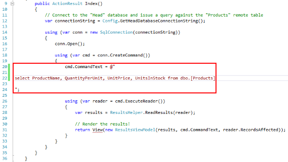

Re-build with `Ctrl-Shift-B` and refresh the browser window. You are now executing your
first cross-database elastic query!

To clarify - you have issued a SQL query to one database, called "Head". This database
has forwarded the query against the `Products` table to another database, called "Products".
The results have been aggregated by "Head" and returned.


### Part Three

Lets write a more interesting query - joining a "local" table with an "external" table.

Replace the value of `CommandText` with the following:

```sql
select c.CustomerCode, count(p.ProductId) as product_count
from dbo.[Products] p
join dbo.[Customers] c on c.CustomerId = p.SupplierId
group by c.CustomerCode
```

The "Customers" table is local to the Head database. "Products" is, of course, external.

Re-build with `Ctrl-Shift-B` and refresh the browser window. You should see a result like
the following:

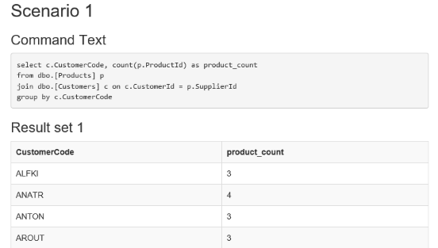


You have queried both a local table and an external table simultaneously!


### Final Notes

Cross-database queries are ideal for reporting against large, distributed data sets. They take the
pain out of writing distributed queries by allowing you to query remote tables as if they were local.

For information about how to set up your own databases for Elastic query, check out
[Getting started with cross-database queries (vertical partitioning)][getting-started-cross-database].


[getting-started-cross-database]: https://azure.microsoft.com/en-us/documentation/articles/sql-database-elastic-query-getting-started-vertical/


-----

## Scenario 2

In this scenario we will introduce **elastic queries across sharded databases**, which allows you to query
a remote table which is split across multiple physical databases.


### Part One

Return to Visual Studio, and navigate to the `Scenario2Controller` class.

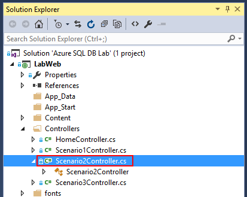


Initially, scenario 2 has the following query:

```sql
-- Query for all line items on all orders by a specific customer

select c.CustomerCode, o.OrderId, o.OrderDate, od.ProductID, p.ProductName, (od.Quantity * od.UnitPrice) as line_item_total
from [dbo].[Orders] o
left join [dbo].[Order Details] od on od.OrderId = o.OrderId
left join [dbo].[Products] p on p.ProductId = od.ProductId
left join [dbo].[Customers] c on c.CustomerId = o.CustomerId
where o.CustomerId = 25;
```
This finds order details for all orders placed by customer **#25**, and includes a calculated field.

This query covers a few local and external tables:

- **Customers** (local)
- **Products** (products database)
- **Orders** and **Order Details** (order shard databases)

Re-build with `Ctrl-Shift-B` and refresh the browser window. And we see the results:

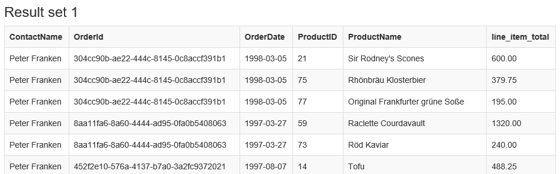
  

### Part Two

So we can execute a simple join. What about a more advanced query? Let's try an `aggregate` with a `group`:

Modify the value of `CommandText` with the following SQL: 

```sql
-- Count orders by customer

select c.CustomerId, c.CustomerCode, count(o.OrderId) as order_count
from [dbo].[Orders] o
left join [dbo].[Customers] c on c.CustomerId = o.CustomerId
group by c.CustomerId, c.CustomerCode
```

This counts the number of orders placed by each customer. Note that the count for each row will
aggregate correctly even if it covers rows across multiple databases.

E.g.

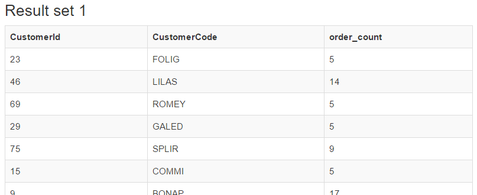


### Final Notes

When using the Elastic query function you can combine local tables, remote tables and sharded tables 
seamlessly into a single query.


-----

## Scenario 3

In this scenario we will introduce the Elastic Database client library, which allows us
to dynamically connect to the appropriate database shard based on a shard key. 

Finally we will introduce **distributed transactions**, wherein you may issue commands 
to multiple separate SQL Databases which are covered by a single logical transaction.

### Part One

First, let's insert some new orders into the order database shards. For this we will use the 
Elastic Database client library.

> **Note:** The Elastic Database client library is available on NuGet under the name
> `Microsoft.Azure.SqlDatabase.ElasticScale.Client`

Return to Visual Studio, and navigate to the `Scenario3Controller` class.


This controller is more complicated that the others as it is issuing queries directly against
the order shard databases.

Let's break the code down section by section. First, we include the "Elastic Database client library" namespace:

```csharp
using Microsoft.Azure.SqlDatabase.ElasticScale.ShardManagement
```

Next, inside the `GetOrderShardMap` factory function, we use the `ShardMapManagerFactory` class to connect to 
the Shard Map stored in the Head database:

```csharp
// The shard map is hosted on the "Head" database
var manager = ShardMapManagerFactory.GetSqlShardMapManager(headConnectionString, ShardMapManagerLoadPolicy.Eager);
```

Finally, we acquire the "shard map" for the order tables (identified by name):

```csharp
var shardMap = manager.GetListShardMap<int>("OrderShardMap");
```

> **Note:** In the example code we are using the .NET `Lazy<T>` class to statically cache the `ListShardMap<int>`
> instance which represents our Order shard map.
> 
> This is considered best practice and can significantly improve the performance of any routine which interacts
> with your shard databases.


The `shard map` is used to determine which shard database to connect to based on a key. In this case, the orders
and order details are sharded based on their "Customer Id". Each shard contains orders for a single customer, e.g.

- **CustomerOrders22** - Orders and order details for Customer 'FISSA' (Id 22)
- **CustomerOrders87** - Orders and order details for Customer 'WARTH' (Id 87)
- **etc...**

In this example we are inserting a new order for two hard-coded customers: "FISSA" and "WARTH". 
(See the two variables defined `firstCustomerId` and `secondCustomerId`) in the `CreateOrders` action method.

To connect to the appropriate shard for the first customer, we would do the following:

```csharp
var firstCustomerId = 22;
var shardConnectionString = "User ID=username;Password=password";

using (var conn = shardMap.OpenConnectionForKey(firstCustomerId, shardConnectionString))
{
    // Execute commands
}
```

The rest of the code is dealing with the details of creating a new order. We connect to each shard in turn 
and insert a new Order record and a few Order Detail records.

Let's try it out. Re-build with `Ctrl-Shift-B` and return to the browser window. Navigate to "Scenario 3".

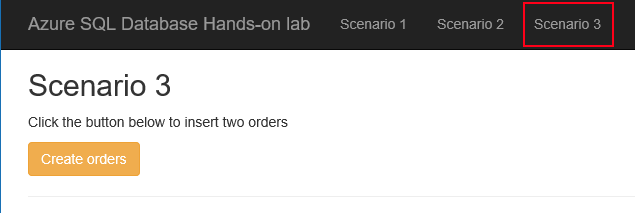

Press the "Create orders" button and wait for a success message.

> **Note:** The first execution may take some time while the shard map warms up.

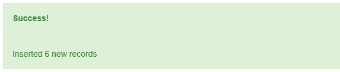

Return to the **Scenario 2** page where the query should still be "Count orders by customer". Scroll down the 
page to locate "FISSA" or "WARTH". Note that every time you press the **Create orders** button the order count
for these two customers will increment.

> **Pro tip:** You may wish to modify this query to filter the results to just the two customers we are
> interested in, e.g. `where c.CustomerId in (22, 87)`.

(Remember to re-build the solution with `Ctrl-Shift-B`)

E.g.

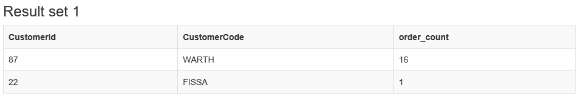


## Part Two

Next, we will introduce *distributed transactions* to the `CreateOrders` method.

This is done using the long-standing .NET `System.Transactions` API. Support for distributed
transactions with Azure SQL Database is included in **v4.6.1** of the .NET Framework.
_See the final notes below for more information._

Return to Visual Studio, and navigate to the `Scenario3Controller`.

Include the "System.Transactions" namespace at the top of the file:

```csharp
using System.Transactions;
```

Locate the comment `// OPEN TRANSACTION HERE` and replace it with the following snippet:

```csharp
using (var transaction = new TransactionScope())
```

Next, locate the comment `// COMMIT TRANSACTION HERE` and replace it with the following snippet:

```csharp
// Commit the transaction across both connections;
transaction.Complete();
```

Re-build the solution with `Ctrl-Shift-B` and return to Scenario 3. Press the **Create orders** button
to verify that the method still works.


## Part Three

You have introduced a distributed transaction to the code!

To see that the changes made to both databases are rolled back in the event of an error, add the
following line of code before the `transaction.Complete();` call:

```csharp
throw new InvalidOperationException("An unexpected application exception occured");
```

E.g.

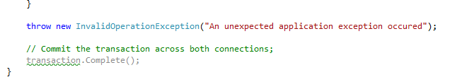

Now, whenever you click **Create orders** any changes to the order shard databases are rolled back after
the exception occurs. Try alternating between **Create orders** and the "Customer order count" 
query to see that the customer order count for "FISSA" and "WARTH" is only incremented when
`transaction.Complete()` is called.


## Final Notes

Azure SQL Database Elastic Transactions are available _only_ with .NET Framework **v4.6.1** or later.

If you are running an older version of the .NET Framework, you may receive an error like the following when attempting to open
a second connection under the transaction:

```
The Promote method returned an invalid value for the distributed transaction.
```


## Further reading

- [Elastic Database features overview][elastic-db-features]
- [Elastic Database Transactions with Azure SQL Database][elastic-db-transactions]

[elastic-db-features]: https://azure.microsoft.com/en-us/documentation/articles/sql-database-elastic-scale-introduction/
[elastic-db-transactions]: https://azure.microsoft.com/en-us/blog/elastic-database-transactions-with-azure-sql-database/ 