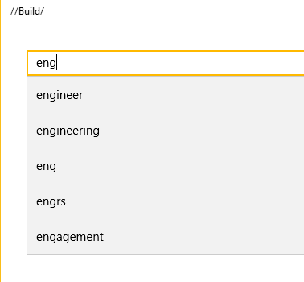

Using Azure Search Api
======================

## Overview

Azure Search is a fully managed search-as-a-service in the cloud. Azure Search offers scalable full-text search for your apps.

We will examine how quick and easy it is to execute searches with Azure Search, and what extra capabilities it offers us.

This hands-on lab will step you through the following features:

1. **Text Search** Using Azure Search to search through a collection of documents.
2. **Spell Corrected Search** Using Azure Search to automatically correct spelling mistakes.
3. **Autocomplete Search** Using Azure Search to complete partial query terms from a existing index. (Preview)
4. **Phonetic Search** Using Azure Search to use "sounds like" searching.
5. **Synonym Search** Using Synonyms in Azure Search (Preview)
6. **Filtering** Using Azure Search faceting features which make filtering simple.
7. **Geospatial** Using the built-in geospatial filtering makes it simple to do distance or perimeter searches.

### Scenario Overview

We have built an Azure Search index that contains jobs in New York City for the user to find. 

### About the code

This lab uses a simple Universal Windows Application as a test application. This simple application can be modified
in order to test the various features of Azure Search.

To begin, open the `Azure Search Lab.sln` solution in visual studio 2015 and press `F5` to compile and launch the 
Windows Universal application.

The lab is broken into three **Scenarios**.

> **Note:** The Azure Search index that we will be querying during this lab was created via the Azure Portal.
> For more information on the Azure Portal refer to the **Appendix** at the bottom of the page.


## Scenario 1

In this scenario we will introduce **Text Searching** and explain how to use **Spell Corrected Search** and **Phonetic Search**.

### Part One

To begin, run the application. You are presented with a blank application with a texbox at the top. Enter "engineer" 
into this text box and press `enter`. 

You will notice that you did not get any results - let's fix this.

Navigate to the `JobSearchService.cs` file.


Locate the following method:

```csharp
public async Task<DocumentSearchResult<JobResult>> ExecuteSearch(string query, List<FacetGroup> facets = null, PositionDistanceSearch geoSearch = null)
{
        //TO DO - Place holder for search
        return new DocumentSearchResult<JobResult>();
}
```

This is just placeholder code. Modify it so that it looks like this:

```csharp
public async Task<DocumentSearchResult<JobResult>> ExecuteSearch(string query, List<FacetGroup> facets = null, PositionDistanceSearch geoSearch = null)
{   
        var searchParameters = new SearchParameters()
        {
            QueryType = QueryType.Full,
            SearchMode = SearchMode.All,
        };
        using (var indexClient = GetClient())
        {
            return await indexClient.Documents.SearchAsync<JobResult>(query, searchParameters);
        }
}
```

Press `F5` to run the application, and type "engineer" into the search box. Press `enter`; you should be presented with a list of results.

E.g.


### Part Two

Clear the textbox and type "enginer" (**note** the spelling mistake). Press `enter` to search. 

Notice that the results are identical - Azure Search has automatically detected the spelling mistake and has included this corrected search term along with the original misspelled word.

E.g.


Clear the textbox and type "kownsil". Press `enter` to search. You will see results related to "counsel".

Azure Search supports phonetic ("sounds like") searching. With very little work, we have leveraged a very powerful search tool that we can use in our application.

You can learn more about how Azure Search enables phoenetic and spelling mistake handling in the [Azure Blog](https://azure.microsoft.com/en-us/blog/custom-analyzers-in-azure-search/)

E.g.


## Scenario 2
In this scenario we will introduce **Synonym Search** and **Autocomplete Search**.

### Part One
A common app feature is the "auto-complete" textbox. Azure Search auto-complete is currently in preview - let's see how it's done.

Stop running the application. Return to Visual Studio and navigate to `JobSearchService.cs`.

Locate the following method stub:

```csharp
public async Task<List<string>> ExecuteSuggest(string query)
{
        //TO DO - Place holder for suggest
        return new List<string>();
}
```

Modify the method to look like this:

```csharp
public async Task<List<string>> ExecuteSuggest(string query)
{
        // Query the Azure Search index for autocomplete suggestions
        var ap = new AutocompleteParameters()
        {
            UseFuzzyMatching = true,
            Top = 8
        };
        var results = await SuggestAutocompleteAsync(query, "sg", ap);
        // Extract the query plus autocomplete from the result set
        return results.Results.Select(e => e.QueryPlusText).Distinct().ToList();
}
```

You will notice that we are passing `sg` as the second parameter to the `SuggestAutocompleteAsync` method. This parameter names a "suggestor" that has been pre-created on the Azure Search 
index. A suggester determines which fields are scanned for suggested query terms. See [Suggesters](https://docs.microsoft.com/en-us/rest/api/searchservice/Suggesters) for more information.

As the autocomplete function is still in preview, the .Net Azure Search client does not yet support calls. The `SuggestAutocompleteAsync` function will call the azure rest enpoint directly.

Press `F5` to run the application. Type "eng" into the search box. As you type you should now see the auto complete list appear and suggest search terms to you.

E.g.



The function that was just enabled will now call the following rest endpoint to retrieve a list of words that match your partial search query.

```http
GET https://[service name].search.windows.net/indexes/[index name]/docs/autocomplete?[query parameters]  
api-key: [admin key]  
```

### Part Two

As part of the index we have uploaded the following set of synonyms to our Azure Search instance.

```Json
{  
   "name":"mysynonymmap",
   "format":"solr",
   "synonyms": "engineer, designer, planner, builder, architect, producer, fabricator, developer, creator"
}
```

The synonym map is then attached to the related fields in the search index. Queries against these fields will then begin returning results that are related to the synonyms in the map. 

To see this in action we have attached the synonym map above to our index. When you type 'Engineer' into the search box and press enter. The results should all show Engineer. This is because there are a overwleming amount of results in the index for Engineer.

Try typing the synonym 'Creator' into the searh box and press enter. You will notice that the results are more vairied as creator is not as used much in the result. 


> For more information on how to create and manage Azure Search Synonyms and attach them to your search index the documentation can be found [here](https://docs.microsoft.com/en-us/azure/search/search-synonyms-tutorial-sdk).

## Scenario 3

In this scenario we will introduce **Filtering / Faceting**.

### Part One

Now that we have basic search functionality, wouldn't it be nice to be able to filter the results further? Luckily this is also very easy with Azure Search using the
"facets" filtering feature.

Navigate to `JobSearchService.cs` and locate the `ExecuteSearch` method that we modified in Scenario 1. It should look like this:

```csharp
public async Task<DocumentSearchResult<JobResult>> ExecuteSearch(string query, List<FacetGroup> facets = null, PositionDistanceSearch geoSearch = null)
{   
        var searchParameters = new SearchParameters()
        {
            QueryType = QueryType.Full,
            SearchMode = SearchMode.All,
        };
        using (var indexClient = GetClient())
        {
            return await indexClient.Documents.SearchAsync<JobResult>(query, searchParameters);
        }
}
```

Add some facets to the query...

```csharp
Facets = FacetDefinitions.Select(e => e.Key).ToList()
```

...so the method looks like this:

```csharp
public async Task<DocumentSearchResult<JobResult>> ExecuteSearch(string query, List<FacetGroup> facets = null, PositionDistanceSearch geoSearch = null)
{   
        var searchParameters = new SearchParameters()
        {
            QueryType = QueryType.Full,
            SearchMode = SearchMode.All,
            Facets = FacetDefinitions.Select(e => e.Key).ToList()
        };
        using (var indexClient = GetClient())
        {
            return await indexClient.Documents.SearchAsync<JobResult>(query, searchParameters);
        }
}
```

**Note:** `FacetDefinitions` is a Dictionary already defined with the facet names and user-friendly display strings at the top of the class:

This allows you to retreive the number of results available for the categories Agency, Posting_Type and Civil_Service_Title which you can use to further filter the search results.  To learn more about how Facets work, please visit [https://azure.microsoft.com/en-us/documentation/articles/search-faceted-navigation/](https://azure.microsoft.com/en-us/documentation/articles/search-faceted-navigation/)

```csharp
        public static Dictionary<string, string> FacetDefinitions = new Dictionary<string, string>()
        {
            {"agency", "Agency"},
            {"posting_type", "Internal/External"},
            {"civil_service_title", "Common Job Title"}
        };
```

As you can see we are passing in three facets: `agency`, `posting_type` and `civil_service_title`. Let's run the application and see what this looks like. 

Press `F5` to start the application. Type "engineer" into the search box and press `enter`.

E.g.


Azure Search now returns a collection of _facets_ which the user can use to refine their query. We're rendering them on the UI as a list of checkboxes. 


### Part Two

Now that we have a collection of usable facets, we need to create a filter to ask Azure Search to refine our query.

Return to Visual Studio and open `JobSearchService.cs`. Go to the `ExecuteSearch` function and add this line:

```csharp
Filter = CreateFilter(facets, geoSearch)
```

...so that the method looks like this:

```csharp
public async Task<DocumentSearchResult<JobResult>> ExecuteSearch(string query, List<FacetGroup> facets = null, PositionDistanceSearch geoSearch = null)
{   
        var searchParameters = new SearchParameters()
        {
            QueryType = QueryType.Full,
            SearchMode = SearchMode.All,          
            Facets = FacetDefinitions.Select(e => e.Key).ToList(),
            Filter = CreateFilter(facets, geoSearch)
        };
        using (var indexClient = GetClient())
        {
            return await indexClient.Documents.SearchAsync<JobResult>(query, searchParameters);
        }
}
```

`CreateFilter` is a method that builds up a filter string for Azure Search. It loops through the given list of facets and encodes each one into the filter string.
This filter is written in OData expression syntax. 

Some examples of filters created by this method:

```
(agency eq 'DEPT OF HEALTH/MENTAL HYGIENE') and (posting_type eq 'Internal')
```
```
(agency eq 'DEPT OF HEALTH/MENTAL HYGIENE' or agency eq 'DEPT OF ENVIRONMENT PROTECTION' or agency eq 'DEPT OF DESIGN & CONSTRUCTION' or agency eq 'HOUSING PRESERVATION & DVLPMNT' or agency eq 'DEPT OF INFO TECH & TELECOMM')
```
```
(agency eq 'DEPT OF ENVIRONMENT PROTECTION') and (posting_type eq 'Internal') and (civil_service_title eq 'ASSOCIATE PROJECT MANAGER')
```

Press `F5` to run the application, then execute a search and try out filtering the results by selecting _facets_.


## Scenario 4

In this scenario we will introduce **Geospatial** filtering.

This allows you to filter results based on their proximity to a specific location or to find all results that are located within a specified boundary.  
In this example, we will use the location proximity to filter jobs that are located within a certain distance of a specified location.

### Part One

Azure Search supports geospatial searching if there is an field in your index of the `Edm.GeographyPoint` type. Let's see how easy it is to integrate
geospatial search into your queries.

Press `F5` to run the application and execute an empty search.

Next click on **Map Results** and you should see all the search results plotted on the map.

E.g


### Part Two

Lets add the geo spatial search to the filter.

Return to Visual Studio and open `JobSearchService.cs`. Locate the `CreateFilter` method.

Add this section of code before the final `return`. This code appends the geospatial filter if it has been provided.

```csharp
if (geoSearch != null)
{
    if (query.Length > 0)
    {
        query.Append(" and ");
    }
    var lat = geoSearch.GeoPoint.Position.Latitude;
    var lon = geoSearch.GeoPoint.Position.Longitude;
    query.Append($"geo.distance(geo_location, geography'POINT({lon} {lat})') le {geoSearch.Radius}");
}
```

Like the _facets_ filter, geospatial filtering is written in OData expression syntax. This is an example of a filter string that allows you to retrieve jobs located within 10KM of a point in New York city :

```
geo.distance(geo_location, geography'POINT(-73.9593882020563 40.7079201657325)') le 10
```

Press `F5` to run the application. Execute an empty search. 

Next click on the **Map Results** tab. and you should see all the search results plotted on the map.

Double click on the map to drop a "pin" and select a search radius from the drop-down menu.

E.g.


Click on **Filter Results**. You will see that the results have been filtered based on their geographical location!

E.g.


### Final Notes

If you would like to learn more about geospatial filtering then check out [Create a geospatial search app using Azure Search][geospatial-search].

You can also watch [Azure Search and Geospatial Data][channel9-geospatial] on Channel 9.

[geospatial-search]: https://azure.microsoft.com/en-us/documentation/articles/search-create-geospatial/
[channel9-geospatial]: https://channel9.msdn.com/Shows/Data-Exposed/Azure-Search-and-Geospatial-Data

## Further Reading

[https://azure.microsoft.com/en-us/documentation/articles/search-howto-stackexchange-data/](https://azure.microsoft.com/en-us/documentation/articles/search-howto-stackexchange-data/)

[Azure Search 101 - Getting started with Azure Search with Liam Cavanagh](https://azure.microsoft.com/en-us/documentation/videos/azure-search-101-getting-started-with-azure-search-with-liam-cavanagh/)

[What is Azure Search](https://azure.microsoft.com/en-us/documentation/articles/search-what-is-azure-search/)

[Search Documentation](https://azure.microsoft.com/en-us/documentation/services/search/)

[Synonym Search Preview](https://docs.microsoft.com/en-us/azure/search/search-synonyms)

## Appendix

The Azure Portal was used to create the Azure Search server. The Azure Portal can be found at [https://portal.azure.com/](https://portal.azure.com/).

Some features that you can use in Azure Portal with Azure Search include:


#### Overview

Allows you to view database settings and document/collection counts for your server.


#### Index Viewer

Allows you to view your indexes and the fields they include. You can also modify them from here.


#### Search Explorer

Test out your search and filter strings, and view the results.


