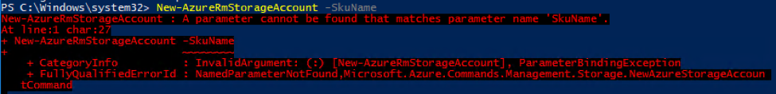
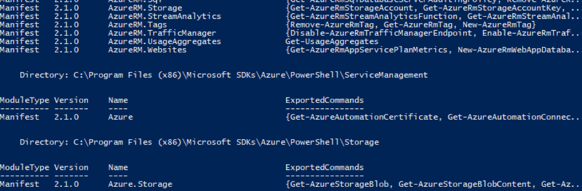
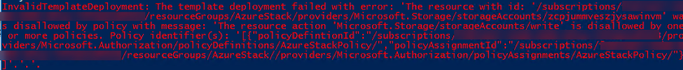
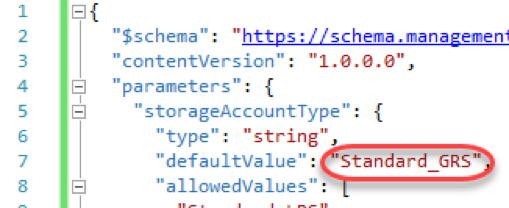

# Azure Stack

# Overview

Azure Stack allows you to bring the fast-paced innovations of cloud computing to your on-premise environment. In this quickstart challenge, you'll be using the Azure Stack policy module to simulate an Azure Stack environment by placing resource group constraints on the full-blown Azure cloud. As a result, you can develop using all of the tools and availability of the full Azure cloud with the confidence that your investment will apply to Azure Stack as well.

# Objectives

- Create an Azure resource group.
- Use the Azure Stack Policy module to constrain the resource group.
- Test the limits of the constrained resource group.

# Prerequisites

- Windows 10
- Azure subscription (Sign up for a free account [here](https://azure.microsoft.com/free/). Needs a Microsoft account)

# Intended Audience

This Quick Start Challenge is intended for developers who are familiar with Azure.

# Task 1: Install the Azure Stack Policy module

1. Open an instance of **PowerShell** from the taskbar. We can install and verify everything using PowerShell.
2. Azure Stack compatible AzureRM modules are installed through API version profiles. The AzureRM.Bootstrapper module provides PowerShell commands that are required to work with API version profiles. Execute the command below to install the bootstrapper. Allow it to install any required modules.
```
Install-Module -Name AzureRm.BootStrapper
```
3. While Azure Stack is designed to provide a very consistent experience to Azure cloud, there are going to be differences along the way related to what's supported. For example, Azure Stack only supports storage accounts that use locally-redundant data storage ( **Standard\_LRS** ). However, Azure cloud supports more options.
4. Open a new instance of **PowerShell**.
5. In the new instance, type the following command, but do not press **Enter**. Instead, press **Space** and then **Tab** when you get to the end of the text to invoke autocomplete.
```
New-AzureRmStorageAccount -SkuName
```
6. What you'll see is that the autocomplete provides a list of options that are available in Azure cloud. You can **Tab** multiple times to cycle through them all. Don't execute the command.

 

7. Close the second instance of PowerShell.
8. Execute the command below to install the **2017-03-09-profile** version of the AzureRM modules for Compute, Storage, Network, Key Vault, etc. Allow it to install any required modules. This will take a while since there are a lot of packages to download and install.

```
Use-AzureRmProfile -Profile 2017-03-09-profile
```

9. Now let's see what happens when you try to set the SKU type of a storage account. Execute the following command.

 ```
 New-AzureRmStorageAccount -SkuName
 ```

10. An error! That's because **SkuName** isn't even an option in this cmdlet for this profile because there is only one choice. As a result, it's not exposed as something to configure. Note that if you want to use the latest Azure cloud profile, its profile is named **"latest"**.

 

11. In addition to the AzureRM modules, you also need to install the Azure Stack-specific PowerShell modules such as **AzureStackAdmin** and **AzureStackStorage**. Execute the command below to do so. Allow it to install any required modules.
```
Install-Module -Name AzureStack -RequiredVersion 1.2.9
```

12. Execute the command below to confirm the installation of AzureRM modules.
```
Get-Module -ListAvailable | where-Object {$\_.Name -like "Azure\*"}
```

13. You should see a long list of available modules.

 

14. AzureStack-Tools is a GitHub repository that hosts PowerShell modules that you can use to manage and deploy resources to Azure Stack. Execute the commands below to download and extract the tools to **C:\AzureStack-Tools-master**.

**Important note:** the command below uses the tick (`) in order to break a PowerShell command into multiple lines for the sake of printing. It is very important that the line break occur immediately after the tick and that there are no empty lines between the tick and the next section of the command to execute. If you are pasting this or other commands into PowerShell and getting errors, try pasting them into notepad first and cleaning up the result so that it matches the structure below. Then paste that into PowerShell.

```
invoke-webrequest https://github.com/Azure/AzureStack-Tools/archive/master.zip `
      -OutFile master.zip
expand-archive master.zip -DestinationPath \. -Force
```

# Task 2: Creating an Azure resource group and applying policy

1. Execute the command below to switch to the Azure Stack tools directory.
```
cd \AzureStack-Tools-master
```

2. Execute the command below to import the Policy module.
```
import-module .\Policy\AzureStack.Policy.psm1
```

3. Execute the command below to sign in to your Azure account. Sign in when prompted.
```
Login-AzureRmAccount –EnvironmentName AzureCloud
```

4. In order to create a resource group, you'll need to specify a subscription ID. Execute the command below to get a list of subscriptions associated with your account.
```
Get-AzureRmSubscription
```

5. Make note of the name of the Azure subscription you would like to use for this lab.

 

6. Execute the command below to select the target subscription into context. All future commands will be executed against this newly selected subscription. Be sure to insert the name of your subscription where specified.
```
$s = Select-AzureRmSubscription -SubscriptionName "[Your subscription name]"
```

7. Execute the command below to create a new resource group named **"Azure Stack"**. This will be the resource group you constrain to support only what a real Azure Stack deployment will support.
```
$resourceGroup = New-AzureRmResourceGroup -Name "AzureStack" -Location "West US"
```

8. Execute the command below to create a new policy definition based on the default Azure Stack policy.
```
$policy = New-AzureRmPolicyDefinition -Name AzureStackPolicy `
      -Policy (Get-AzureStackRmPolicy)
```

9. Execute the command below to store the name of the resource group in the target variable. This will make it easier in the next step to build the path string to the resource group.
```
$rgName = $resourceGroup.ResourceGroupName
```

10. Execute the commands below to assign the newly created policy to the resource group. Now deployments will be restricted based on what Azure Stack supports.

```
 $subscriptionId = $s.Subscription.SubscriptionId
 New-AzureRmPolicyAssignment -Name AzureStackPolicy -PolicyDefinition $policy `
      -Scope /subscriptions/$subscriptionId/resourceGroups/$rgName
```

# Task 3: Deploying an offending template and adjusting it for Azure Stack

1. Execute the block below to attempt to deploy to a resource group based on the target template. The template itself is very simple and only defines a single storage account to be created. However, it requires a setting not available in Azure Stack, so it is destined to fail.

```
Try {
New-AzureRmResourceGroupDeployment -Name "TemplateDeployPSH" `
      -ResourceGroupName $resourceGroup.ResourceGroupName `
      -TemplateFile "C:\Labs\AZR07 - Azure Stack\azuredeploy.json" `
      -ErrorAction Stop
}
Catch {
Write-Host $\_.Exception.Message -ForegroundColor Red
}
```

2. The failure should happen almost immediately. Note that it specifies that something associated with the storage account creation defies the assigned policy.

 

3. Open **azuredeploy.json** in **Visual Studio.**
4. Locate the line with **Standard\_GRS** (around line 7). This setting (geo-redundant storage) is not available in Azure Stack, so the policy rejected it. Change it to **"Standard\_LRS"** (locally-redundant storage) and save the file.

 

5. Return to PowerShell and execute the deployment again. It should not fail this time. It may take a minute for the creation to complete. You now have a deployment up and running in Azure based on a template that will also work in your Azure Stack deployment.

 

# Summary

Congratulations on completing this Quick Start Challenge! In this lab, you've learned how to use the Azure Stack Policy module to constrain an Azure resource group to the capabilities available in Azure Stack.

# Additional Resources

If you are interested in learning more about this topic, you can refer to the following resources:

**Documentation** : [https://azure.microsoft.com/en-us/overview/azure-stack/](https://azure.microsoft.com/en-us/overview/azure-stack/)

**GitHub SDK** : [https://github.com/Azure/AzureStack-Tools](https://github.com/Azure/AzureStack-Tools)

**Team blog** : [https://azure.microsoft.com/en-us/blog/tag/azure-stack/](https://azure.microsoft.com/en-us/blog/tag/azure-stack/)
