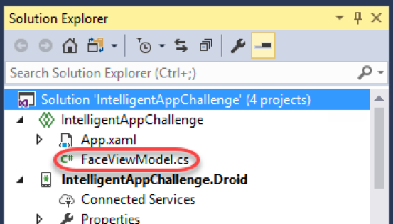
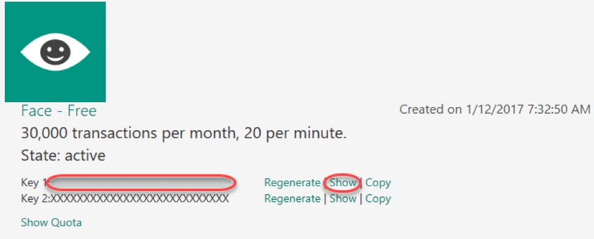
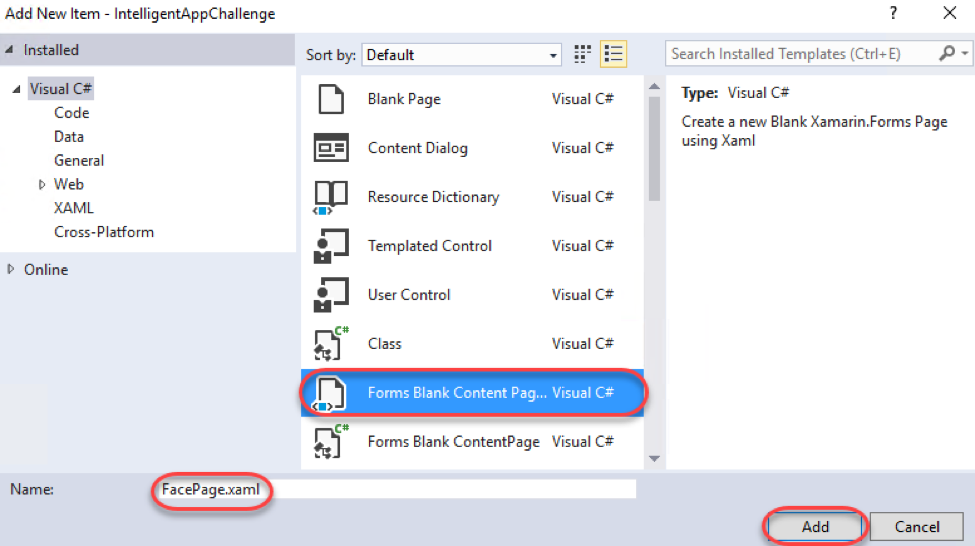
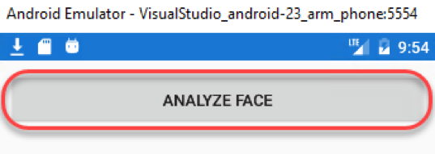
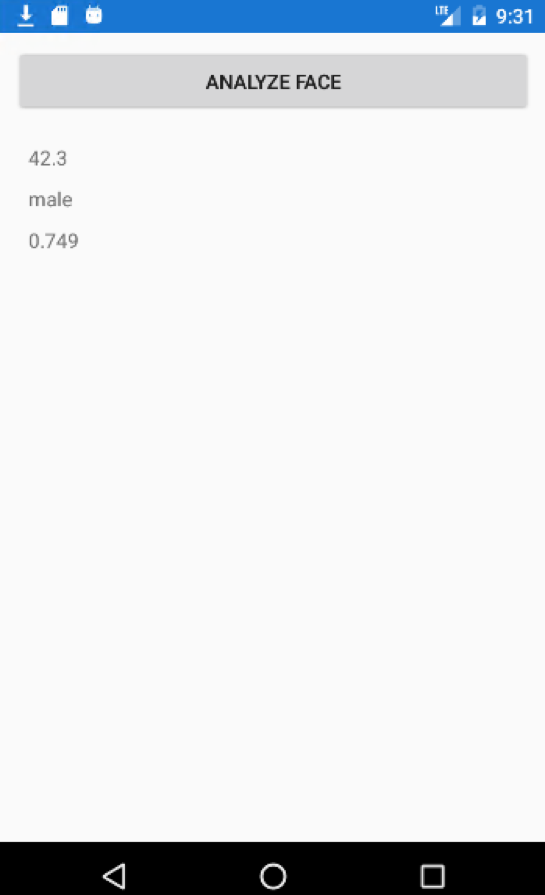

# Build Smarter Apps with Xamarin &amp; the Intelligent Cloud

# Overview

Microsoft Cognitive Services let you build apps with powerful algorithms using just a few lines of code. They work across devices and platforms such as iOS, Android, and Windows, keep improving, and are easy to set up.

In this Quick Start you will create an Android app that uses Cognitive Services to provide facial recognition on an image. It will then provide facial attributes such as the estimated age, smile, and gender.

# Objectives

- Integrate a Xamarin application with Microsoft Cognitive Services's Face API

# Prerequisites

- Windows 10
- Visual Studio 2017
- A Cognitive Services account with a Face API key (free trial at [https://www.microsoft.com/cognitive-services/en-us/face-api](https://www.microsoft.com/cognitive-services/en-us/face-api))

# Intended Audience

This Quick Start Challenge is intended for developers who are familiar with Xamarin.

# Task 1: Opening the solution and launching the Android emulator

1. Launch a new instance of **Visual Studio**.
2. Select **File | Open | Project/Solution** and select the solution file at **C:\Labs\DEV07 - Build Smarter Apps with Xamarin &amp; the Intelligent Cloud\IntelligentAppChallenge\IntelligentAppChallenge.sln**.
3. Close the **Xamarin Mac Agent** dialog if it opens.
4. Click the **Open Android Emulator Manager (AVD)** button from the toolbar. This is an Android SDK utility that can be used to launch the emulator. Since it can take a few minutes for the emulator to be ready, you'll kick that process off now so that it should be already available to deploy to later on.

 

5. Bring **Android Virtual Device (AVD) Manager** to the front (it will open behind Visual Studio).
6. Select the **ARM phone** emulator (it should be the first one) and click **Start**.

 

7. Click **Launch**.

 

8. It will take a few seconds for the emulator launch to complete. Once the boot process is underway, you'll see a **Close** button. Click it.

 

# Task 2: Extending the app

1. Return to Visual Studio. Leave the emulator open to load in the background.
2. The solution structure includes four projects: an Android platform project, an iOS platform project, a portable class library for working with Microsoft Cognitive Services, and a Shared Project **(IntelligentAppChallenge)** with all of the shared code. We will be working exclusively with the shared code in this lab. Although the provided solution has already been created, it's relatively empty at this time, except for a **FaceViewModel** class that has been provided to save time. We will now extend it to deliver an application that selects an image and implements the facial recognition method.
3. From **Solution Explorer** , open **FaceViewModel.cs**.

 

4. The first thing you'll notice is the empty **API\_KEY** constant. Insert your **Face API** key here. You can get this from [https://www.microsoft.com/cognitive-services/en-US/subscriptions](https://www.microsoft.com/cognitive-services/en-US/subscriptions) by clicking **Show** and copying the key for pasting into the code.

 

5. From **Solution Explorer** , right-click the **IntelligentAppChallenge** and select **Add | New Item**.

 

6. Select the **Forms Blank Content Page Xaml** template and enter a **Name** of **"FacePage.xaml"**. Click **Add**.

 

7. Insert the markup below into the **ContentPage** tag. It adds a button and some labels to hold the attributes of our analyzed face.

```
<ContentPage.Content>
	<StackLayout Padding="10" Spacing="10">
    	<Button Text="Analyze Face" Command="{Binding AnalyzeFaceCommand}" />
        <StackLayout Padding="10" Spacing="10">
        	<Label Text="{Binding Face.FaceAttributes.Age}" />
            <Label Text="{Binding Face.FaceAttributes.Gender}" />
            <Label Text="{Binding Face.FaceAttributes.Smile}" />
            <Label Text="" />
    	</StackLayout>
	</StackLayout>
</ContentPage.Content>
```

8. Open **FacePage.xaml.cs**.
9. Add the code below to the end of the **FacePage** constructor.
```
BindingContext = new FaceViewModel();
```

10. Open **App.xaml.cs**.
11. Replace the line setting **MainPage** with the line below. This will use our new page instead of the default.
```
MainPage = new FacePage();
```

12. As we saw in the previous XAML, there was a **Command** called **AnalyzeFaceCommand** on the **Button**. We will now wire this up to a method that will perform facial detection logic on our picture.
13. Open **FaceViewModel.cs** and add the property below to the class.
```
public Command AnalyzeFaceCommand { get; set; }
```

14. Add the line below to the end of the **FaceViewModel** constructor.
```
AnalyzeFaceCommand = new Command(async () => await AnalyzeFace());
```

15. Most of the work will happen in the **AnalyzeFace** method. Start it off by adding the stub code below to the class.
```
async Task AnalyzeFace()
{
}
```

16. Add the code below to the **AnalyzeFace** method. This code uses the **Plugin.Media** library to abstract photo functionality. If there is a camera available to use, it will use it. Otherwise, the user will pick a photo from the gallery. For the purposes of this lab, the camera check has been disabled to force the photo to be picked from the device.
```
await CrossMedia.Current.Initialize();

MediaFile photo;

// Disabling check for lab purposes.
if (false)

//if (CrossMedia.Current.IsCameraAvailable)
{
	photo = await CrossMedia.Current.TakePhotoAsync(
		new StoreCameraMediaOptions
		{
			Directory = "Facial Analysis",
			Name = "me.jpg"
		});
}
else
{
	photo = await CrossMedia.Current.PickPhotoAsync();
}
```

17. Once we have the photo, we will send it to the Face API service. The **FaceServiceClient** provides easy access to this via **DetectAsync**. The return object will include the face attributes. Note that we're only going to use the first face found, although the service can detect multiple. Add the code below to the end of the **AnalyzeFace** method.
```
using (var stream = photo.GetStream())
{
	var faceServiceClient = new FaceServiceClient(API\_KEY);
	var faces = await faceServiceClient.DetectAsync(stream,
	returnFaceAttributes: attributes);
	Face = faces[0];
}
```

# Task 3: Building and deploying the app to an emulator (or a device)

1. Press **F5** to build and run the project. The project has been configured to deploy the Android app to the emulator launched earlier, but you'd follow the same process for deploying to other platforms and/or real devices.
2. Switch over to the Android emulator. If you see this dialog, click **Wait**. Sometimes you need to click it twice.

 

3. The build and deploy process may take a few minutes. Once it's done, you'll be able to take it for a spin. If the app doesn't load correctly, return to Visual Studio and select **Debug | Stop Debugging**. This will keep the emulator running while you make changes to the project and redeploy. If you close the emulator, it will need to boot again.
4. When the app loads, click **Analyze Face** and select an image using **Photos** (opt to always use this app to select photos). You may alternatively download an image from the internet using the emulator's browser.

 

5. After analysis has completed, the results will be shown in the app. Your results may vary based on the image you selected.

 

# Summary

Congratulations on completing this Quick Start Challenge! In this lab, you've learned how to integrate the Face API with a Xamarin application.

# Additional Resources

If you are interested in learning more about this topic, you can refer to the following resources:

**Documentation** : [https://www.microsoft.com/cognitive-services](https://www.microsoft.com/cognitive-services)

**SDKs** : [https://www.microsoft.com/cognitive-services/en-us/sdk-sample](https://www.microsoft.com/cognitive-services/en-us/sdk-sample)

**Team blog** : [https://www.microsoft.com/cognitive-services/en-us/blog](https://www.microsoft.com/cognitive-services/en-us/blog)
