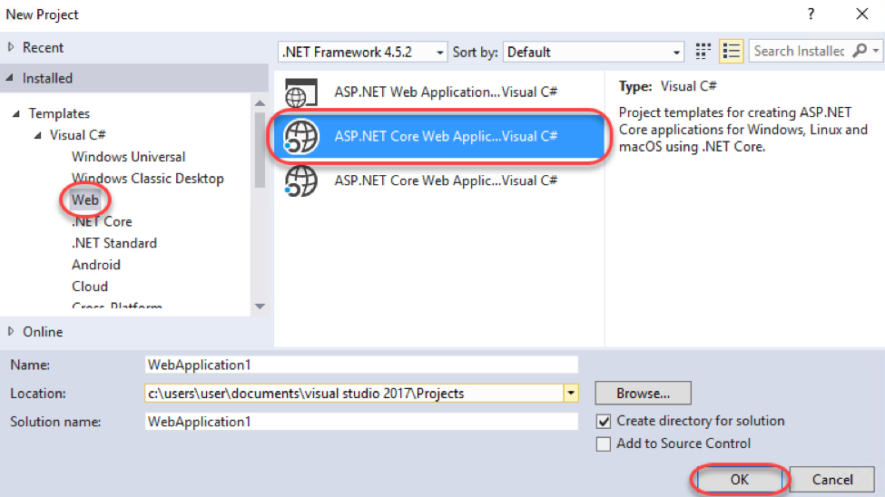
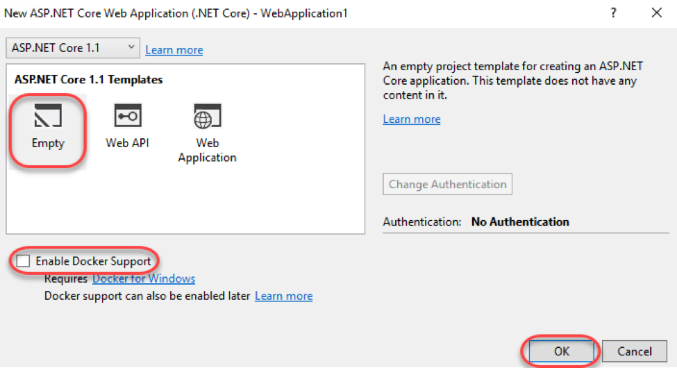
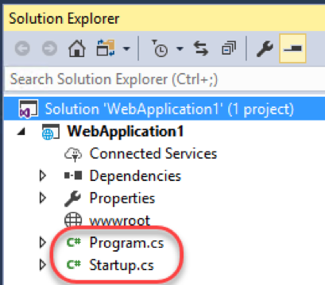
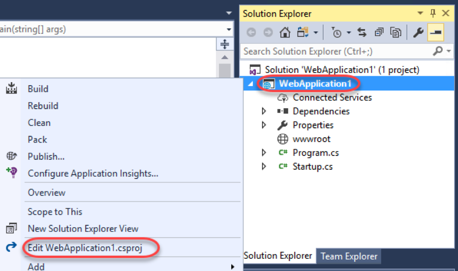
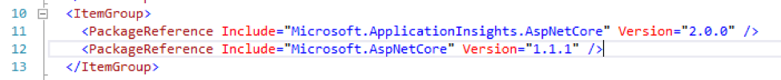
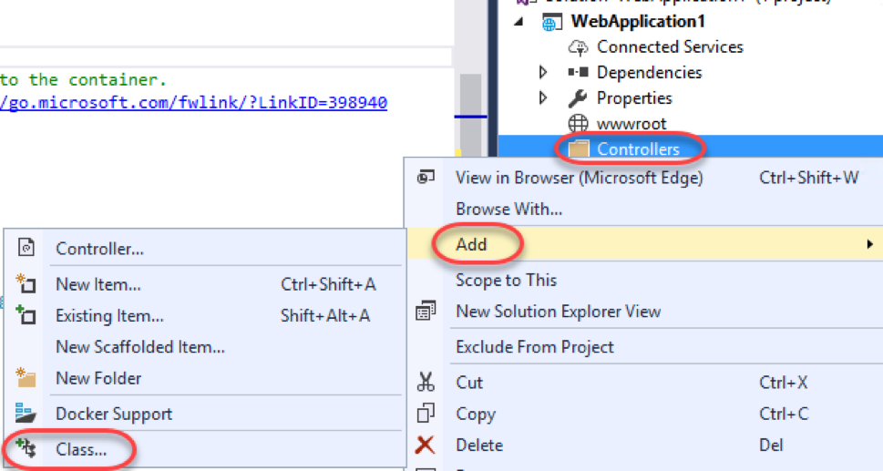
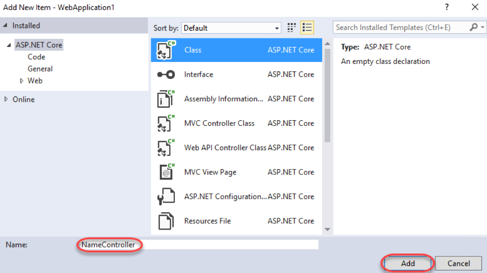
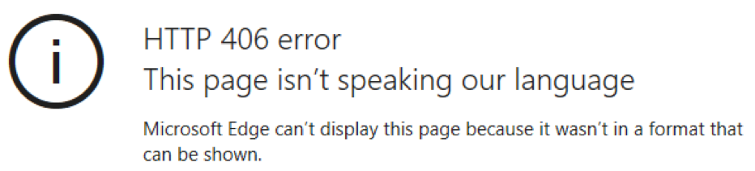
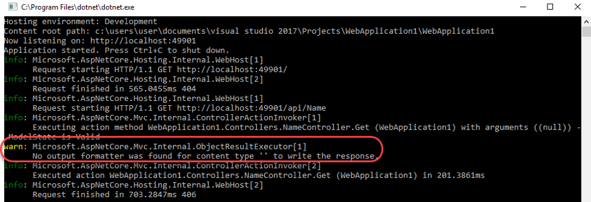
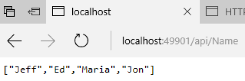

# Build a simple API with ASP.NET Core

# Overview

HTTP is not just for serving up web pages. It's also a powerful platform for building APIs that expose services and data. HTTP is simple, flexible, and ubiquitous. Almost any platform that you can think of has an HTTP library, so HTTP services can reach a broad range of clients, including browsers, mobile devices, and traditional desktop apps.

In this Quick Start, you will create a new empty ASP.NET Core application and extend it to expose a REST endpoint that returns a JSON result.

# Objectives

- Create an empty ASP.NET Core application
- Add a REST API
- Run the API application
- Add JSON support

# Prerequisites

- Windows 10
- Visual Studio 2017

# Intended Audience

This Quick Start Challenge is intended for developers who are familiar with ASP.NET with C#. Experience with ASP.NET Core is not required.

# Task 1: Create an ASP.NET Core web application

1. Launch an instance of **Visual Studio**.
2. Select **File | New | Project**.
3. Select the **Visual C# | Web** category and the **ASP.NET Core Web Application** template. Leave the default name and click **OK**.

 

4. Select the **Empty** template and make sure **Docker Support** is not selected. Click **OK**.

 

# Task 2: Add a REST API

1. Since this project was created using the **Empty** template, it really only has the bare minimum required to get up and running. If you'd like to learn more about the **Program.cs** , please check out the lab on creating your first ASP.NET Core application. If you'd like to learn more about **Startup.cs** , please see the lab on ASP.NET startup, configuration, and middleware.

 

2. In **Solution Explorer** , right-click the project node and select **Edit WebApplication1.csproj**.

 

3. In this extremely lean project, note that only two packages are referenced to build against. This provide the absolute minimum for ASP.NET Core and its associated Application Insights.

 

4. Add the following package reference to the end of the group to add baseline MVC support and **Save** the file. Keep it open for use again later.
```
<PackageReference Include="Microsoft.AspNetCore.Mvc" Version="1.1.2" />
```

5. Open **Startup.cs**.
6. Add the following code to the **ConfigureServices** method to enable MVC in the app.
```
AddMvcCore();
```

7. From the **Configure** method, delete the following template code.

```
app.Run(async (context) =>
{
	await context.Response.WriteAsync("Hello World!");
});
  ```

8. Replace the code above with the following code to instruct the application to answer when MVC requests are received.
```
UseMvcWithDefaultRoute();
```

9. In **Solution Explorer** , add a new folder to the project named **Controllers**. This folder name is the common convention ASP.NET MVC uses to locate controllers to handle incoming requests.
10. Next, you'll need to add a controller to the project. For the purposes of this lab, the controller should be added as a simple class that follows the naming convention (as opposed to being added as a controller with scaffolding). Right-click the **Controllers** folder and select **Add | Class**.

 

11. Set the **Name** to **"NameController"** and click **Add**.

 

12. Add the following attribute to the declaration of the **NameController** class. This instructs the MVC infrastructure to route requests to this controller based on its name. By convention, the route will be **api/Name**.
```
[Microsoft.AspNetCore.Mvc.Route("api/[controller]")]
```

13. Add the following method to the class. By convention, this method will be called when the **GET** verb is used in requests to this route.
```
public string[] Get()
{
	return new[] { "Jeff", "Ed", "Maria", "Jon" };
}
```

# Task 3: Running the API application

1. Since the application is based on ASP.NET Core, there are several options for hosting. From the **Run** dropdown, select **WebApplication1** (or the name of your project) to self-host. This will provide a console that can be used for debugging.

 

2. Press **F5** to build and run the application.
3. Since there is nothing configured for the default route **("/")**, the default request to that page will return a **404** since nothing is found to return.

 

4. Append **"/api/Name"** to the URL (such as [http://localhost:49901/api/Name](http://localhost:49901/api/Name), although your port may vary) and navigate. Note that this time, the HTTP error is **406** , which indicates that the server doesn't have a way to answer the request in a format appropriate for the client.

 

5. Bring up the server console and locate the **warn** line. This error indicates that the server doesn't know how to format the data exposed by the API.

 

6. Close the console to end the debug session.

# Task 4: Adding a JSON formatter

1. Return to **Visual Studio** and open the **csproj** file again. You can easily add support for formats by including their respective packages.
2. Insert the line below to the end of the package list and **Save** the file. This will add formatting support for JSON. Note that there is also ready-made support for formatting as XML available in another package.
```
<PackageReference Include="Microsoft.AspNetCore.Mvc.Formatters.Json" Version="1.1.2" />
```

3. Open **Startup.cs** and locate the **ConfigureServices** method you edited earlier. Update the line of code to also call **AddJsonFormatters** as shown below.
```
services.AddMvcCore().AddJsonFormatters();
```

4. Press **F5** to build and run the application.
5. The browser window to the API page should still be open. If not, navigate back to it by appending **"/api/Name"** to the URL. You should now see the raw data, which is available because the server now has support for an appropriate formatting thanks to the addition of its package.

 

# Summary

Congratulations on completing this Quick Start Challenge! In this lab, you've learned how to create an ASP.NET Core API application.

# Additional Resources

If you are interested in learning more about this topic, you can refer to the following resources:

**Documentation** : [https://www.asp.net/core](https://www.asp.net/core)

**GitHub** : [https://github.com/aspnet](https://github.com/aspnet)

**Team blogs** : [https://weblogs.asp.net](https://weblogs.asp.net)
