# Build and Test, See how Mobile Center helps you ship apps faster

# Overview

Mobile Center brings together multiple services, commonly used by mobile developers, into a single, integrated product. You can build, test, distribute, and monitor your mobile apps and easily add backend cloud services to scale your app to millions of users on demand.

# Objectives

- Fork a GitHub project.
- Link a GitHub account with Mobile Center.
- Set up an automated build and test of a mobile project.
- Review build and test results.

# Prerequisites

- A GitHub account ( [http://github.com](http://github.com))

# Intended Audience

This Quick Start Challenge is intended for developers who are familiar with the process of mobile development. It does not require any experience with development itself.

# Task 1: Fork a copy of the demo project

1. Log in to your GitHub account at [https://github.com](https://github.com).
2. Search for the **"myweather.forms"** repo.

 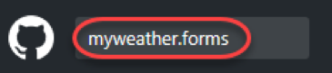

3. There may be several results. Select the one under **jamesmontemagno**.

 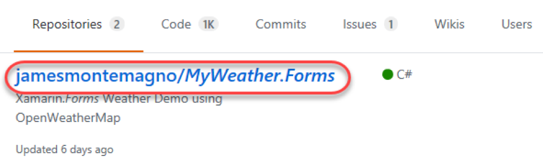

4. **Fork** the project into your own account. You now have your own copy to work with.

 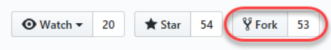

# Task 2: Set up a build in Mobile Center

1. Open a new browser tab and navigate to the **Mobile Center** at [https://mobile.azure.com](https://mobile.azure.com).
2. Click **Connect with GitHub**. This is the easiest way to link your accounts so that Mobile Center has access to your projects.

 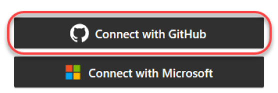

3. If this is the first time you're connecting via GitHub, you'll be asked to consent to some permissions requests. Click **Authorize application**.

 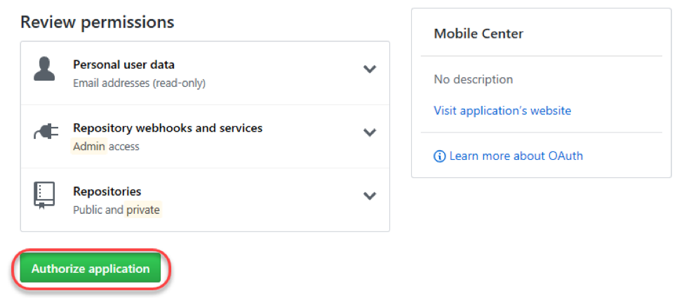

4. Click **Add new app**.

 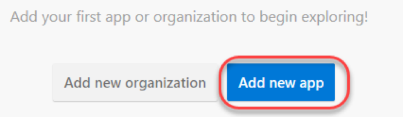

5. Enter **"MyWeather-Android"** as the **Name** of the project and select **Android** and **Xamarin**.

 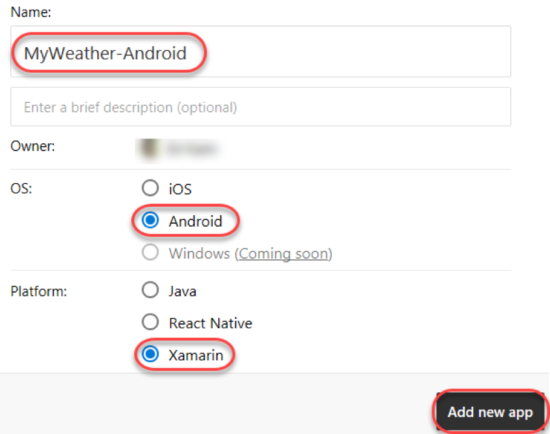

6. From the left-hand navigation, select the **Build** tab.

 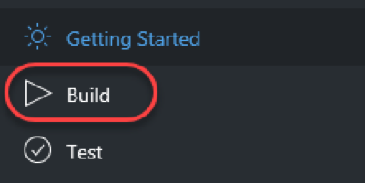

7. Select the **GitHub** option.

 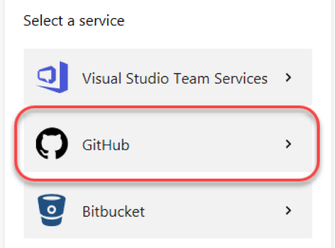

18. Select the **MyWeather.Forms** project.

 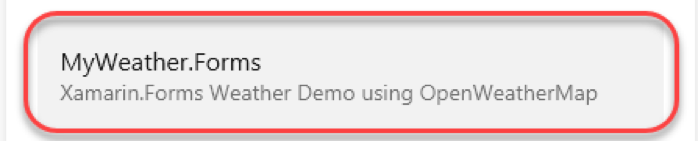

9. Select the **master** branch.

 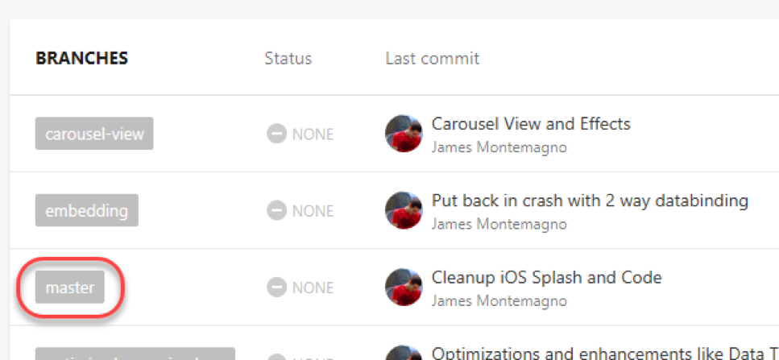

10. Click **Set up branch**.

 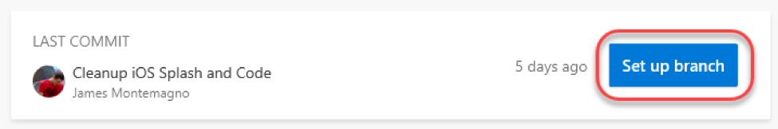

11. Select the **Release** configuration.

 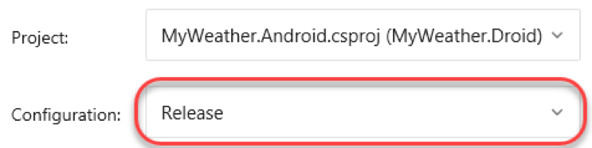

12. Enable the option to **Sign builds**. As part of this, you'll need to upload the **Build.keystore** file available in the **C:\Labs** directory under the code for this lab. Both passwords are **"Build\*1234"** and the **Alias** is **"Build2016"**.

 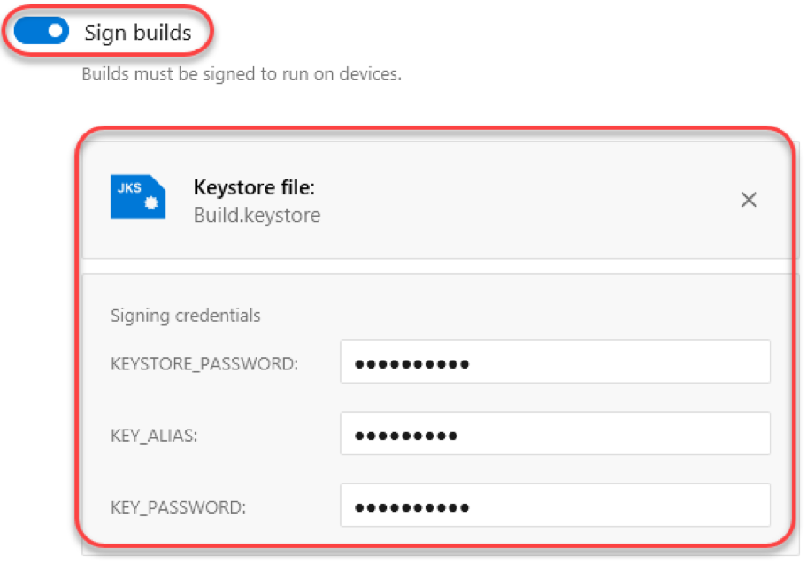

13. If available, select the option to **Start your trial now!**.

 

14. Select the option to **Run a lunch test on a device**. This will validate that the build loads as expected. Note that it does take around ten minutes. Also select **Distribute builds** to notify group members when a build becomes available. Click **Finish setup** to kick off the first build.

 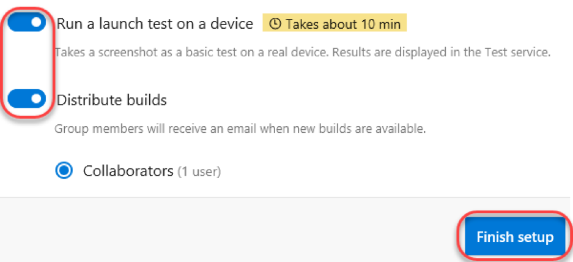

15. It will take some time for the build to complete.

 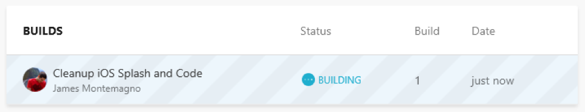

# Task 3: Review build and test results

1. Once the build has completed, select it.

 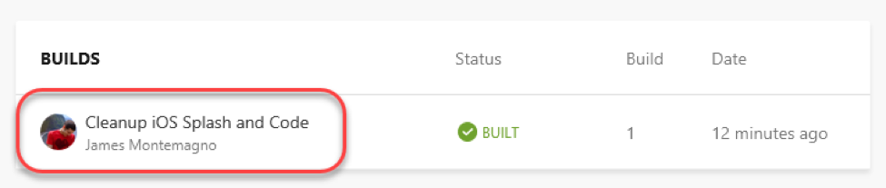

2. You can review the details of the build, including full build output.

 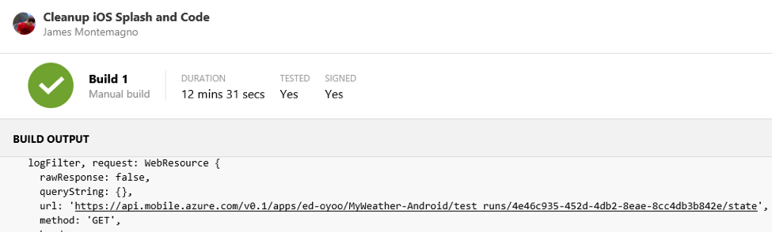

3. Select the **Test** tab.

 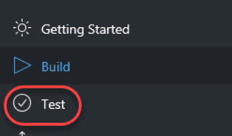

4. Select the most recent test run.

 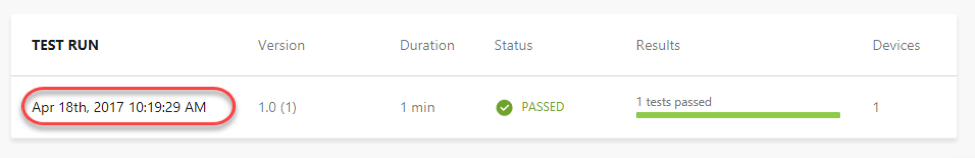

5. The test run included only one test, so click **App Launches Test**.

 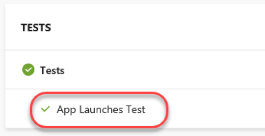

6. The test review page provides a screenshot of the end of the test, along with defaults on what device was used and information about memory and CPU usage. (Want a free t-shirt? Take a screenshot of this page and follow the instructions at the end of the lab.)

 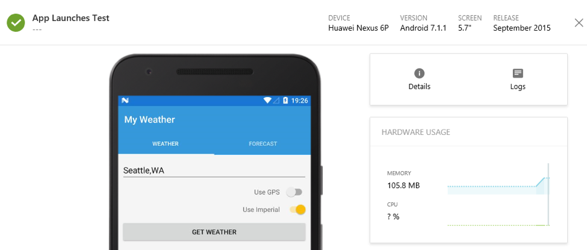

7. Select the **Distribute** tab and note that one tester (you) are included on the distribution.

 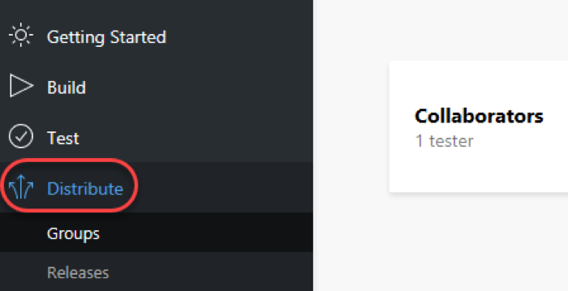

8. If you check the email associated with your account (probably your GitHub email), you'll see a new message from **Visual Studio Mobile Center** announcing the new build's availability. You could then click through to learn more and get the new build.

 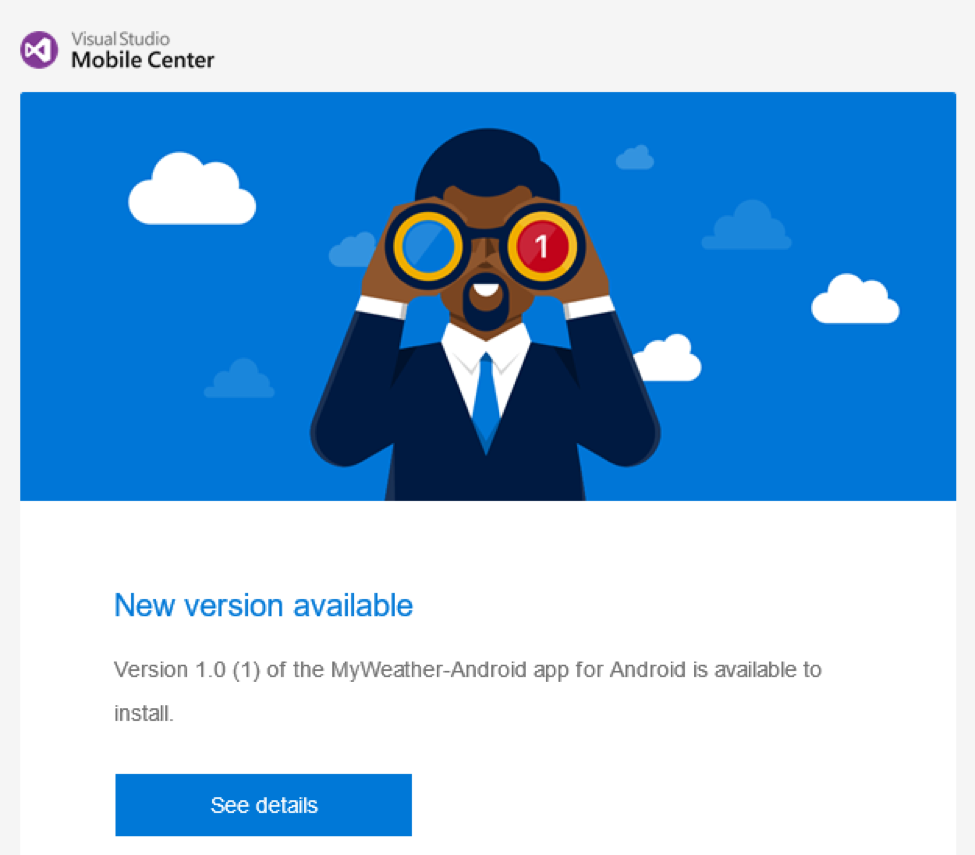

9. Want a sweet new **Mobile Center t-shirt**? Take a screen shot of your successful launch test and tweet it out to **#build2017 @MobileCenter**. Then show the booth staff and they'll hook you up!

 

# Summary

Congratulations on completing this Quick Start Challenge! In this lab, you've learned how to use Mobile Center to set up an automated build, test, and distribution workflow—and all in only a few minutes!

# Additional Resources

If you are interested in learning more about this topic, you can refer to the following resources:

**Documentation** : [https://docs.microsoft.com/en-us/mobile-center/](https://docs.microsoft.com/en-us/mobile-center/)

**GitHub SDK** : [https://github.com/Microsoft/mobile-center-sdk-dotnet](https://github.com/Microsoft/mobile-center-sdk-dotnet)

**Team blog** : [https://blogs.msdn.microsoft.com/visualstudio/tag/visual-studio-mobile-center/](https://blogs.msdn.microsoft.com/visualstudio/tag/visual-studio-mobile-center/)
