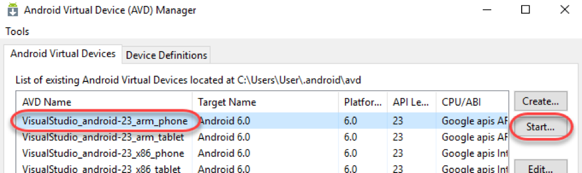
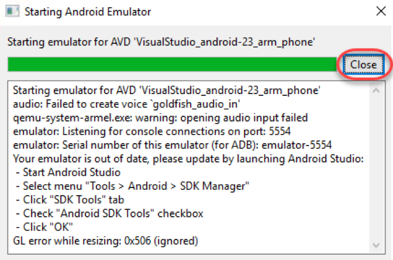
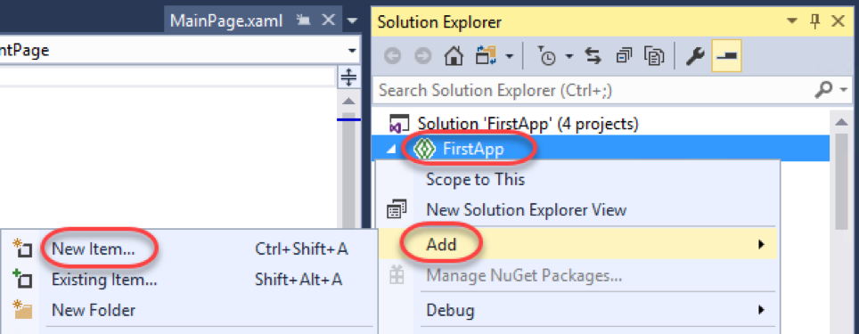
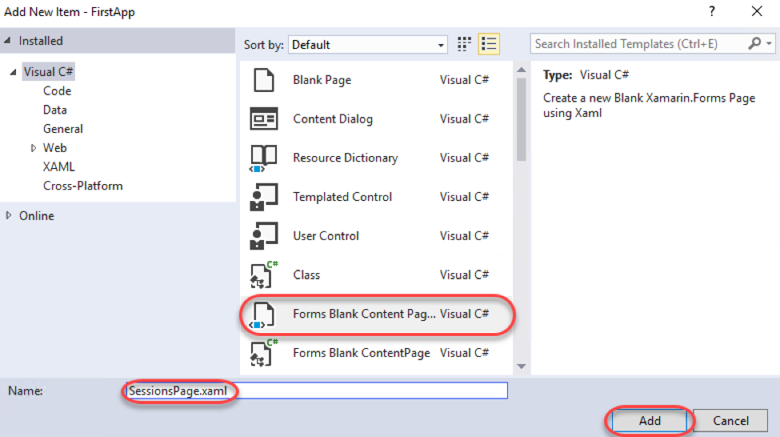
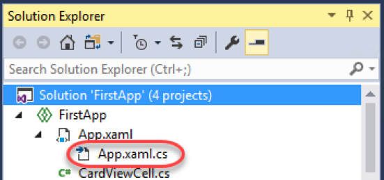
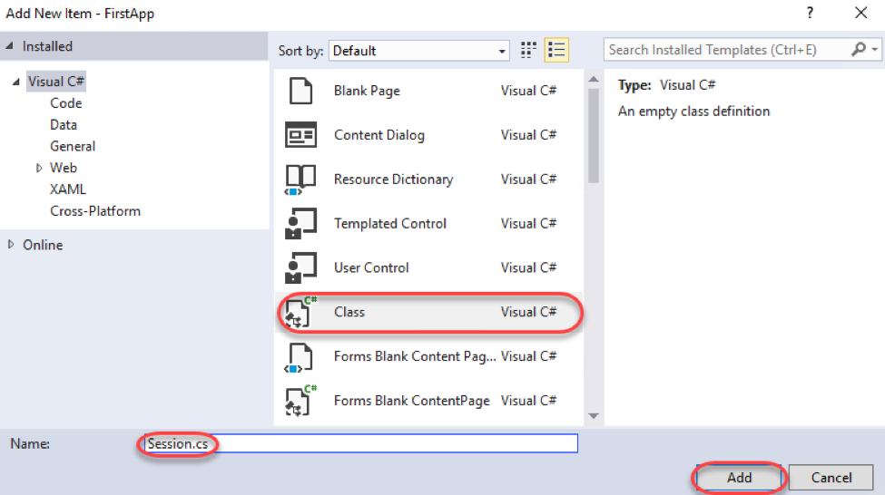
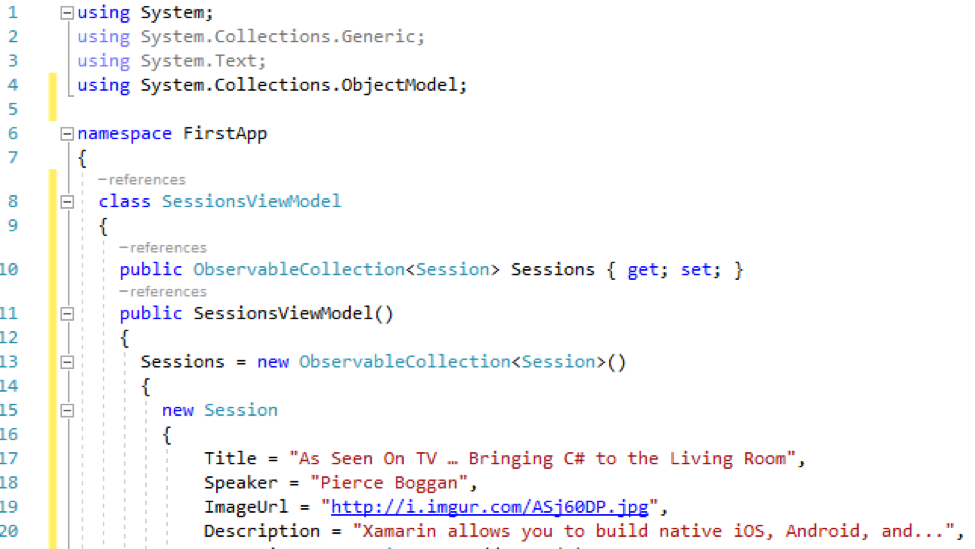
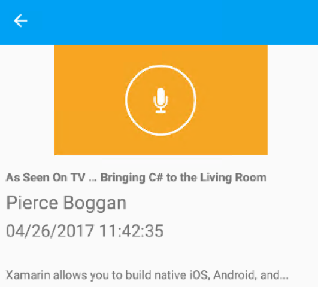

# Building Your First Mobile App for iOS, Android, and Windows

# Overview

Visual Studio and Xamarin enable you to deliver native Android, iOS, and Windows apps, using existing skills, teams, and code. You can use the same IDE, language, and APIs everywhere to build native apps for multiple platforms on a shared C# codebase.

In this lab you will build a lightweight version of a conference app using the model-view-viewmodel (MVVM) pattern. It includes a list of sessions a user can attend and selecting a session will give the user more details on that session. The application includes native projects for iOS, Android, and UWP.

# Objectives

- Extend the sample app to support basic conference features across devices

# Prerequisites

- Windows 10
- Visual Studio 2017

# Intended Audience

This Quick Start Challenge is intended for developers who are familiar with C# and Visual Studio.

# Task 1: Opening the solution and launching the Android emulator

1. Launch a new instance of **Visual Studio**.
2. Select **File | Open | Project/Solution** and select the solution file at **FirstApp.sln** (contained in the **src/FirstApp/** folder in this repo).
3. Close the **Xamarin Mac Agent** dialog if it opens.
4. Click the **Open Android Emulator Manager (AVD)** button from the toolbar. This is an Android SDK utility that can be used to launch the emulator. Since it can take a few minutes for the emulator to be ready, you'll kick that process off now so that it should be already available to deploy to later on.

 

5. Bring **Android Virtual Device (AVD) Manager** to the front (it will open behind Visual Studio).
6. Select the **ARM phone** emulator (it should be the first one) and click **Start**.

 

7. Click **Launch**.

 

8. It will take a few seconds for the emulator launch to complete. Once the boot process is underway, you'll see a **Close** button. Click it.

 

# Task 2: Extending the app

1. Return to Visual Studio. Leave the emulator open to load in the background.
2. The solution structure includes four projects: an Android platform project, an iOS platform project, a UWP platform project, and a Shared Project **(FirstApp)** with all of the shared code. We will be working exclusively with the shared code in this lab. Although the provided solution has already been created, it's relatively empty at this time. We will now extend it to deliver an application that shows the conference sessions and details.
3. In **Solution Explorer** , right-click the **FirstApp** node and select **Add | New Item**. You will add a few files to this project during this lab, and they'll all follow this general flow.

 

4. Select the **Forms Blank Content Page Xaml** template and set the **Name** to **"SessionsPage.xaml"**. Click **Add**.

 

5. **SessionsPage** will ultimately replace the default **MainPage** , so open **App.xaml.cs**.

 

6. Locate the **App()** constructor and replace the line setting **MainPage** with the code below.
```
MainPage = new NavigationPage(new SessionsPage());
```

7. Right-click the **FirstApp** node in **Solution Explorer** and select **Add | New Item** like before. This time, add a new **Class** named **Session**. This will serve as the model for each conference session.

 

8. Replace the default empty class declaration with the following.
```
public class Session
{
	public string Title { get; set; }
	public string Speaker { get; set; }
	public string ImageUrl { get; set; }
	public string Description { get; set; }
	public DateTime StartTime { get; set; }
	public DateTime EndTime { get; set; }
}
```

9. Add another class to the shared **FirstApp** project named **SessionsViewModel.cs**. This will serve as the viewmodel for the conference session list and bind each session model to the user interface.
10. Add a **using** directive for **System.Collections.ObjectModel** to the top of the file.
```
using System.Collections.ObjectModel;
```

11. Add an **ObservableCollection** property named **Sessions** to the view model using the code below.
```
public ObservableCollection<Session> Sessions { get; set; }
```

12. Add the constructor below to initialize the collection with some demo data.
```
public SessionsViewModel()
{
	Sessions = new ObservableCollection<Session>()
	{
		new Session
		{
			Title = "As Seen On TV … Bringing C# to the Living Room",
			Speaker = "Pierce Boggan",
			ImageUrl = "http://i.imgur.com/ASj60DP.jpg",
			Description = "Xamarin allows you to build native iOS, Android, and...",
			StartTime = DateTime.Now.AddHours(1),
			EndTime = DateTime.Now.AddHours(3)
		},
		new Session
		{
			Title = "Designing for Touch",
			Speaker = "James Montemagno",
			ImageUrl = "http://i.imgur.com/UPhZonl.jpg",
			Description = "Xamarin allows you to build native iOS, Android, and...",
			StartTime = DateTime.Now.AddHours(1),
			EndTime = DateTime.Now.AddHours(3)
		},
		new Session
		{
			Title = "Google Fit, Android Wear, and Xamarin",
			Speaker = "Chris Hardy",
			ImageUrl = "http://i.imgur.com/XT8VHMf.jpg",
			Description = "Xamarin allows you to build native iOS, Android, and...",
			StartTime = DateTime.Now.AddHours(1),
			EndTime = DateTime.Now.AddHours(3)
		},
		new Session
		{
			Title = "Effective iOS Memory Management",
			Speaker = "Joseph Hill",
			ImageUrl = "http://i.imgur.com/YDEv0oz.jpg",
			Description = "Xamarin allows you to build native iOS, Android, and...",
			StartTime = DateTime.Now.AddHours(1),
			EndTime = DateTime.Now.AddHours(3)
		},
		new Session
		{
			Title = "Creating Custom Layouts",
			Speaker = "Nat Friedman",
			ImageUrl = "http://i.imgur.com/DbZlxvM.jpg",
			Description = "Xamarin allows you to build native iOS, Android, and...",
			StartTime = DateTime.Now.AddHours(1),
			EndTime = DateTime.Now.AddHours(3)
		},
	};
}
```

13. Your final class should start something like the code below.

 

14. Open **SessionsPage.xaml**. This will serve as the view for our model **(Session)** and viewmodel **(SessionsViewModel)**.
15. Replace the contents of the file with the code below so that it is aware of our custom controls (the **xmlns:local** ) and has a proper **Title**.
```
<ContentPage xmlns="http://xamarin.com/schemas/2014/forms"
	xmlns:x="http://schemas.microsoft.com/winfx/2009/xaml"
	xmlns:local="clr-namespace:FirstApp;assembly:FirstApp"
	x:Class="FirstApp.SessionsPage"
	Title="Build 2017">
</ContentPage>
```

16. Insert the declaration of the **ContentPage.Content** property within the **ContentPage** tag. This will allow you to set that property using nested XAML.
```
<ContentPage.Content>
</ContentPage.Content>
```

17. Insert the **ListView** below within the **ContentPage.Content** tag. This will bind to a session list we'll configure next and display each item based on the provided template via **ItemTemplate**. In this case, the template is simply an instance of a control provided to offer a nicer user experience. Also notice the **ItemTapped** event is wired up to a method we'll need to implement later as well. There are also some additional properties being set. **HasUnevenRows** is set to **true** so that items can have different heights depending on the size they need. **SeparatorVisibility** is set to **None** so that there is no separator between cells.
```
<ListView ItemsSource="{Binding Sessions}"
	HasUnevenRows="true"
	SeparatorVisibility="None"
	ItemTapped="Handle\_ItemTapped">
	<ListView.ItemTemplate>
		<DataTemplate>
			<local:CardViewCell Text="{Binding Title}" Detail="{Binding Speaker}" ImageSource="{Binding ImageUrl}"/>
		</DataTemplate>\
	</ListView.ItemTemplate>
</ListView>
```

18. The final XAML file should start as shown below. Note that the main advantage of using XAML is that it helps keep a clean separation of markup and code using the MVVM pattern. You can then concentrate on the behavior of your application and let a design team handle the rest.

 

19. Open **SessionsPage.xaml.cs**.
20. Add the following line to the end of the constructor to set up the data binding source.
```
BindingContext = new SessionsViewModel();
```

21. Add the **Handle\_ItemTapped** method below to provide a handler for when items are tapped. There will be an error in the code because **SessionDetailPage** has not yet been created. We'll do that next.
```
async void Handle\_ItemTapped(object sender, Xamarin.Forms.ItemTappedEventArgs e)
{
	var session = (Session)e.Item;
	await Navigation.PushAsync(new SessionDetailPage(session));
}
```

22. Add another **Forms Blank Content Page Xaml** file to the shared project and name it **SessionDetailPage.xaml**.
23. Add the markup below inside the **ContentPage** tag. Note that this also uses data binding for virtually every field. We will need to set the source next.
```
<ContentPage.Content>
	<StackLayout VerticalOptions="StartAndExpand">
		<Image Source="{Binding ImageUrl}" />
		<StackLayout Padding="10" Spacing="5">
			<Label Text="{Binding Title}" Font="25,Bold" />
			<Label Text="{Binding Speaker}" FontSize="22" />
			<Label Text="{Binding StartTime}" FontSize = "20" />
			<Label Text="{Binding CreationDate, StringFormat='{0:HH:mm:ss}'}" />
			<Label Text="{Binding Description}" LineBreakMode="WordWrap" />
		</StackLayout>
	</StackLayout>
</ContentPage.Content>
```

24. Open **SessionDetailPage.xaml.cs**.
25. Add the following property to the class. It will represent a session and be our data source.
```
public Session Session { get; set; }
```

26. Add an overloaded constructor that accepts a **Session** parameter as shown below. It will set up the data binding relationship based on the parameter passed in.
```
public SessionDetailPage(Session session)
{
	InitializeComponent();
	
	Session = session;
	BindingContext = Session;
}
```

27. Open **App.xaml**.
28. Insert the markup below inside the **Application.Resources** tag. This is just some styling to make the final product a little nicer.
```
<ResourceDictionary>
	<Style TargetType="NavigationPage">
		<Setter Property="BarBackgroundColor" Value="#00a1f1" />
		<Setter Property="BarTextColor" Value="White" />
	</Style>
</ResourceDictionary>
```

# Task 3: Building and deploying the app to an emulator (or a device)

1. Press **F5** to build and run the project. The project has been configured to deploy the Android app to the emulator launched earlier, but you'd follow the same process for deploying to other platforms and/or real devices.

2. Switch over to the Android emulator. If you see this dialog, click **Wait**. Sometimes you need to click it twice.

 

3. The build and deploy process may take a few minutes. Once it's done, you'll be able to take it for a spin. If the app doesn't load correctly, return to Visual Studio and select **Debug | Stop Debugging**. This will keep the emulator running while you make changes to the project and redeploy. If you close the emulator, it will need to boot again.
4. Once the app loads, tap one of the sessions to navigate to its details page.

 

5. And that's it! You just built a cross-platform mobile app with a lot of potential in a few minutes. You can continue to explore the app by adding more functionality or debugging with breakpoints.

 

# Summary

Congratulations on completing this Quick Start Challenge! In this lab, you've learned how to build a mobile application that spans Android, iOS, and Windows.

# Additional Resources

If you are interested in learning more about this topic, you can refer to the following resources:

**Documentation** : [https://developer.xamarin.com](https://developer.xamarin.com)

**GitHub** : [https://github.com/xamarin](https://github.com/xamarin)

**Team blog** : [https://blog.xamarin.com](https://blog.xamarin.com)
