# Continuous Deployment of ASP.NET Core Websites to Azure with VSTS

# Overview

Visual Studio Team Services simplifies continuous integration for your applications for all platforms and all languages. You can create and manage build processes that automatically compile and test your applications in the cloud or on premises, either on demand or as part of an automated continuous integration strategy. In this Quick Start, you will create an ASP.NET Core web application and configure it for continuous deployment to Azure via Visual Studio Team Services.

# Objectives

- Create an ASP.NET Core web application
- Create an Azure web app
- Configure VSTS to automatically build and deploy the web app

# Prerequisites

- Windows 10
- Visual Studio 2017
- Visual Studio Team Services subscription (Sign up for a free account at **https://www.visualstudio.com/team-services**. Needs a Microsoft account)
- Azure subscription (Sign up for a free account **https://azure.microsoft.com/free**. Needs a Microsoft account)

# Intended Audience

This Quick Start Challenge is intended for developers who are familiar with ASP.NET with C# and Visual Studio Team Services. Experience with ASP.NET Core or Azure are not required.

# Task 1: Create a new Visual Studio Team Services project

We'll start off by creating a new Visual Studio Team Services project backed by a Git repository.

1. Log in to your Visual Studio Team Services account at https://[youraccount].visualstudio.com.
2. Click **New Project**.

 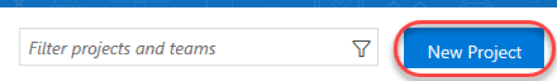

1. Enter **"Build CI Quick Start"** as the **Project name** and ensure **Git** is selected as the **Version control**. Click **Create**.

#

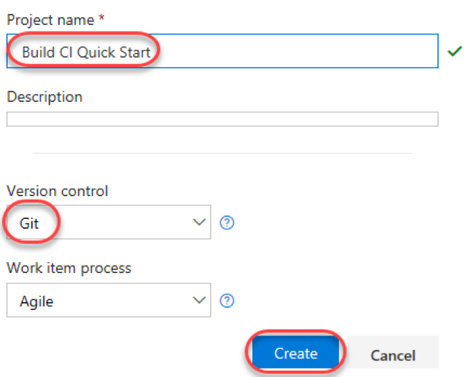

# Task 2: Create an ASP.NET Core web application

1. Launch an instance of **Visual Studio**.
2. Select **File | New | Project**.
3. Select the **Visual C# | Web** category and the **ASP.NET Core Web Application** template. Leave the default name and click **OK**.

 

1. Select the **Web Application** template and make sure **Docker Support** is not selected. Click **OK**.

 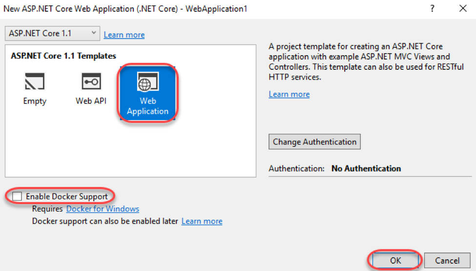

1. From the bottom right corner, select **Add to Source Control | Git**.

 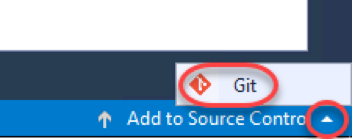

1. In **Team Explorer** , click **Publish Git Repo**.

 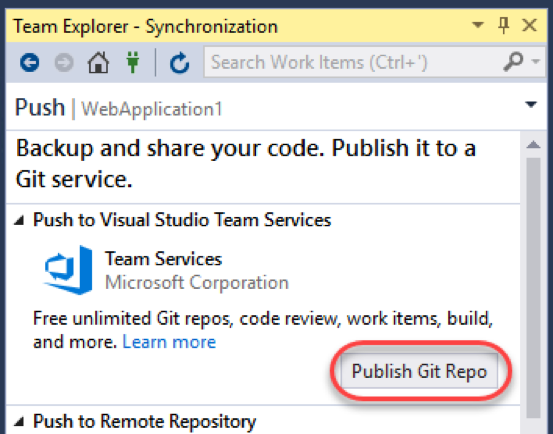

1. From the **Add an account** dropdown, select **Add an account**.

 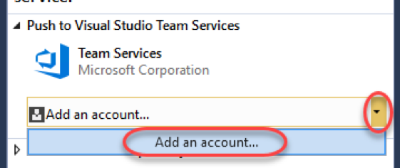

1. Sign in using the Microsoft account associated with your Visual Studio Team Services account.
2. Select the **Team Services Domain** you created the VSTS project in earlier. Then click **Advanced**.

 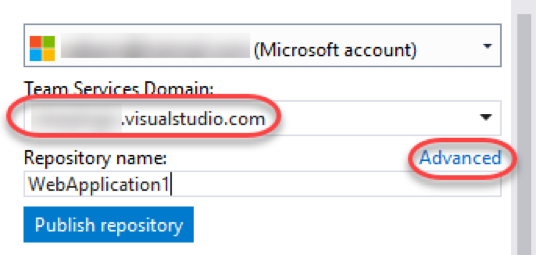

1. Select the **Team project** (if there is more than one) and click **Publish repository**.

 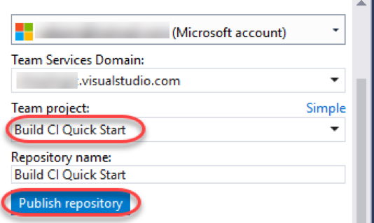

1. Although the repository has been published, the project source has not. Click **Changes** to view the uncommitted code.

 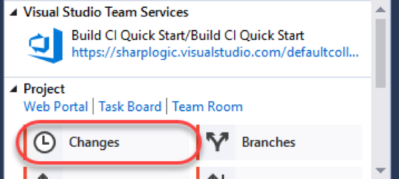

1. Enter **"Initial commit"** as the comment and select **Commit Staged and Sync** from the **Commit Staged** dropdown.

 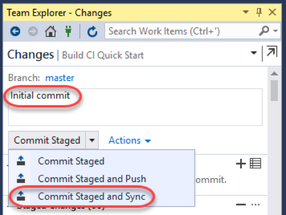

# Task 3: Create and configure an Azure web application for continuous delivery

1. Log in to the Azure portal at [https://portal.azure.com](https://portal.azure.com).
2. Click the **New** button and select **Web + Mobile | Web App**.

 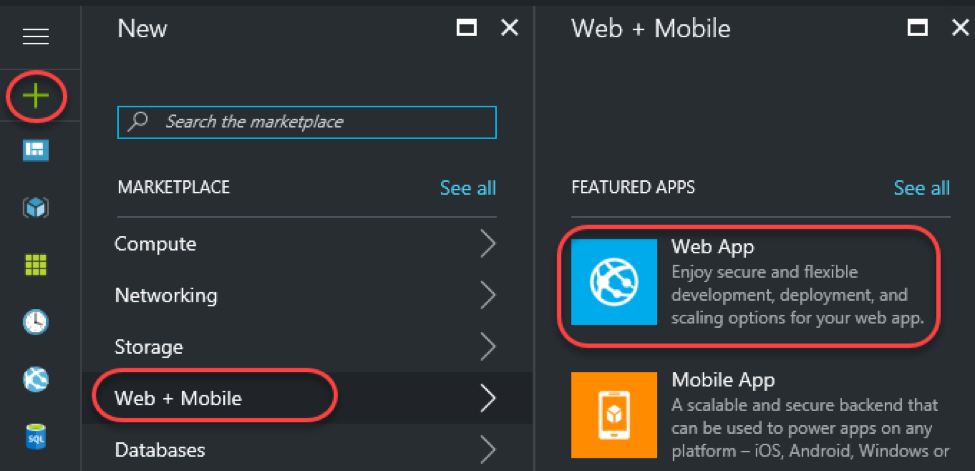

1. Enter a globally unique name for **App name**. You may want to incorporate your own name, such as **"buildcijohndoe"**. To keep things simple, use the same name for the **Resource Group**. Click **Create**.

 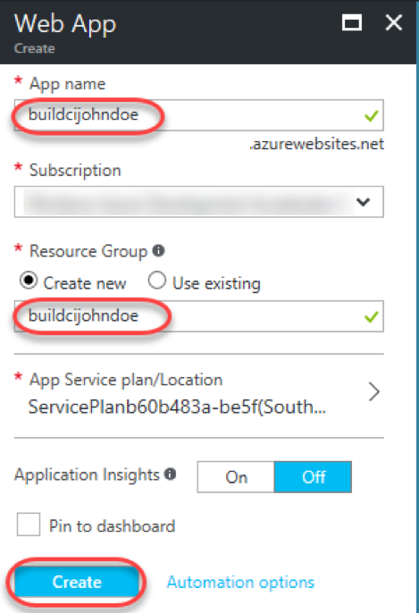

1. You can track the status of the resource creation using the **Notifications** button in the top right corner of the portal. Click **Deployments succeeded** to bring you to the resource group when the process has completed.

 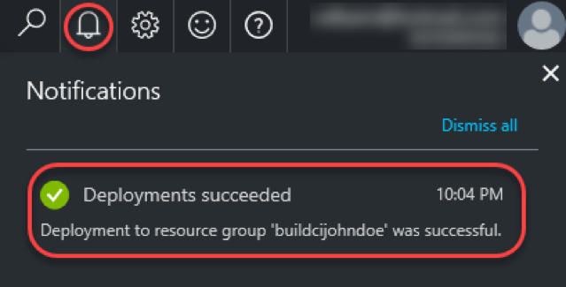

1. Select **Continuous Delivery**. This will provide a quick and easy way to configure your VSTS account to kick off a build and deploy when your Git repo changes. It's important to note that you could also configure this from your VSTS account or via the Continuous Delivery Tools Extension for Visual Studio.

 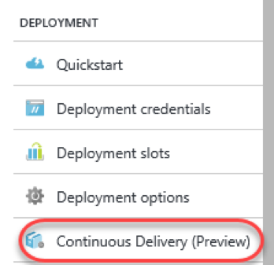

1. Click **Configure**.

 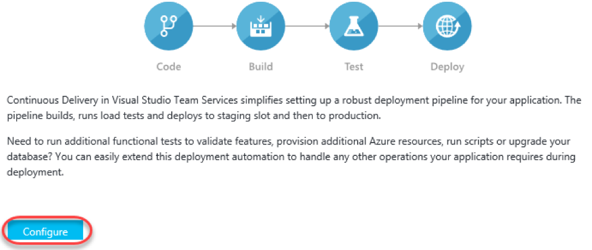

1. Select the **Source code** tab and select your team services account and project created earlier. It should only have one repository and branch in it since it was just created. Click **OK**.

 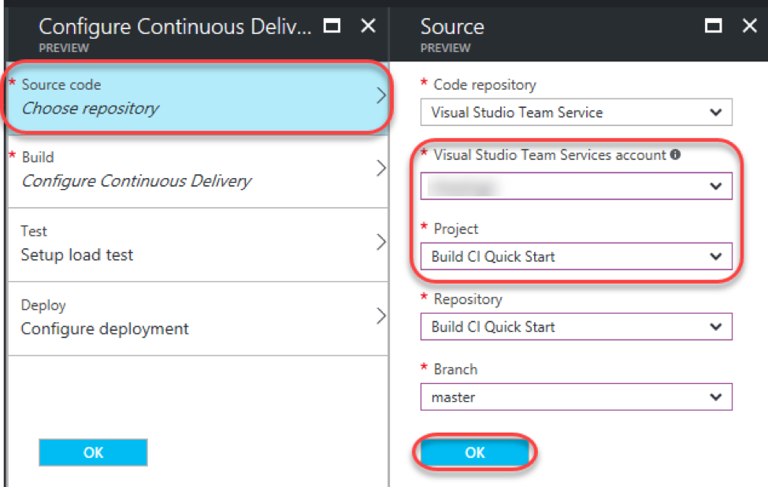

1. Select the **Build** tab and select **ASP.NET Core** as the **Web Application framework**. Click **OK**.

 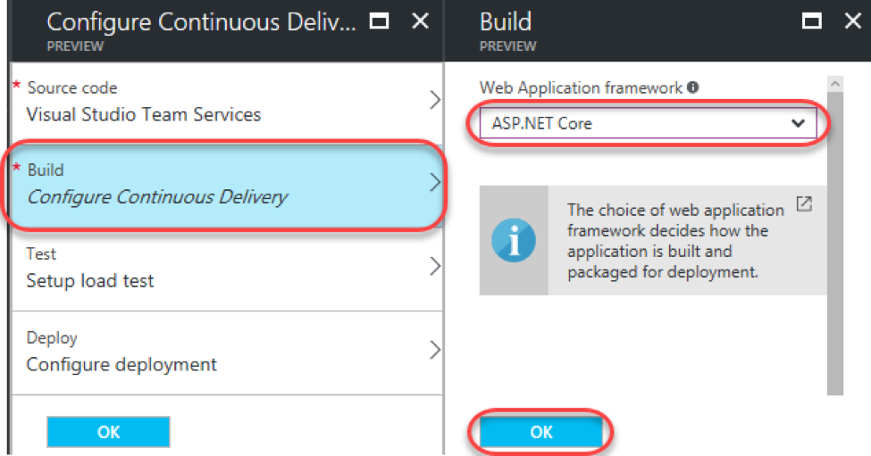

1. If you have time, you can check out the **Test** and **Deploy** tabs. They enable you to configure tests and deployment slots, respectively. Click **OK** to complete.

 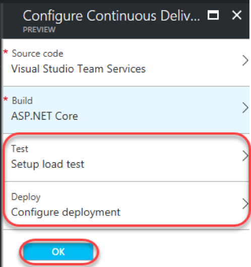

1. It will take a while for the continuously delivery setup to complete.

 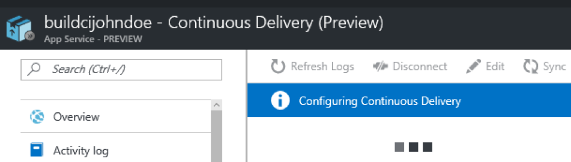

1. Once completed, you will see some options to view created assets, as well as an option to view a build that was triggered at the end of the configuration. Click **Build triggered** to view that build in VSTS in a new tab.

 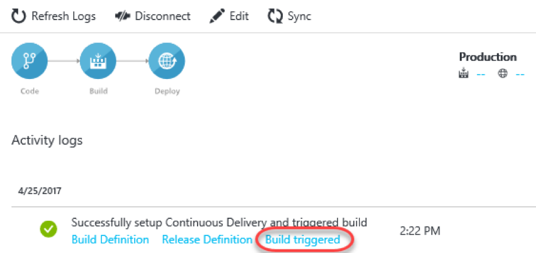

1. Depending on how quickly you get to the new tab, the build may already be completed. You can explore the page while the build continues. When it's complete, click the **Release-1** link to view the release process.

 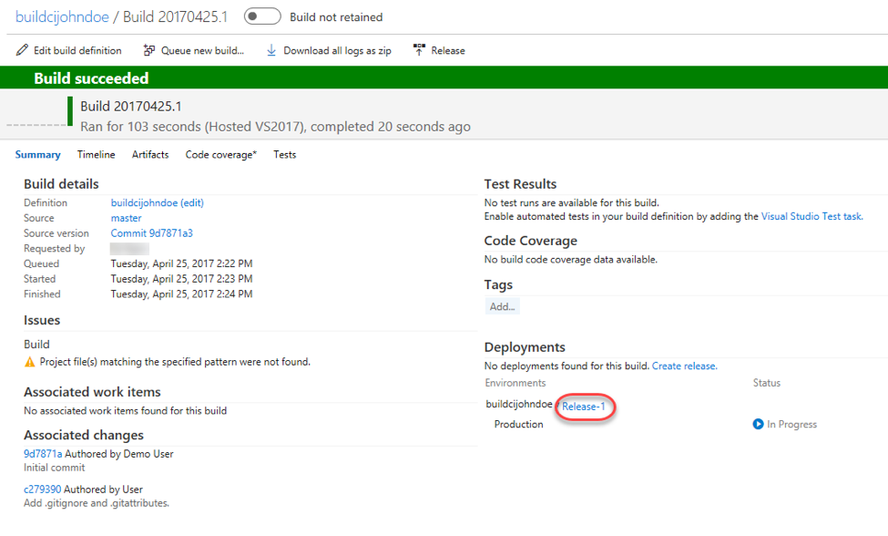

1. Note that you'll also receive a mail (if desired) indicating that your build has completed.

 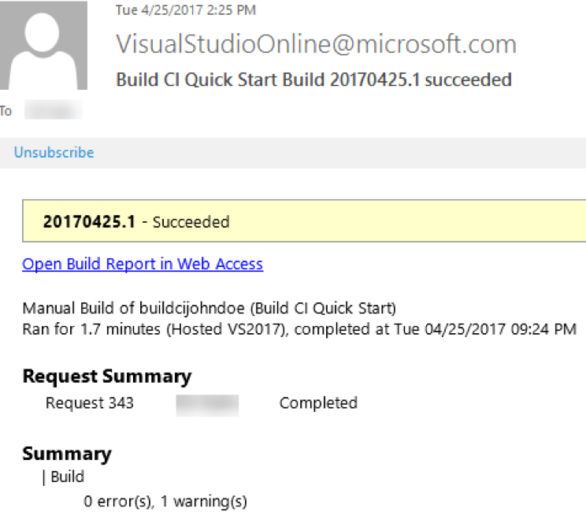

1. The release process will also run automatically to deploy the successful build out to the Azure resource created earlier. When the released has succeeded, return to the Azure portal tab.

 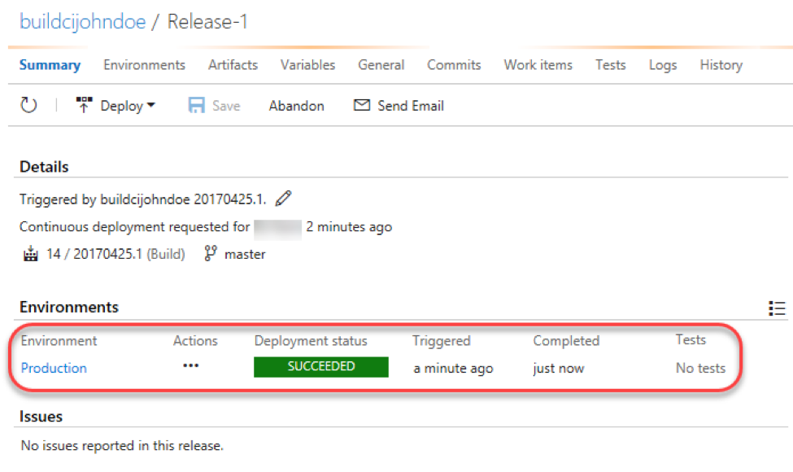

1. Use the **breadcrumb** at the top to return to the overview blade for your resource group.

 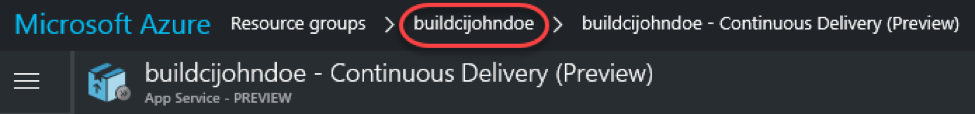

1. Click the app service to view it.

 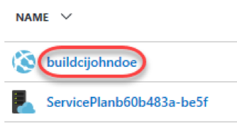

1. Locate the **URL** field and click its link to open the site in a new tab.

 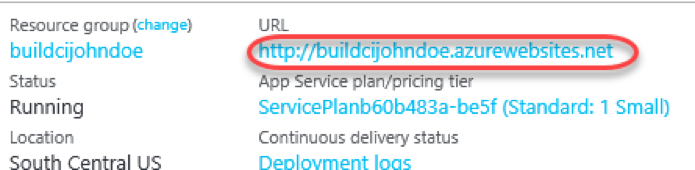

1. Your site should now be live!

 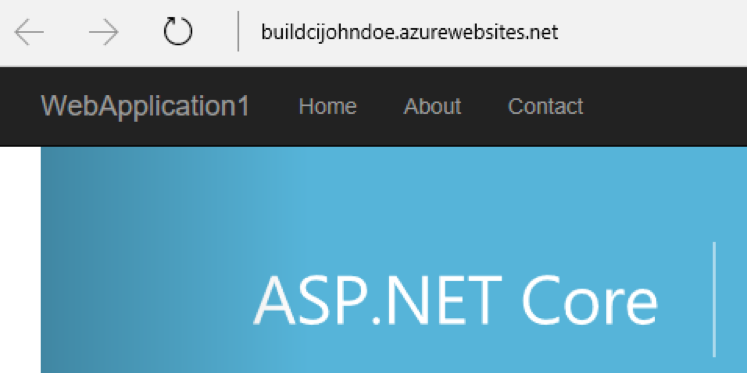

# Task 4: Commit a change and follow the delivery pipeline

1. Now let's commit a change to the project's source and see how it works its way back out to the public site. Return to the VSTS tab.
2. Select **Code | Files**.

 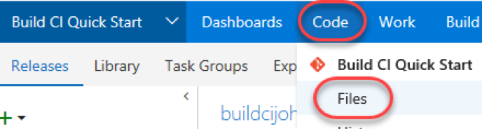

1. Navigate to **WebApplication1/Views/Home/Index.cshtml**.

 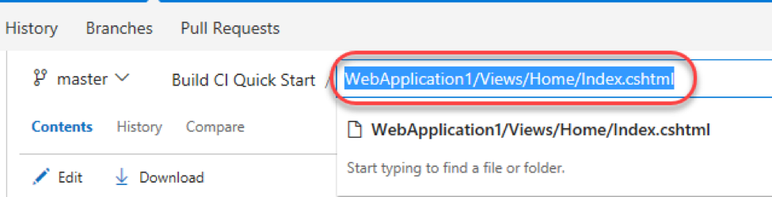

1. Click **Edit** so we can make a quick change right in the browser.

 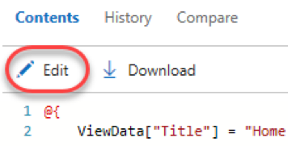

1. Update the text in the first carousel panel by inserting the text **"and deploy"** as shown below.

 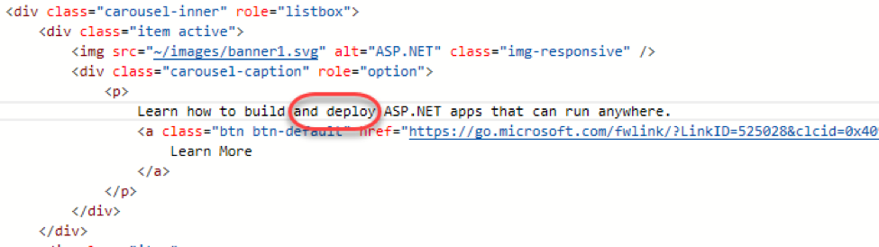

1. Click the **Save** button to save and commit the file.

 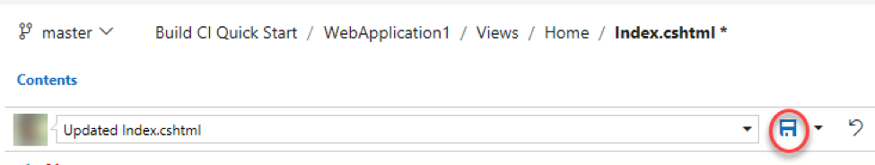

1. Select **Build &amp; Release | Builds**.

 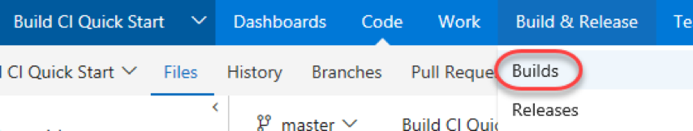

1. You should now see a build in progress. It was kicked off automatically after your changes and will propagate out to production via release as well. When the build has completed, select the **Releases** tab.

 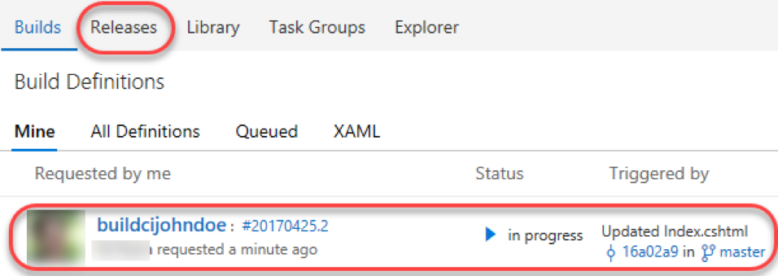

1. Wait until the second release has completed. You may need to use the **Refresh** button to see updates.

 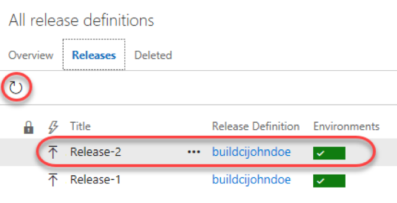

1. Return to the tab with your production site open and refresh the window. It should now have the changes you just made.

 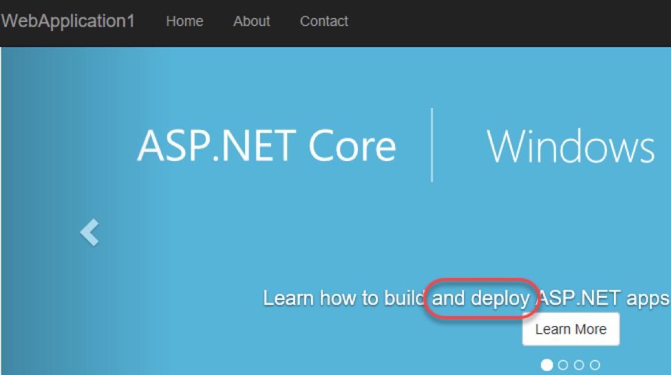

# Summary

Congratulations on completing this Quick Start Challenge! In this lab, you've learned how to set up continuous integration for an ASP.NET Core web application in Visual Studio Team Services.

# Additional Resources

If you are interested in learning more about this topic, you can refer to the following resources:

**Documentation** : [https://www.visualstudio.com/en-us/docs/overview](https://www.visualstudio.com/en-us/docs/overview)

**GitHub** : [https://github.com/Microsoft/vsts-tasks](https://github.com/Microsoft/vsts-tasks)

**Team blog** : [https://blogs.msdn.microsoft.com/visualstudioalm/](https://blogs.msdn.microsoft.com/visualstudioalm/)
