# Create Your First ASP.NET Core Application with MVC

# Overview

ASP.NET Core is a new open-source and cross-platform framework for building modern cloud based internet connected applications, such as web apps, IoT apps, and mobile backends. ASP.NET Core apps can run on [.NET Core](https://www.microsoft.com/net/core/platform) or on the full .NET Framework. It was architected to provide an optimized development framework for apps that are deployed to the cloud or run on-premises. It consists of modular components with minimal overhead, so you retain flexibility while constructing your solutions. You can develop and run your ASP.NET Core apps cross-platform on Windows, Mac and Linux. ASP.NET Core is open source at [GitHub](https://github.com/aspnet/home).

In this Quick Start you will create your first ASP.NET Core application with Visual Studio.

# Objectives

- Create an ASP.NET Core application
- Explore ASP.NET Core hosting
- Run a self-hosted ASP.NET Core application

# Prerequisites

- Windows 10
- Visual Studio 2017

# Intended Audience

This Quick Start Challenge is intended for developers who are familiar with ASP.NET and C#.

# Task 1: Creating a new ASP.NET Core application

Let's start off by creating a new project in Visual Studio.

1. Launch a new instance of Visual Studio.
2. Select File | New | Project.
3. Select the **Visual C# | Web** category and the **ASP.NET Core Web Application (.NET Core)** template. Be sure you don't select the one that requires the full .NET Framework.
4. Enter a name of **"Movies"** and click **OK**.

 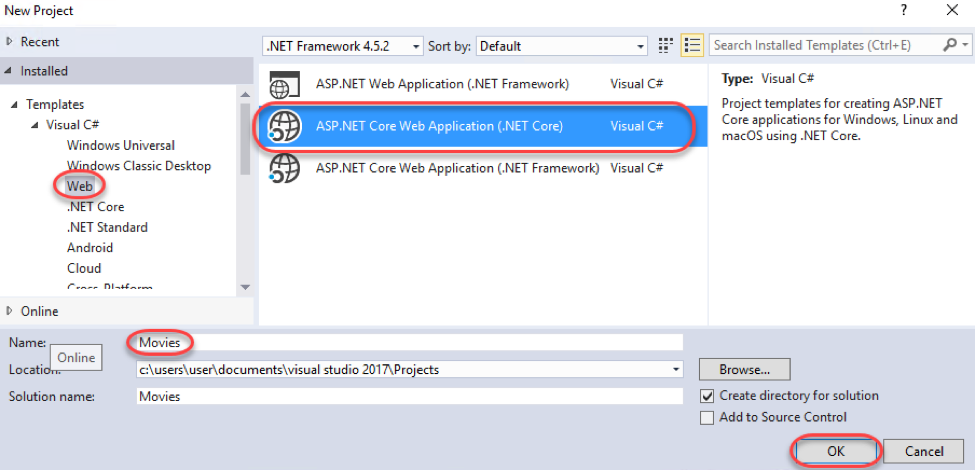

5. Select the Web Application template and make sure the Enable Docker Support checkbox is unchecked. Then, click Change Authentication.

 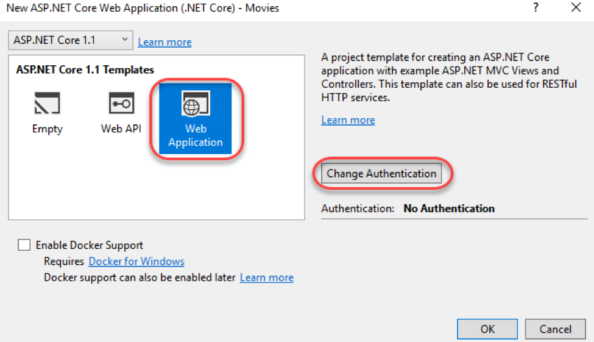

6. Select Individual User Accounts and click OK.

 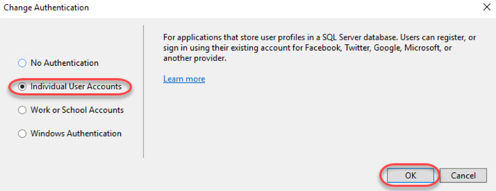

7. Click **OK** to create the project. It will take a moment to complete.

# Task 2: Understand how the application is hosted

1. From **Solution Explorer** , open **Program.cs**. This is the bootstrapper that will run your application.

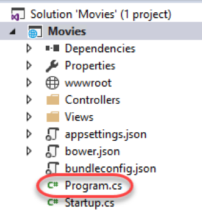

2. While there are only two lines of code here, they're pretty substantial. Let's break them down. First, a new **WebHostBuilder** is created. ASP.NET Core apps require a host in which to execute. A host must implement the **IWebHost** interface, which exposes collections of features and services, and a **Start** method. The host is typically created using an instance of a **WebHostBuilder** , which builds and returns a **WebHost** instance. The **WebHost** references the server that will handle requests.

 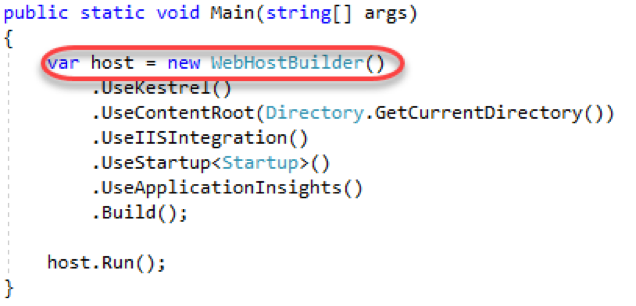

3. While the **WebHostBuilder** is responsible for creating the host that will bootstrap the server for the app, it requires you provide a server that implements **IServer**. By default, this is **Kestrel** , a cross-platform web server for ASP.NET Core based on **libuv** , which is a cross-platform asynchronous I/O library.

 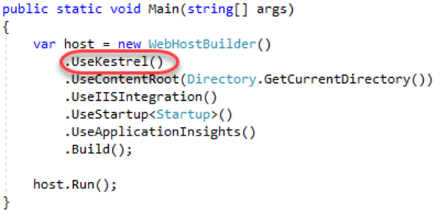

4. Next, the server's content root it set. This determines where it searches for content files, like MVC View files. The default content root is the folder from which the application is run.

 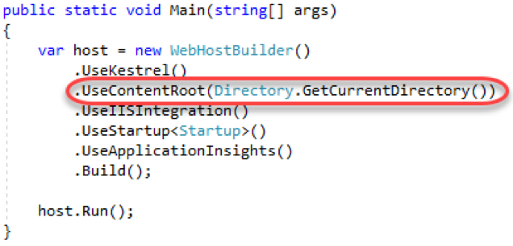

5. If the app should work with IIS, the **UseIISIntegration** method should be called as part of building the host. Note that this does not configure a server, like **UseKestrel** does. To use IIS with ASP.NET Core, you must specify both **UseKestrel** and **UseIISIntegration**. **Kestrel** is designed to be run behind a proxy and should not be deployed directly facing the internet. **UseIISIntegration** specifies IIS as the reverse proxy server.

 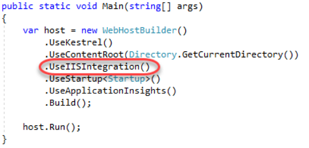

6. It's a cleaner practice to separate the loading of settings from the application bootstrapping. In order to easily do this, **UseStartup** is used to specify that the **Startup** class is to be called for the loading of settings and other startup tasks, such as inserting middleware into the HTTP pipeline. You may have multiple **UseStartup** calls with the expectation that each one overwrites previous settings as needed. Another lab covers ASP.NET Core startup, configuration, and middleware in more depth.

 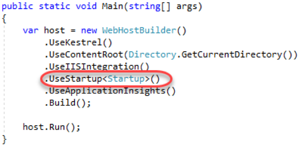

7. Next, **UseApplicationInsights** is called to simplify the process of using to collet telemetry data.

 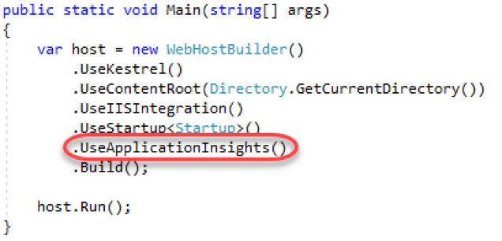

8. The last step in creating the **IWebHost** is to call **Build**.

 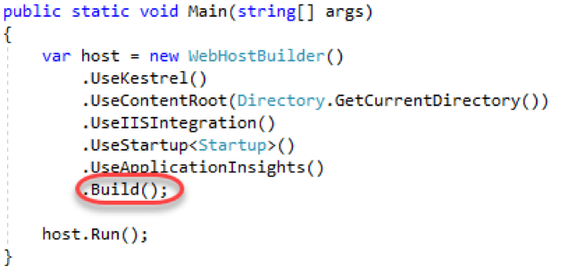

9. While **IWebHost** classes are required to implement the non-blocking **Start** , ASP.NET Core projects have an extension method called **Run** that wraps **Start** with blocking code so you don't need to manually prevent the method from exiting immediately.

 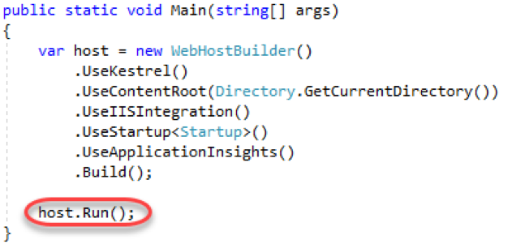

# Task 3: Running the application

1. By default, the project is configured to be hosted in **IIS Express** for debugging. However, since we're working with ASP.NET Core and have brought our own web server, it's easy to change that to self-host. From the **Run** dropdown, select **Movies**.

 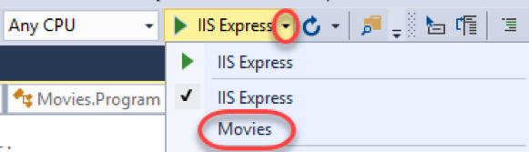

2. Press **F5** to build and run the application.
3. Visual Studio will launch two windows. The first is a command window that provides you a console into the self-hosted server application.

 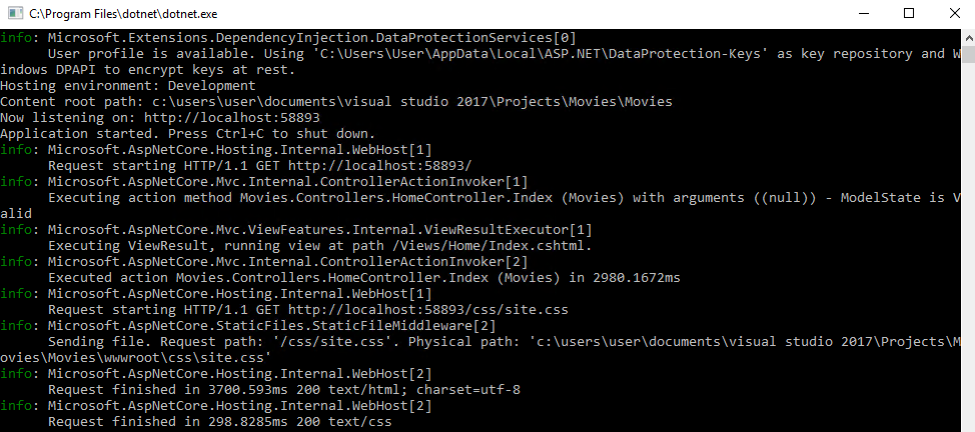

4. The second is a typical browser window to test the site. As far as the browser knows, this application could be hosted anywhere.

 

5. Keep both windows open and return to Visual Studio. From **Solution Explorer** , open **Views\Home\Index.cshtml**.

 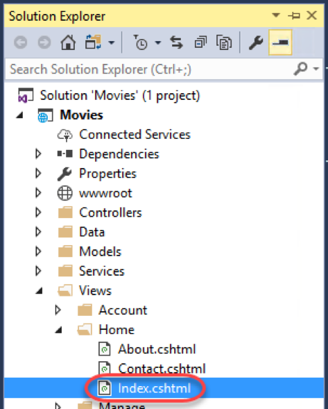

6. Insert the text **"Core"** in the first paragraph tag as shown below and **Save** the file.

 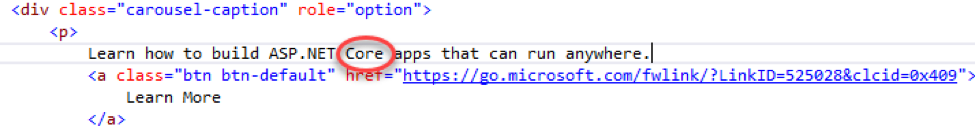

7. Refresh the browser window to see the new text updated.

 

8. This lab provides a taste of the opportunities available when working with ASP.NET Core. If you'd like to continue the lab to complete the movies database application, the next steps are at [https://docs.microsoft.com/en-us/aspnet/core/tutorials/first-mvc-app/start-mvc](https://docs.microsoft.com/en-us/aspnet/core/tutorials/first-mvc-app/start-mvc).

# Summary

Congratulations on completing this Quick Start Challenge! In this lab, you've learned how to create a basic ASP.NET Core application, as well as how it's hosted.

# Additional Resources

If you are interested in learning more about this topic, you can refer to the following resources:

**Documentation** : [https://docs.microsoft.com/en-us/aspnet/core/](https://docs.microsoft.com/en-us/aspnet/core/)

**GitHub** : [https://github.com/aspnet/Home](https://github.com/aspnet/Home)

**Team blog** : [https://weblogs.asp.net](https://weblogs.asp.net)
