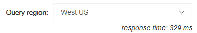
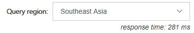
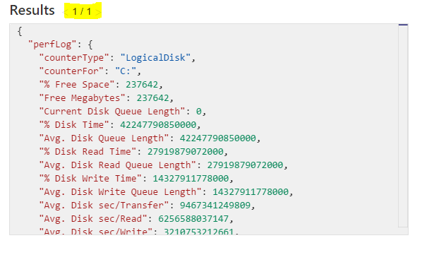
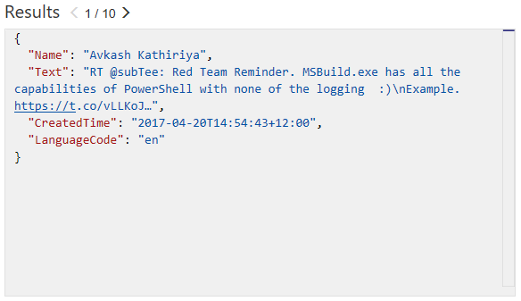

Azure DocumentDB Lab
=================================================

## Overview

Azure DocumentDB is a NoSQL, JSON document database built for big data solutions that require scaling and high availability.

This hands-on lab will step you through the following features:

1. **Querying** - Connect to a DocumentDB database and execute a simple query
2. **Filtering** - Execute ad-hoc queries on schemaless JSON data.

### About the code

This lab uses a simple ASP.NET MVC website as a test application. This application allows you to
write arbitrary query commands and execute them against our test databases. Any result set will be
rendered automatically into the JSON response panel. There are arrows to navigate left and right through the results. 

> **Note:** The DocumentDB that we will be querying was created via the Azure Portal.
> For more information on the Azure Portal refer to the **Appendix** at the end of this lab.

-----

## Scenario 1

In this scenario. We will change the MVC application to send a query to the DocumentDB server.

### Part One

To begin, open the `Azure DocumentDB Lab.sln` solution in Visual Studio 2017 and press `F5` to 
compile and launch the web app on the local machine.

You should be presented with an application that looks like this:


This page is designed to take the query that the user writes and pass it to a DocumentDB server that
we have set up for the purposes of this demo. 

Type this query into the query editor:

```SQL
SELECT *
FROM c
```

...and click on **Run It!**


Currently there are no results - we need to finish implementing the DocumentDB call first.

### Part Two

In the visual studio solution navigate to the `HomeController` class in the `LabWeb` project.


Find the `Query` action method. There is a line of code that looks like this:

```csharp
IDocumentQuery<dynamic> docQuery = null;
```

We will modify it to create and send a DocumentDB query. 

The query text from the page is passed into the action via the `query` variable. Change it to the following:

```csharp
var collectionUri = GetDocumentCollectionUri();
var client = await GetReadOnlyClient(locationName);
var docQuery = client.CreateDocumentQuery(collectionUri, query, _feedOptions).AsDocumentQuery();
```

Notice in the FeedOptions, we are setting `MaxItemCount = 10`. This means we will get up to 10 results per execution of the query. The DocumentDB API has 
support for paging built in (We will see an example of this shortly).

Let's quickly inspect the rest of the Query Action:

```csharp
var results = await docQuery.ExecuteNextAsync();
```

This part is what actually uses the Azure DocumentDB SDK to call DocumentDB and retrieve the results for
our query. Notice this will only return up to `MaxItemCount` results as above (In our case 10 items). 
This can also be set to -1 for dynamic sizing of the resulting set to the maximum response size.

If we wanted to get the next set of results we would have to call `docQuery.ExecuteNextAsync()` again.

In the interests of this demo, we are only retrieving the first ten results. However if this was a real-world application
where we need ALL of the results for a query. We would set the MaxItemCount to -1 and do something like the following:

```csharp
while (docQuery.HasMoreResults)
{
    //Can use strongly typed objects by using <T> on docQuery.ExecuteNextAsync<T>()
    var results = await docQuery.ExecuteNextAsync();

    //dynamic can also be T
    foreach (dynamic result in results)
    {
        //Do something with results
    }
}
```

**Note:** We are deserializing the JSON string and serializing it back again so that we can format the JSON into human readable string.

Press `F5` to compile and launch the web app on the local machine.

Type this query into the query box:

```SQL
SELECT *
FROM c
```

...and click on **Run It!**


Progress! We have successfully returned results from DocumentDB.


## Scenario 2

From now on, we will be working directly in the web browser.

In this scenario we will introduce the SQL-like syntax of DocumentDB and show how we can use it to manipulate our results.

The dataset we are querying is a live stream of tweets from twitter with hashtags relating to //build/.

### Part One

In the query, the `FROM` name is simply an alias to the entire collection for the user to refer to in the query. It is not actually a table like in traditional SQL.

For example:

```SQL
SELECT *
FROM t
```

...is exactly the same as:

```SQL
SELECT *
FROM tweets
```

Give it a try!


## Part Two

Now that we know how to select some records, lets see how the different data centres affect our latency!

This project has been configured to allow the user to select which region to execute their DocumentDB query against. By default the Azure DocumentDB SDK will chose the most optiomal endpoint to perform read and write operations, however client applications can specify the ordered preference list of regions to be used to perform document operations. (We are using this so you can see the differences between regions)

Exceute this query and select a different region each time. Notice how the response time changes due to the location of the data center?

```SQL
SELECT *
FROM tweets
```






Try this out with the difference queries going forward!

## Part Three

When refering to fields you must use the alias you define in the `FROM` clause.

Execute this query:

```SQL
SELECT CreatedBy
FROM tweets
```


As you can see this resulted in an error.

To fix this error we have to provide the full "path" to the properties of the objects within the database.

Execute this query instead:

```SQL
SELECT tweets.CreatedBy
FROM tweets
```


### Part Four

Now that we know how to select a certain field, we can filter on them.

Send a tweet now on twitter using #MSBuild or #DocumentDB. Lets see if we can find your tweet!

Write a query to select a specific tweet by its user by username (replace windowsdev with your username):

```SQL
SELECT *
FROM tweets
WHERE tweets.CreatedBy.ScreenName = "windowsdev"
```

Or to find a tweet by the users name (replace "Windows Developer" with your own name)

```SQL
SELECT *
FROM tweets
WHERE tweets.CreatedBy.Name = "Windows Developer"
```


Because we are refering to objects / documents, we can filter our result set by seeing if a property exists on the object.

For example:

```SQL
SELECT *
FROM tweets
WHERE tweets.CreatedBy.UserIdentifier.url != null
```


## Scenario 3

In this scenario we are going to see how we can use joins to inspect child objects / arrays.

### Part One

We have been using DocumentDB to inspect all the tweets in the database and for certain users.

Lets see how we can find out the hashtags that have been used in all the tweets. We can use the `JOIN` keyword to join to our hashtags array in each tweet. We can also give it an alias and inspect its properties.

Let's see the `JOIN` in action. Try this query:

```SQL
SELECT hashtags
FROM tweets
JOIN hashtags IN tweets.Hashtags
```

Inspect the results and you will see for each hashtag object in the array of each tweet/document has been returned as a seperate result set:


Now that we know how to join to our child array we can use it for filtering. Lets find all other hashtags that have been used along with the build hashtags (#MSBuild, #Azure, #DocumentDB):

```SQL
SELECT hashtags
FROM tweets
JOIN hashtags IN tweets.Hashtags
WHERE hashtags.text NOT IN ("MSBuild", "MsBuild", "DocumentDb", "DocumentDB", "Azure")
```


Imagine that we want to see hashtags where "#Tech" and "#Question" used. There two ways we can achieve this.

Using an `OR` predicate:

```SQL
SELECT hashtags
FROM tweets
JOIN hashtags IN tweets.Hashtags
WHERE (hashtags.text = "Tech" OR hashtags.text = "Question")
```

...or using an `IN` predicate: 

```SQL
SELECT hashtags
FROM tweets
JOIN hashtags IN tweets.Hashtags
WHERE hashtags.text IN ("Tech", "Question")
```


If there are properties that have whitespace, you can filter these results by the special index to address it:

```SQL
WHERE hashtags["Property With Spaces"] ...
```

This syntax will be familiar to users of JavaScript, or C# dictionary accessor syntax.

We can use the `BETWEEN` keyword to filter by a range of values. We are doing this on the indices property.

Try this query:

```SQL
SELECT indices
FROM tweets
JOIN hashtags IN tweets.Hashtags
JOIN indices IN hashtags.indices
WHERE indices BETWEEN 21 AND 28
```


Note that you can actually return the entire tweet where the indices of the hashtag is between 21 and 28 simply by selecting the tweets rather than the indices

e.g. :

```SQL
SELECT tweets
FROM tweets
JOIN hashtags IN tweets.Hashtags
JOIN indices IN hashtags.indices
WHERE indices BETWEEN 21 AND 28
```

We have used the `MaxItemCount` in the code to limit our results to 10 items. We can also restrict the amount 
of results returned by using a `TOP` clause in our query. 

Lets adjust our query to find the top result. Give this a try:

```SQL
SELECT TOP 1 tweets
FROM tweets
JOIN hashtags IN tweets.Hashtags
JOIN indices IN hashtags.indices
WHERE indices BETWEEN 21 AND 28
```



We can also order our query so we can find the most recent tweet(s). (use ASC for ascending and DESC for Descending) :

```SQL
SELECT TOP 5 tweets
FROM tweets
JOIN hashtags IN tweets.Hashtags
JOIN indices IN hashtags.indices
WHERE indices BETWEEN 21 AND 28
ORDER BY tweets.CreatedAt DESC
```

## Part Two

We can use a feature called **Projection** to create an entirely new result set. We could use this to create a common structure or to make it match a structure we already have.

Try this query:

```SQL
SELECT tweets.CreatedBy.Name,
		tweets.FullText,
		tweets.CreatedAt,
        tweets.TweetDTO.metadata.iso_language_code
FROM tweets
```


This query allowed us to combine all tweets into a flattened structure which could be useful, for example, when binding to a strongly typed dataset.

You can take this one step further by defining property names :

```SQL
SELECT tweets.CreatedBy.Name AS Name,
		tweets.FullText AS Text,
		tweets.CreatedAt AS CreatedTime,
        tweets.TweetDTO.metadata.iso_language_code AS LanguageCode
FROM tweets
```



### Further Reading 

[Get Started with DocumentDB - http://aka.ms/docdbstart](http://aka.ms/docdbstart)

[Documentation and Videos - http://aka.ms/docdbdocs](http://aka.ms/docdbdocs)

[How does pricing work? - http://aka.ms/docdbpricing](http://aka.ms/docdbpricing)

[Get help on the forums - http://aka.ms/docdbforum](http://aka.ms/docdbforum)

[DocumentDB SQL Query Syntax](https://azure.microsoft.com/en-us/documentation/articles/documentdb-sql-query)

[DocumentDB Query Playground](https://www.documentdb.com/sql/demo)

## Appendix

The Azure Portal was used to create the DocumentDB server. The Azure Portal can be found at [https://portal.azure.com/](https://portal.azure.com/).

Some features that you can use in Azure Portal with DocumentDB include:


#### Document Explorer

View the JSON  documents inside your collections.


#### Query Explorer

Test your queries and view the results.


#### Script Explorer

View, add and modify stored procedures, user functions and triggers.


