# Getting Started with Git in Visual Studio

# Overview

Git is the most commonly used version control system today and is quickly becoming _the_ [standard for version control](http://stackoverflow.com/research/developer-survey-2015). Git is a distributed version control system, meaning your local copy of code is a complete version control repository. These fully-functional local repositories make it is easy to work offline or remotely. In this Quick Start you will create a Git repository in Visual Studio Team Services, add a project to it, and manage changes via branches and pull requests.

# Objectives

- Create a Visual Studio Team Services project with a Git repository.
- Commit a new project to the Git repository.
- Create a new branch and commit changes to it.
- Merge the new branch into the master branch via pull request.

# Prerequisites

- Windows 10
- Visual Studio 2017
- Visual Studio Team Services subscription (Sign up for a free account [here](https://www.visualstudio.com/team-services/). Needs a Microsoft account)

# Intended Audience

This Quick Start Challenge is intended for developers who are familiar with C# and Visual Studio. It does not require prior experience with Git.

# Task 1: Create a new Visual Studio Team Services project

We'll start off by creating a new Visual Studio Team Services project backed by a Git repository.

1. Log in to your Visual Studio Team Services account at https://[youraccount].visualstudio.com.
2. Click **New Project**.

 

3. Enter **"Build Quick Start"** as the **Project name** and ensure **Git** is selected as the **Version control**. Click **Create**.

 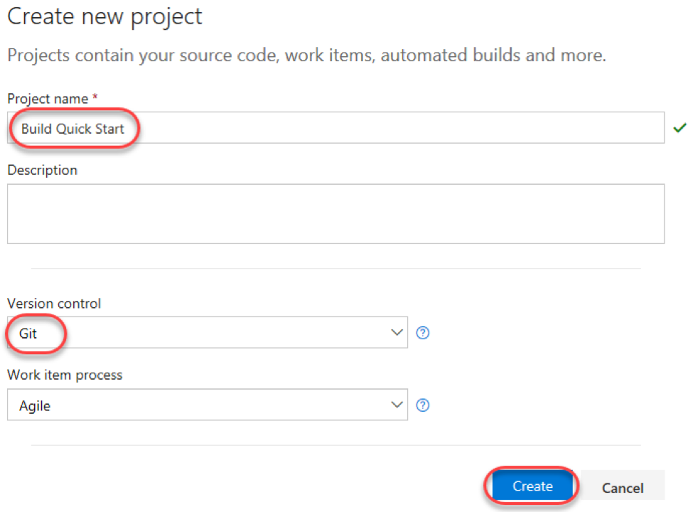

4. Once the project has been created, select the **Code** tab. It will be empty by default.

 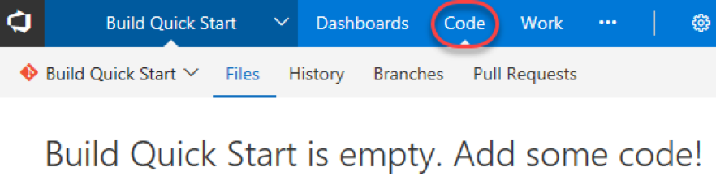

# Task 2: Connect Visual Studio to your team project and Git repo

1. Launch a new instance of **Visual Studio 2017**.
2. In **Team Explorer** , click the **Connect** option to connect to your **Visual Studio Team Services** account.

 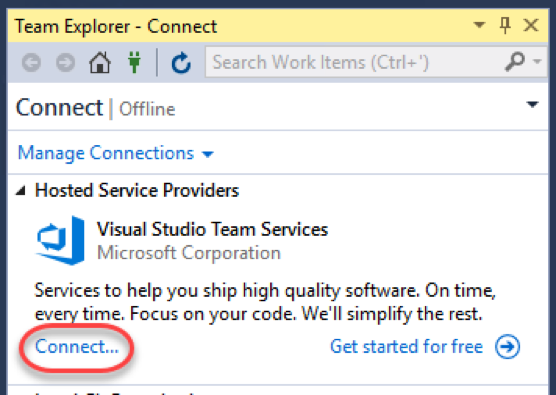

3. From the dropdown, select **Add an account** and follow the prompts to log in with the Microsoft account associated with your VSTS account.

 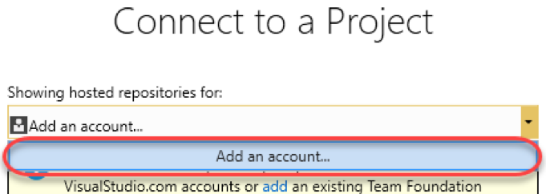

4. Select the **Build Quick Start** project created in the portal earlier and click **Connect**.

 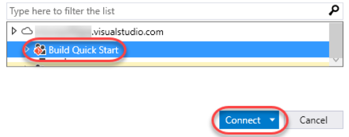

5. Although there's no source in the project yet, you'll need to **Clone** the existing repo to get started. Click **Clone**.

 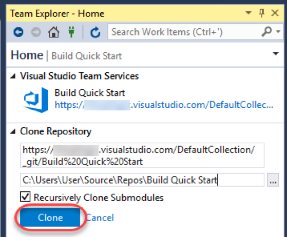

6. Click **Settings** to configure your Git settings.

 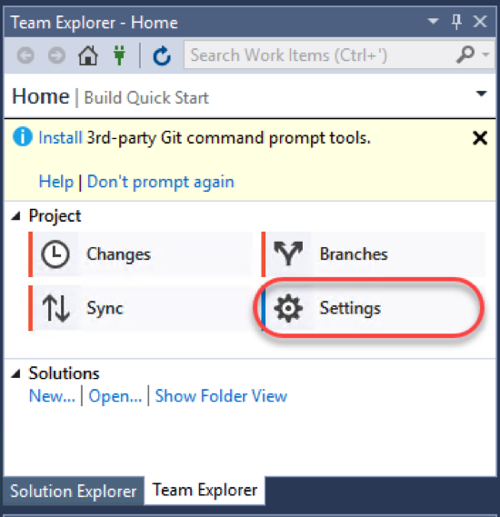

7. Click **Global Settings**.

 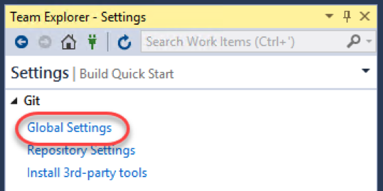

8. Enter a **User Name** and **Email Address**. You should use the email address associated with your VSTS login. Click **Update**.

 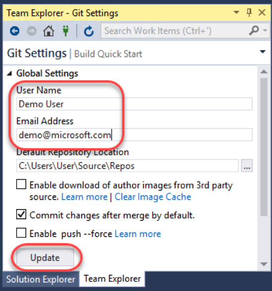

# Task 3: Add a new project to your Git repo

1. Click the **Home** shortcut and click **New** under **Solutions**.

 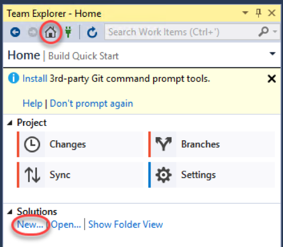

2. Select the **Visual C# | .NET Core** category and the **Console App (.NET Core)** template. Git source control works with any kind of project, but we're going to keep it very simple here.
3. Leave the default project name.
4. Ensure **Create new Git repository** is checked. This will create your new project within the context of a local Git repo. Since Git is distributed in nature, you'll always work against this local repo and then periodically synchronize it with the server (or "origin").
5. Click **OK** to create the project.

 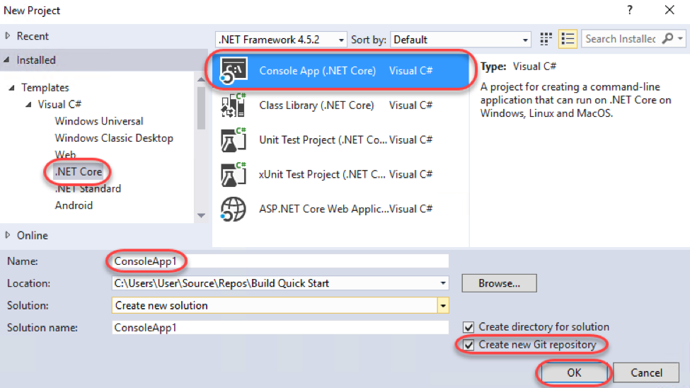

6. In **Team Explorer** , click **Changes**.

 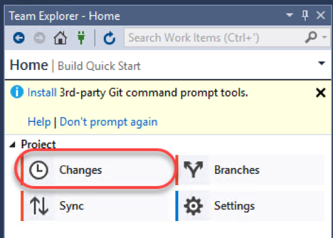

7. Enter **"Initial commit"** as the message and click **Commit All**.

 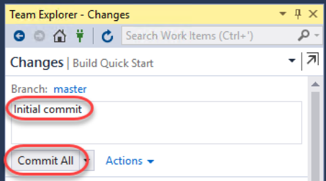

8.Refresh the Visual Studio Team Services browser window. Note that it still doesn't have any code. This is because we committed the project locally and have not yet pushed those changes to the server. 

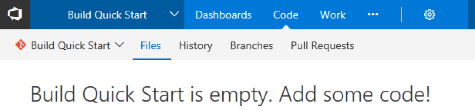

9. Back in **Team Explorer** , note the local commit message. In order to share the committed changes to the server, click **Sync** to navigate to the **Synchronization** view.

 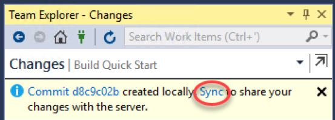

10. Because there is no remote branch yet, the only option available is to push the local branch to the server. Click **Push** to push the branch.

 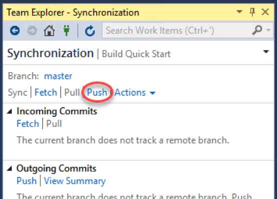

11. Refresh the VSTS browser window to notice that there is now code committed to the server.

 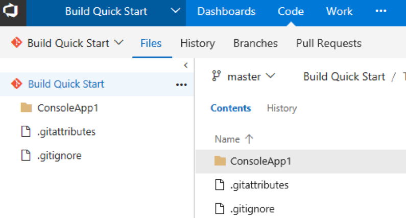

# Task 4: Manage a change via branch and pull request

1. From the views dropdown, select **Branches**.

 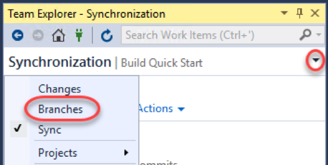

2. Right-click the **master** branch and select **New Local Branch From**. This will create a new branch from the master branch so that you can work against it and even perform server commits that do not impact work being done on the master branch itself.

 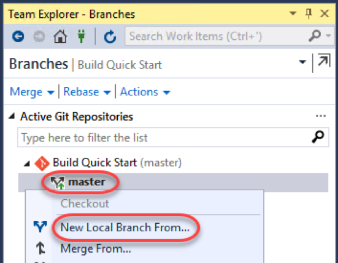

3. Enter a **Name** of **"my\_branch"** and click **Create Branch**. For complex projects, it is recommended that you follow a slash-delimited branch naming convention, such as **"username/feature"**.

 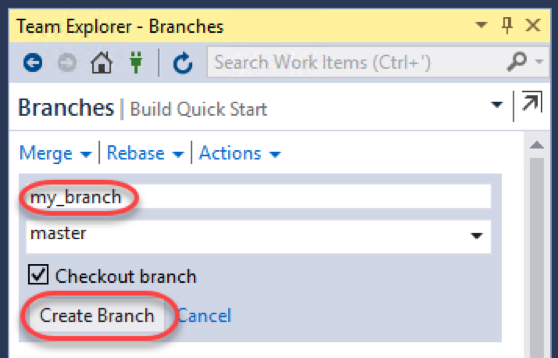

4. Double-click **my\_branch** to select it as the active branch.

 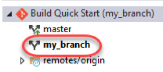

5. In **Solution Explorer** , note that the source file now has a blue padlock glyph next to it. This indicates that the file is under source control.

 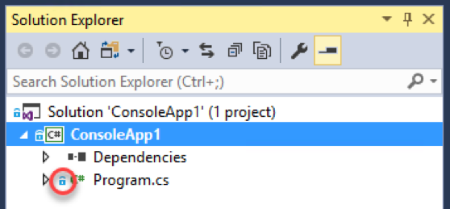

6. Open **Program.cs** and update the main line of code to the following (adding "Git").
```
Console.WriteLine("Hello Git World!");
```

7. Note now that **Solution Explorer** shows a red **check** to indicate that this file has been modified from the version in source control.

 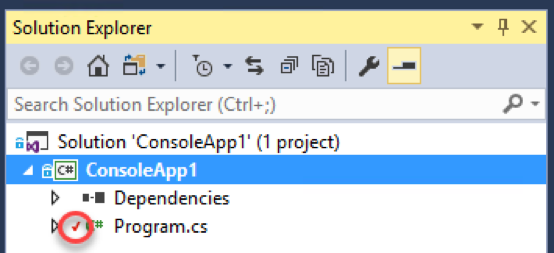

8. In **Team Explorer** , select **Changes** from the views dropdown. This will provide a list of files that have been changed from source control.

 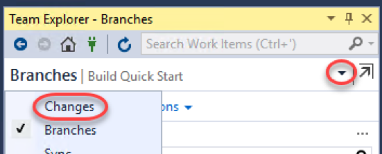

9. Right-click **Program.cs** and select **Compare with Unmodified**.

 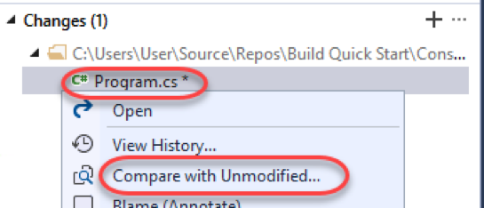

10. In the diff view, you can see exactly what lines (and sections of lines) have been changed.

 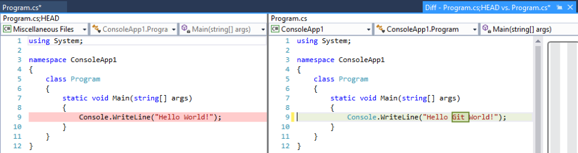

11. In **Team Explorer** , enter a message of **"Text update"** and select **Commit All | Commit All and Push**. This will commit the changes to the current branch and push the branch to the origin.

 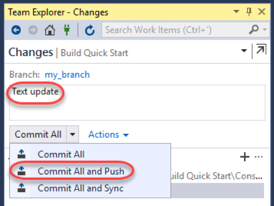

12. In the VSTS browser window, select the **Branches** tab.

 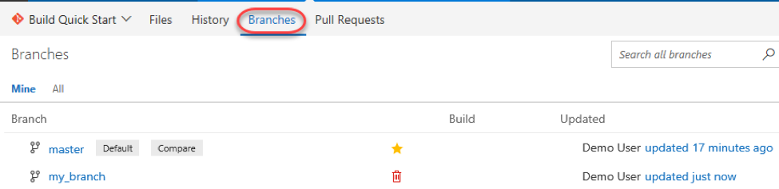

13. Hover over the **my\_branch** row and click the **New pull request** link that appears. A pull request communicates your desire to have the target branch merged into another branch.

 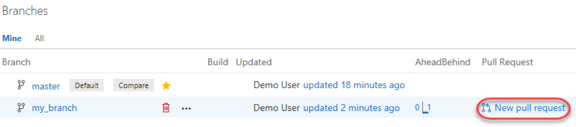

14. You can greatly customize who is included in the pull request and what information they might need to make a decision, such as linked work items. In this case, click **New pull request** to create using default settings.

 

15. Once created, reviewers can review the code and have discussions about the pull request. In this case we'll skip to the end and assume it's a good set of changes. Click **Complete**.

 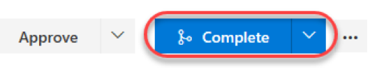

16. Note that the option to delete the source branch is selected by default when merging. This makes it easier to keep the repo relatively clean. Click **Complete merge**.

 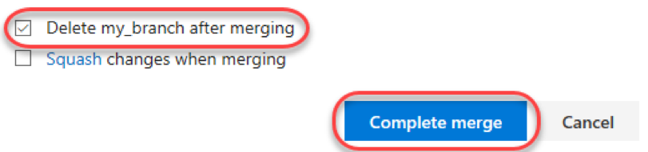

17. Select the **Branches** tab and note that there is now only the **master** branch.

 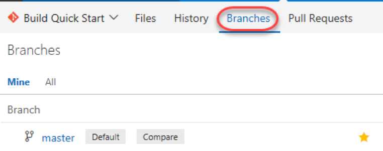

18. Click the **updated** link (probably **"updated just now"** ).

 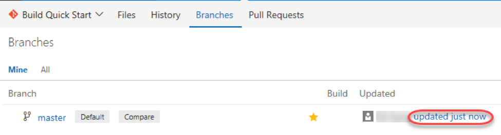

19. Now you can also view the history of this branch and even drill into specific pull requests and commits.

 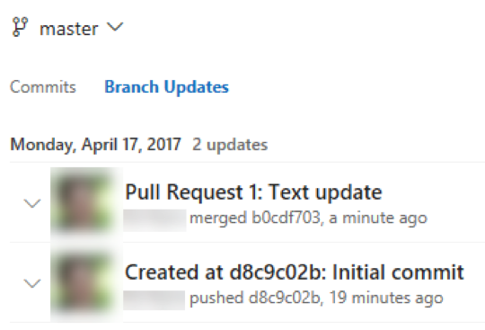

# Summary

Congratulations on completing this Quick Start Challenge! In this lab, you learned how to use Visual Studio with Git.

# Additional Resources

If you are interested in learning more about this topic, you can refer to the following resources:

**Documentation** : [https://www.visualstudio.com/learn-git/](https://www.visualstudio.com/learn-git/)
