# Live Unit Testing, Refactoring, and Code Style

# Overview

Visual Studio 2017 introduces Live Unit Testing, a feature that automatically runs unit tests in the background as you edit code. It also visualizes the results and code coverage live—in the editor—in real-time. In addition to giving feedback on the impact that your changes had on the existing tests, you also get immediate feedback on whether the new code you added is already covered by one or more existing tests. This will gently remind you to write unit tests as you are making bug fixes or adding features. You will be on your way to the promised land where there is no test debt in your code base!

Visual Studio 2017 has also introduced improvements in its refactoring support, as well as substantial advancements in the way developers can enforce the code style used across projects.

In this Quick Start, you will tour these features from the context of an existing ASP.NET application.

# Objectives

- Work with live unit testing
- Work with refactoring
- Work with code style

# Prerequisites

- Windows 10
- Visual Studio 2017

# Intended Audience

This Quick Start Challenge is intended for developers who are familiar with ASP.NET with C#.

# Task 1: Working with live unit testing

1. Launch a new instance of **Visual Studio**.
2. Select **File | Open | Project/Solution** and select the solution file **MvcMovieRTM.sln** (contained in the **src/MvcMovieSample/** folder in this repo). This is an ASP.NET MVC project that has some unit tests in a separate project.
3. From **Solution Explorer** , open the **Test** project's **MoviesControllerIndex.cs**.

 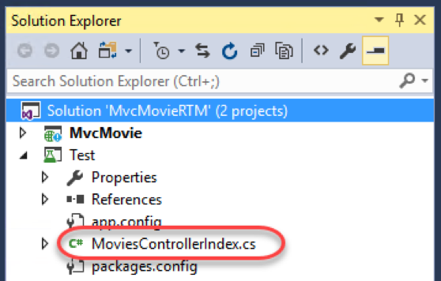

4. There are a lot of ways to run tests in Visual Studio, such as from **Test Explorer** or even from within the editor window. Click the **testing glyph** above the **ShouldReturnViewWithMovies** test method and select **Run**.

 

5. Once the test has completed, you'll see the update in **Test Explorer**.

 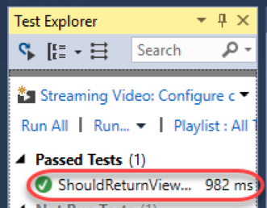

6. However, wouldn't it be great if these tests automatically ran as you edited the dependent code? That's where **Live Unit Testing** comes in. With Live Unit Testing, you can not only have your unit tests run as the source is edited, but you can also see updates on how well the tests perform against a given line of code directly in the editor. Select **Test | Live Unit Testing | Start** to turn this on.
7. The **Output** window should show the tests building and executing.

 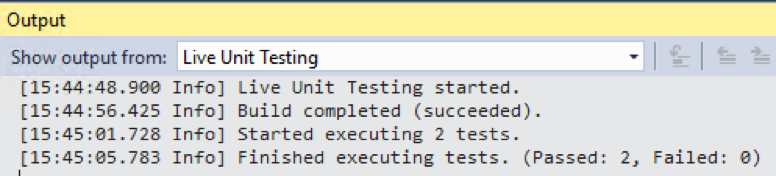

8. Within a few seconds, the live unit testing should complete and update the editor with **check** glyphs that indicate that each line is tested and that all their tests pass.

 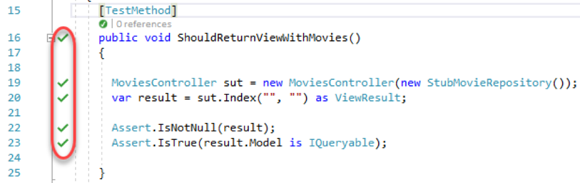

9. Right-click the **MoviesController** reference and select **Go To Definition**.

 

10. Scroll down to the **Index** method and locate the line of code that is not tested (indicated by the **blue line** glyph).

 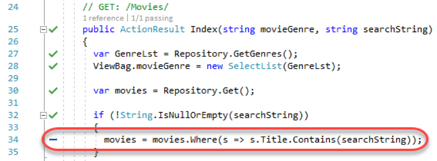

11. Return to **MoviesControllerIndex.cs** unit test file.
12. Uncomment the **ShouldSearchTitles** unit test in the **MoviesControllerIndex** class. This code searches for movies with **"Ghost"** in their titles, of which there should be two. It will also exercise the untested line of code we just found.
```
[TestMethod]
public void ShouldSearchTitles()
{
	var sut = new MoviesController(new StubMovieRepository());
	var result = sut.Index("", "Ghost") as ViewResult;
	Assert.IsNotNull(result);
	var moviesModel = (result.Model as IQueryable<Movie>).ToArray();
	Assert.IsNotNull(moviesModel);
	Assert.AreEqual(2, moviesModel.Count());
}
```

13. Within seconds, the live unit testing should pick up the test and start running it, even if you didn't save the file. It works the same when you edit the code being tested. You'll know the tests are about to be run by the **check-clock** glyph.

 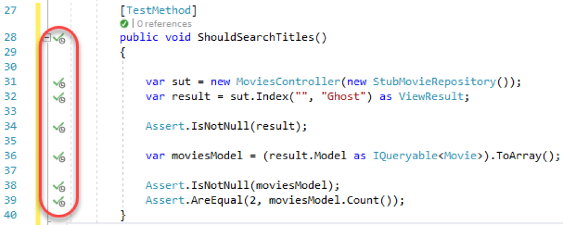

14. After a few seconds, the tests should show success.

 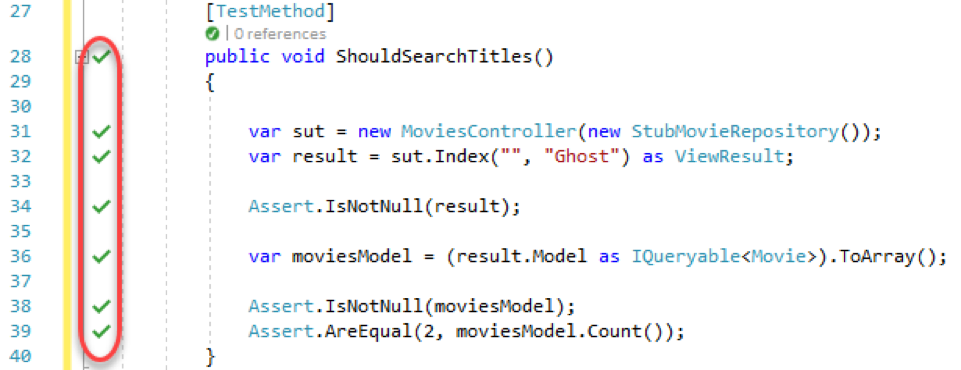

15. Switch to **MoviesController.cs** and notice that the live unit testing glyph has been updated to indicate that this line of code is now tested and that all tests pass.

 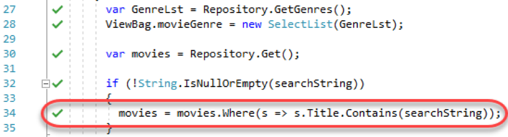

16. Return to **MoviesControllerIndex.cs** unit test file.
17. Now it's time to force an error. Change **"Ghost"** to **"Ghot"**. None of the movies match this text, so the test will fail.

 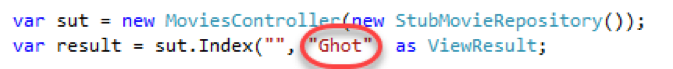

18. The **red x** glyphs should quickly appear to indicate that those lines are exercised by failing tests.

 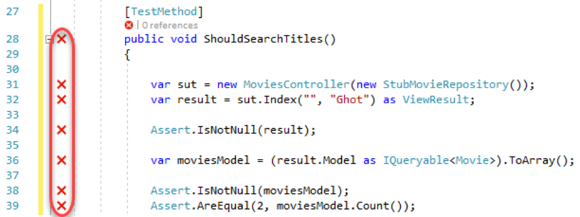

19. Return to the controller file and notice that the glyphs are all updated here as well. It's important to understand that only one failing test is enough to get the fail glyph, as shown by the **1/2 passing** code lens.

 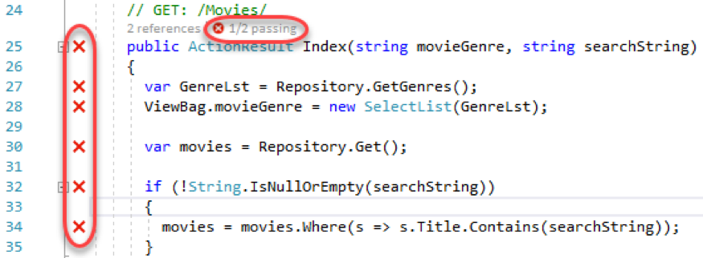

20. Click the **1/2 passing** code lens and double-click the failing test.

 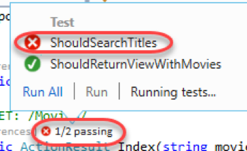

21. Revert the text back to **"Ghost"** and all the signs of failure should disappear quickly.

 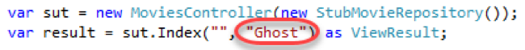

# Task 2: Working with refactoring

1. Refactoring has become an important part of every developer's life. In addition to renaming variables, it's used to reorder parameters, extract code into methods, and more. In this case, let's suppose it's been decided that the convention for unit test classes should end with **Tests**. Append **"Tests"** to the end of this class.

 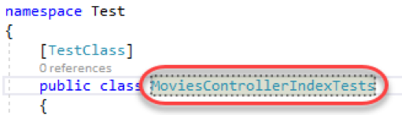

2. One easy way to refactor this change throughout the project is to use a **Quick Action**. Although this name is only used in one place in code, it's also used in one place outside of code—in the file name. Click the **Quick Action** button and select **Rename file to MoviesControllerIndexTests.cs.**

 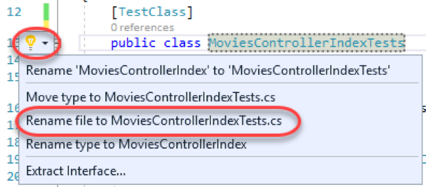

3. Confirm that the file has been renamed in **Solution Explorer**.

 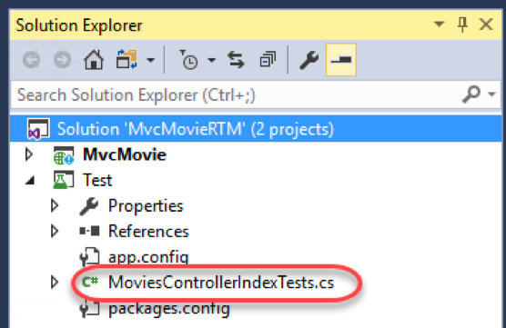

4. Back in code, the unit tests should be picked up and run as expected. There's a lot you can do with refactoring, and the support in Visual Studio is enhanced with every release.

 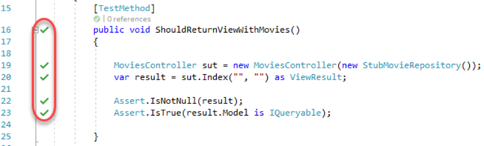

# Task 3: Working with refactoring

1. As the DevOps loop tightens, it's becoming more and more important to get all developers on the same page. One of the key aspects to team development is the ability for everyone to follow the same style and conventions. Visual Studio helps teams define and enforce conventions during the coding process, ensuring that nothing gets built unless it's built correctly. Select **Tools | Options**.
2. Search for **"code style"** and select the **Text Editor | C# | Code Style | General** option. Scroll down to the **'var' preferences** section. This page provides a way to define preferences for coding rules that can be enforced in the editor and during builds.

 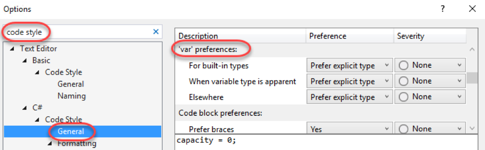

3. Select the **When variable type is apparent** rule. Note the example shown at the bottom of the window. This rule is applied when a variable is being declared and its type is apparent based on the assignment. Select the **Preference** of **Prefer 'var'** and set the **Severity** to **Error**. This means that whenever the variable has an obvious type, Visual Studio will force the developer to use the **var** keyword instead of the explicit type or else it will be marked as an error. Click **OK**.

 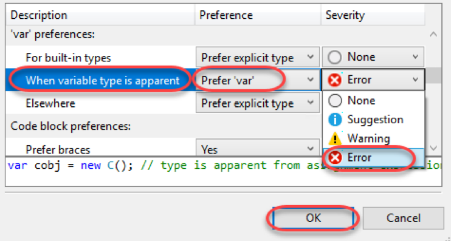

4. In **ShouldReturnViewWithMovies** , notice how **MoviesController** is now marked as an error with a red squiggle because it's an explicit type being used in a scenario where the variable type is apparent.

 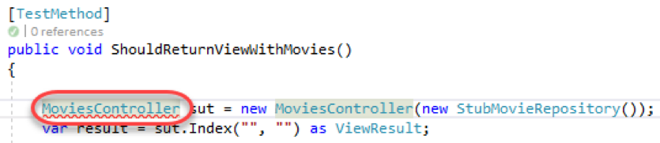

5. Click the **Quick Action** and select the option to see a proposed fix and click **Preview changes**.

 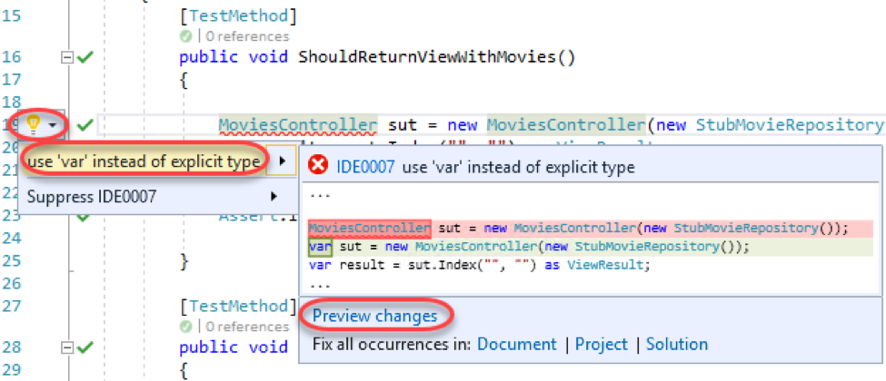

6. The **Preview Changes** dialog shows all instances of this rule violation along with their proposed changes. Click **Cancel**.

 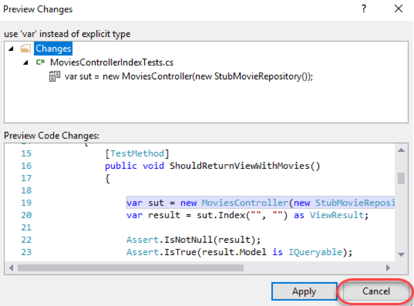

7. Select **Tools | Options** to bring the dialog up again. It should still be on the **Code Style** page.
8. Change the **Severity** of this rule to **Warning**. Click **OK**.

 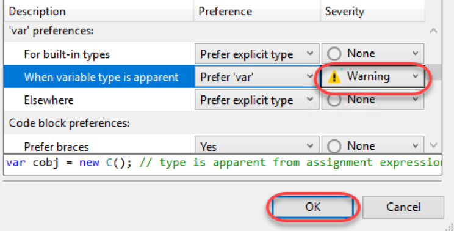

9. Now notice how the type declaration has a green squiggle to indicate that it needs attention, but is not an error. You can also use the **Quick Action** to suppress this warning if you prefer.

 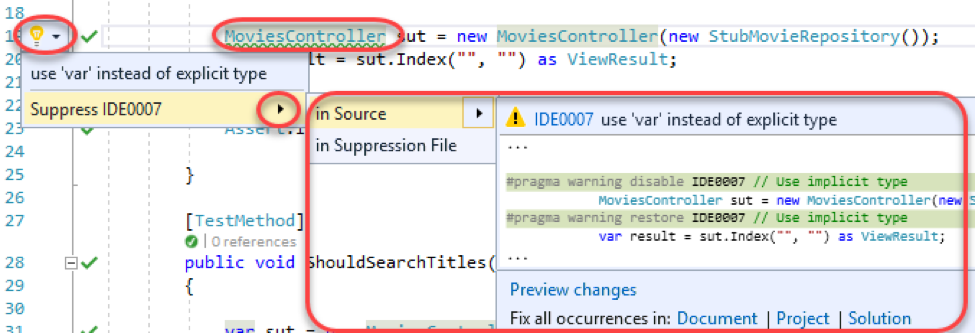

# Summary

Congratulations on completing this Quick Start Challenge! In this lab, you've learned how to work with live unit testing, refactoring, and code style in Visual Studio 2017.

# Additional Resources

If you are interested in learning more about this topic, you can refer to the following resources:

**Documentation** : [https://www.asp.net/core](https://www.asp.net/core)

**GitHub** : [https://github.com/aspnet](https://github.com/aspnet)

**Team blogs** : [https://weblogs.asp.net](https://weblogs.asp.net)
