# Logic Apps

# Overview

Logic Apps in Azure enable you to quickly build powerful integration solutions. In this quick start you'll build a Logic App that can take a query you give it and search using Bing for related news articles. It will then determine whether each article has a positive or negative sentiment, count the positive ones and return you the result of how many were positive. You'll see how you can use our Azure services, conditional logic and variables in Logic Apps.

# Objectives

- Create a Logic App.
- Integrate the Logic App with Cognitive Services.
- Test the Logic App.

# Prerequisites

- Windows 10
- Azure subscription - Sign up for a free account here: https://azure.microsoft.com/free
(Needs a Microsoft account)
- Cognitive services account with API keys for Bing Search and Text Analytics (You can obtain these API keys from https://www.microsoft.com/cognitive-services.  On the Cognitive Services site, navigate to the service you want an API key for, then scroll to the **bottom** of the page and click the "Try For Free" button.)

# Intended Audience

This Quick Start Challenge is intended for developers who are familiar with Azure.

# Task 1: Creating a new Logic App

1. Log in to your Cognitive Services account and copy your **Bing Search** and **Text Analytics** API keys into a new instance of Notepad. You will need these later on.
2. Log in to the Azure portal at https://portal.azure.com.
3. Select **New | Web + Mobile | Logic App**.

 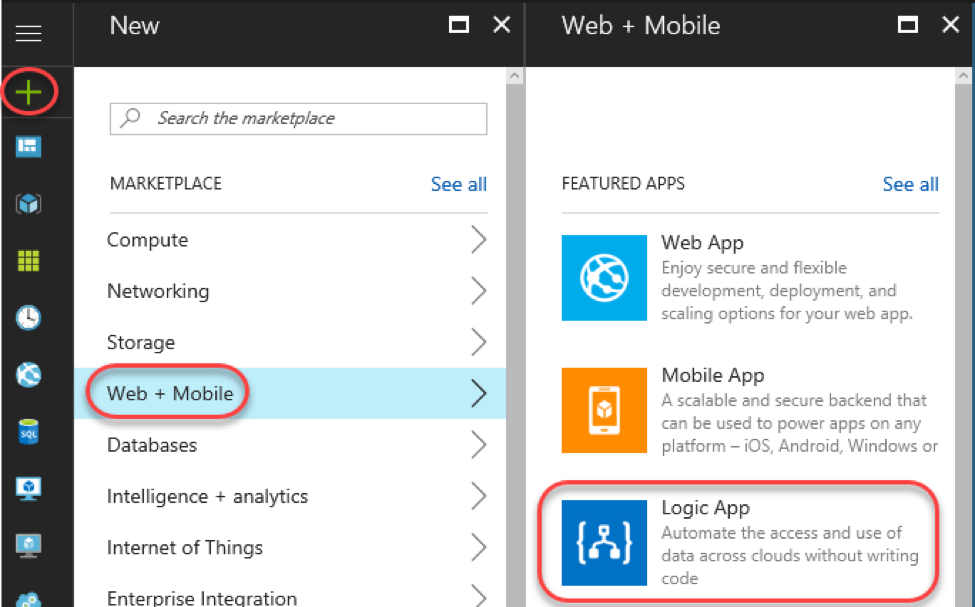

4. Set the **Name** to **"SentimentAnalyzer"** and create a new **Resource group** named **"LogicAppsAtBuild"**. Check **Pin to dashboard** and click **Create**.

 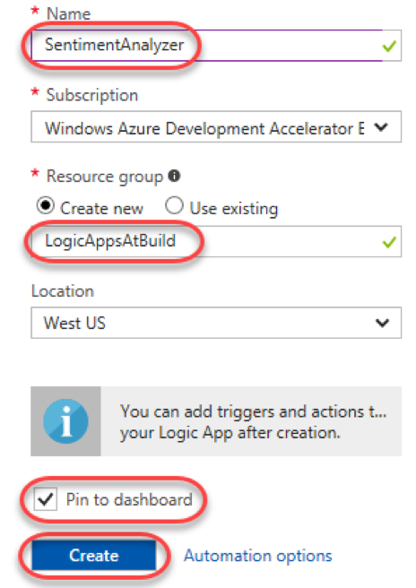

# Task 2: Using a template

1. Once the Logic App has been created, the **Logic Apps Designer** will load. A logic app always starts with a trigger. This is the action that makes the logic app "fire" after you've saved it. It could be time based (like "fire every 5 minutes") or event based ("run every time X happens"). In this case, it will start when you make an HTTP request to the Logic App. Scroll down and select the **HTTP Request-Response** template.

 

2. In the summary that appears, click **Use this template**.

 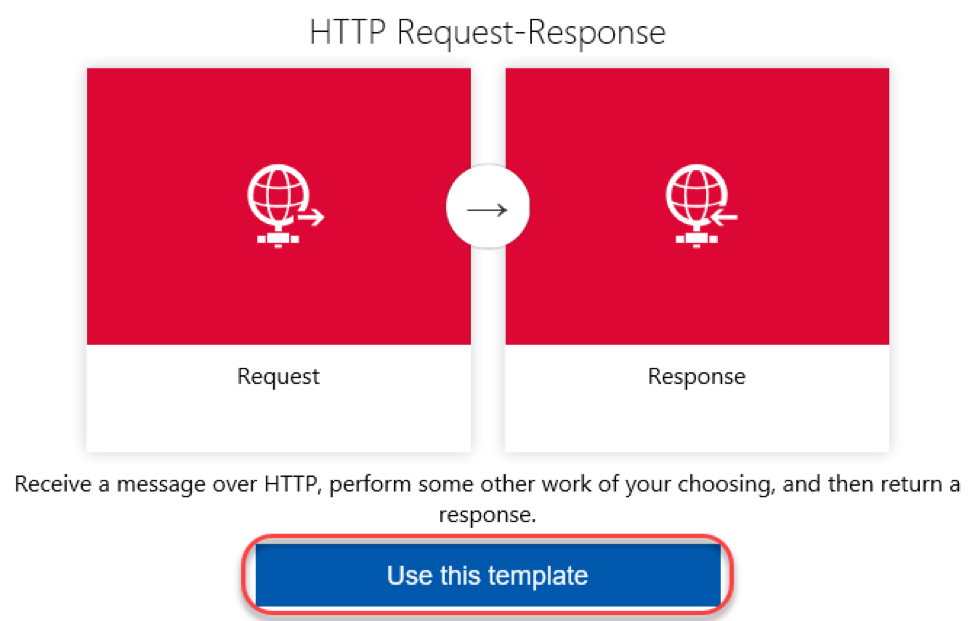

3. You will now be in the designer and see two boxes: the HTTP **Request** and **Response** actions. In the **Request** trigger, click **Edit**.

 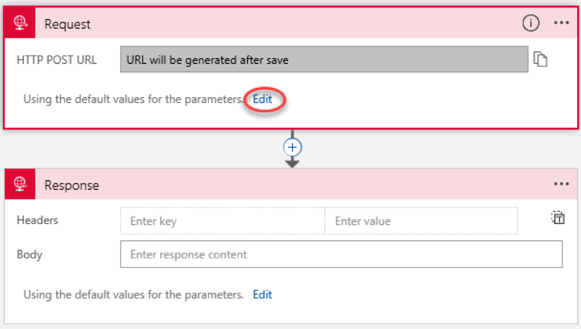

4. Expand **Show advanced options**.

 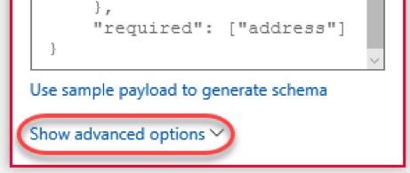

5. Select the **Get Method** and enter **"searchterms/{query}"** as the **Relative path**. This will allow you to pass data into the request later on.

 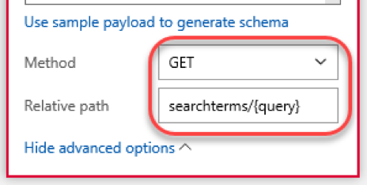

# Task 3: Adding actions

1. Click the **Insert a new step** button (the **+** ) on the relationship connector and select **Add an action**.

 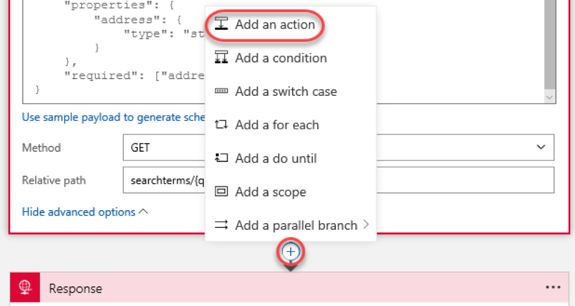

2. Search for **"Bing"** and select the **Bing Search – List news by query** action.

 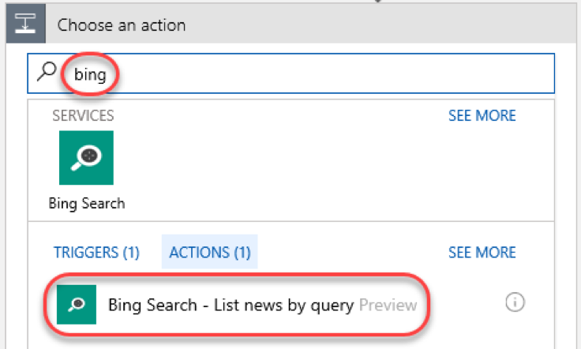

3. Enter a **Connection Name** of **"BingConnection"** and paste the **Bing Search API Key** you copied earlier from the Cognitive Services site. Click **Create**.

 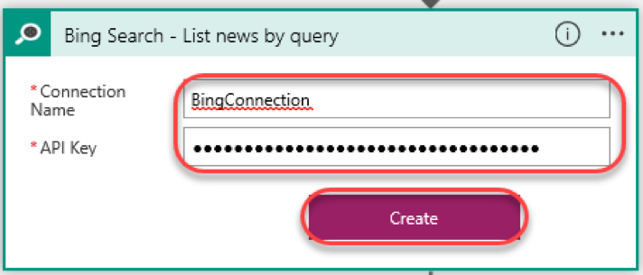

4. Click the **Search Query** field and select **Body** from the flyout.

 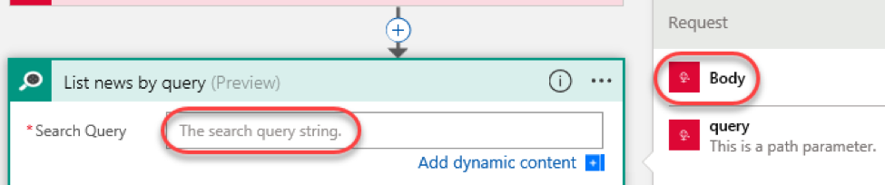

5. Set the **Count** to **"10"** to limit the result set to 10 hits.

 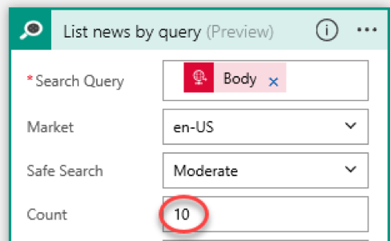

6. Click the **Insert a new step** button (the **+** ) on the relationship connector below **BingConnection** and select **Add an action**.

 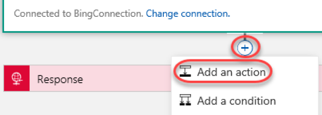

7. Search for **"variable"** and select the **Variables – Initialize variable** action.

 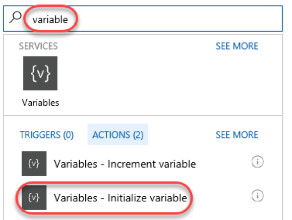

8. Set the **Name** to **"Counter"** and **Value** to **"0"**.

 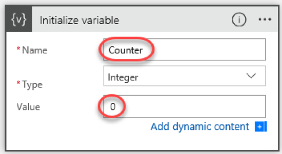

9. Add another action after the variable action.

 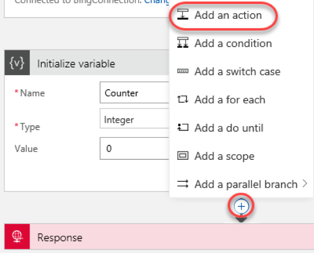

10. Search for **"sentiment"** and select the **Text Analytics – Detect Sentiment** action.

 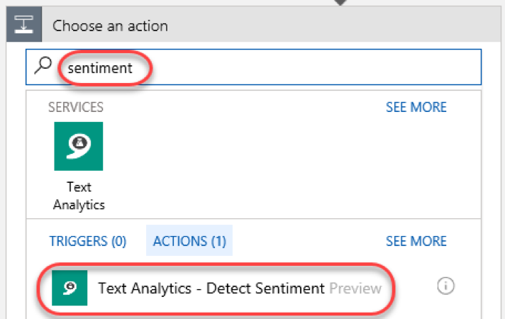

11. Enter a **Connection Name** of **"SentimentConnection"** and paste the **Text Analytics Account Key** you copied earlier from the Cognitive Services site. Click **Create**.

 

12. Click the **Text** field and select **Description**.

 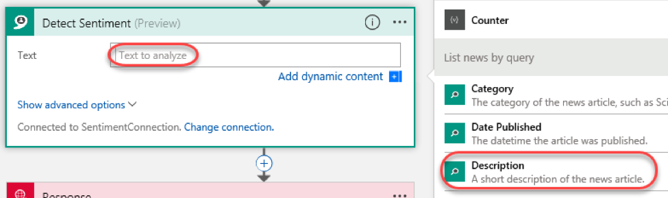

13. Notice that a **For each** action is automatically added around your new action. This is because Logic Apps knew that the results of the Bing Search was an array and therefore you probably want to loop through the items in the array—which you do!

 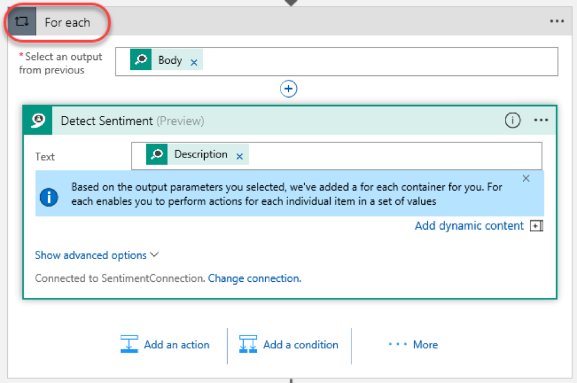

14. Click **Add a condition** to insert a new type of action within the **For each** loop. This **Condition** action enables you to perform **If/Else** logic.

 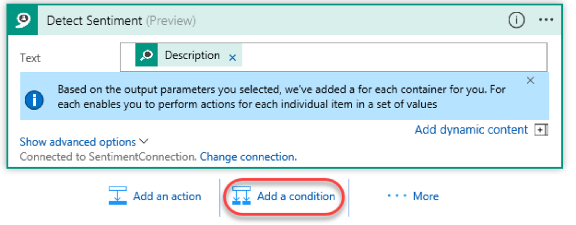

15. Click the **Choose a value** field in the condition and select **Score**.

 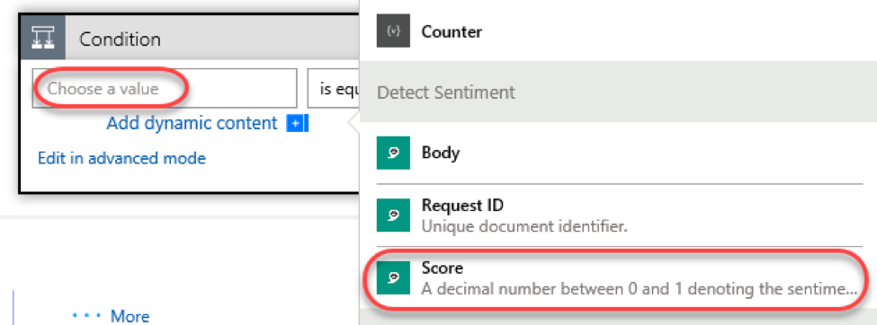

16. Compete the condition with **"is greater than"** and **"0.5"**. This condition will be true when the detected sentiment is positive. Note that it is very important to include the leading 0 so that the field is interpreted as a numeric value.

 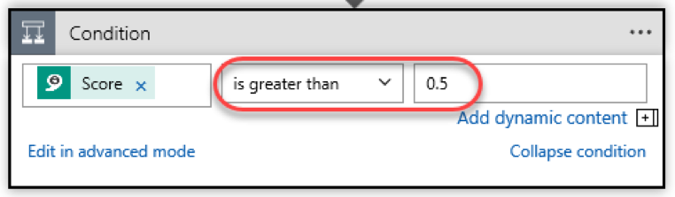

17. In the **Yes** branch, click **Add an action**.

 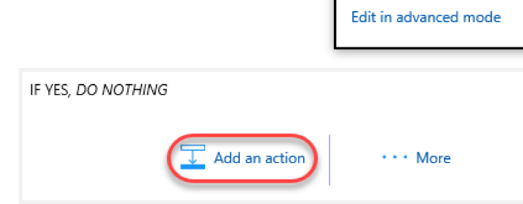

18. Search for **"variable"** and select **Variables – Increment variable**.

 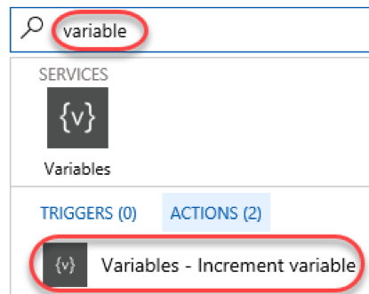

19. Select the **Counter** variable **Name** and have it **Increment By****"1"**.

 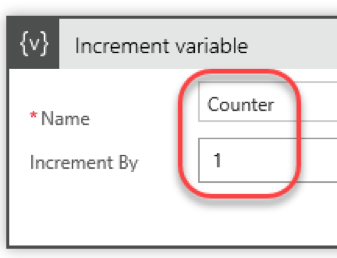

20. Click the **Response** action to expand it.

 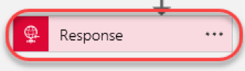

21. Set the **Body** field to **"There were "** (with a space after "were") and click **Add dynamic content**.

 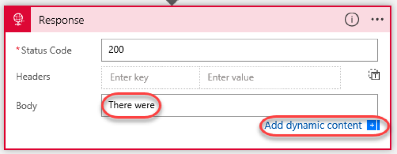

22. Click **Counter** to add that variable to the result string.

 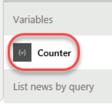

23. Then finish by typing **"positive articles out of 10"**.

 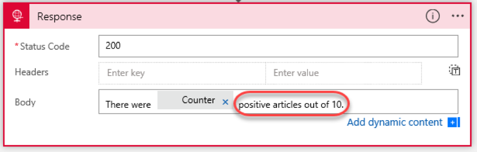

24.  Click **Save** to save the app.

 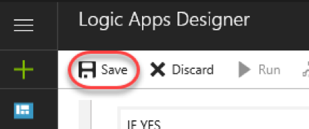

25. Expand the **Request** trigger.

 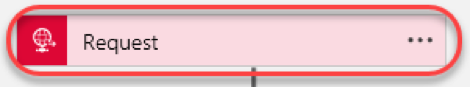

26. The **HTTP GET URL** is the URL for your Logic App. Click the **Copy to clipboard** button to copy it.

 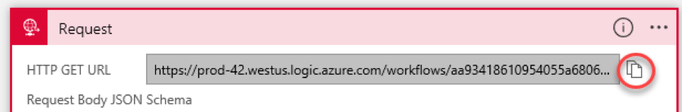

# Task 4: Testing your Logic App

1. Open another browser tab.
2. Paste the copied URL into the address bar, but do not navigate there yet.
3. Find the place where you specified the input parameters. The query parameter was **/{query}** , which will be escaped as **/%7Bquery%7D**. Change it to **"/Build2017"** and click **Enter** to navigate.
4. If everything went right you should see the results in a few seconds, something like the text below.
```
There were 8 positive results out of 1
```

5. Return to the Logic App tab and scroll to the left. Locate the **Runs History** section and click the first item.

 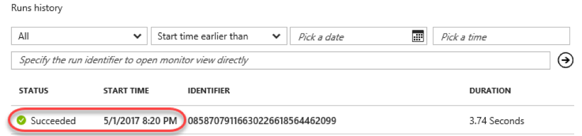

6. You should see the Logic App with an indicator next to each action showing what it did.

 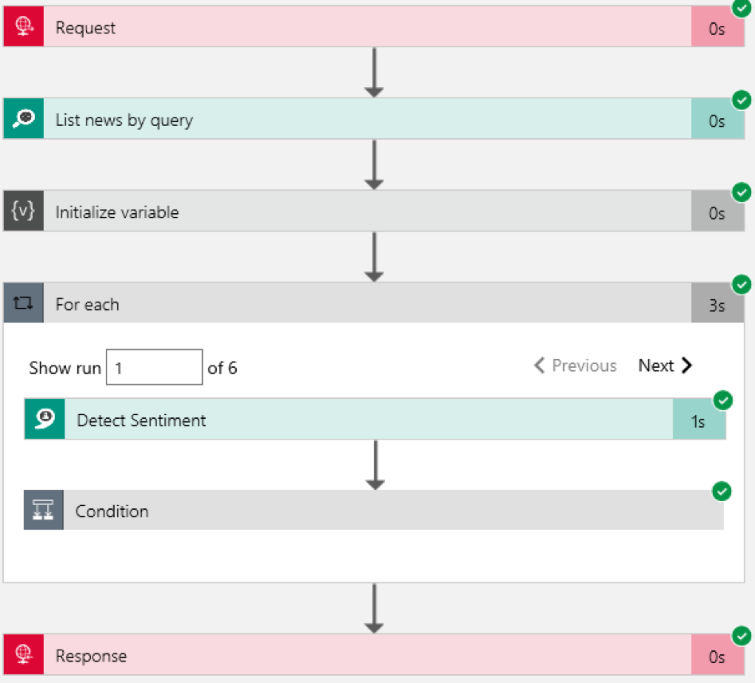

7. You can click the actions and view the inputs and outputs. Note that for the loop you can click through all the iterations of the loop!
8. You're done. Now try changing the query (you can put in phrases not just words) and see how it changes the results. Try using something you know will either product mostly positive or negative results!

# Summary

Congratulations on completing this Quick Start Challenge! In this lab, you've learned how to build an Logic App in Azure.

# Additional Resources

If you are interested in learning more about this topic, you can refer to the following resources:

**Documentation** : [https://docs.microsoft.com/en-us/azure/logic-apps/](https://docs.microsoft.com/en-us/azure/logic-apps/)

**GitHub:** [https://github.com/logicappsio](https://github.com/logicappsio)

**Team blog** : [https://blogs.msdn.microsoft.com/logicapps/](https://blogs.msdn.microsoft.com/logicapps/)
