# Snapshot Debugger

# Overview

The Snapshot Debugger is a new and powerful diagnostic experience coming to your .NET (Framework and Core 2.0) apps, hosted in Azure.  The Snapshot Debugger is available through the Azure portal as a standalone capability; but also integrates with Visual Studio Enterprise 2017 to provide a powerful F5 like debugging experience inside Visual Studio, without impacting the production application.

# Objectives

Completing this Quick Start should make you familiar with the Snapshot Debugger capabilities and help you understand how to take advantage of these capabilities to reduce the mean-time-to resolution.  You can use Snapshots of production issues to help you get directly to the root cause of problems in your .NET/Azure hosted production apps.

# Prerequisites

The Virtual Machine that accompanies this Quick Start comes with all the software configured for you to quickly complete this lab.  All you will need is an Azure Subscription.

- If you do not have an Azure Subscription, you can join our [Visual Studio Dev Essentials](https://www.visualstudio.com/dev-essentials/) program to gain free monthly Azure credits.

The username for this VM is **build** and the password is **QuickStart2017**

# **Intended Audience**

This Quick Start is intended for .NET developers who are hosting or who intend to host their applications in Azure.

# **Background**

You have an Azure web app running in production.  The application allows users to enter visitor information for anyone visiting your company.  You're seeing reports from users that they cannot create new visits or even see the list of visitors and you need to investigate.  We will walk through preparing an application to leverage the SnapShot Debugger, publishing that application and then using Application Insights to track down the problem.

# Task 1: Open and configure the solution

1. Open Visual Studio Enterprise 2017
2. Connect Visual Studio to your Azure account

 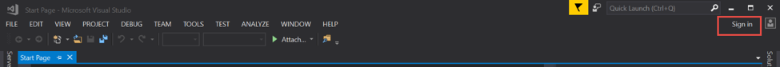
­­­­

And complete the sign in steps

3. Open the project on the Desktop, either through the File menu option or through Start Page
  a. Browse to C:\users\build\desktop\mycompany.visitors\
  b. Open the solution MyCompany.Visitors.Server.sln
4. Right click on the "MyCompany.Visitors.Web" project and select "Configure Application Insights

 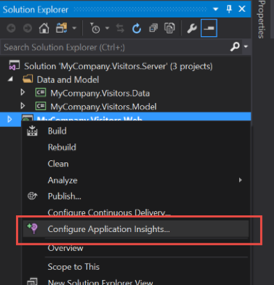

5. Click the "Start Free" button

 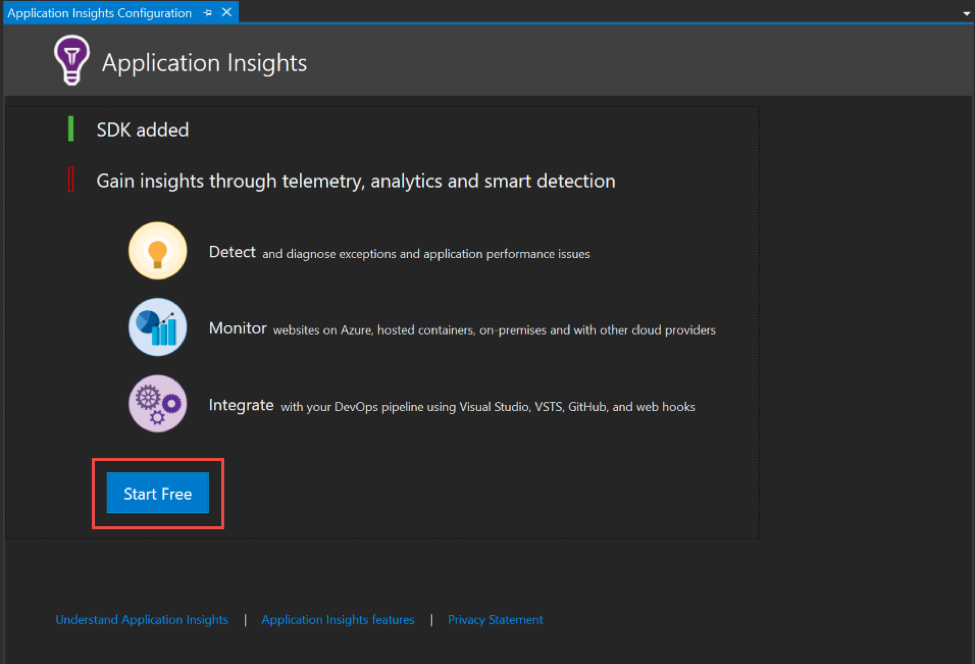

6. Configure the Application Insights resource creation by
  a. Verifying your account
  b. Selecting your subscription
  c. Configuring the resource, providing the
    i. Resource Group name: azure-snapshot-lab
    ii. Application Insights Resource name: MyCompany.Visitors.Web
  d. If you have already selected a billing model for this subscription, skip the next step.
    i. Switch the billing model "Application Insights will remain free and halt data collection after 1GB/Month" for this lab.  You can change this through the Azure portal later if you wish

Then click the "Register" button to trigger the resource creation in Azure

 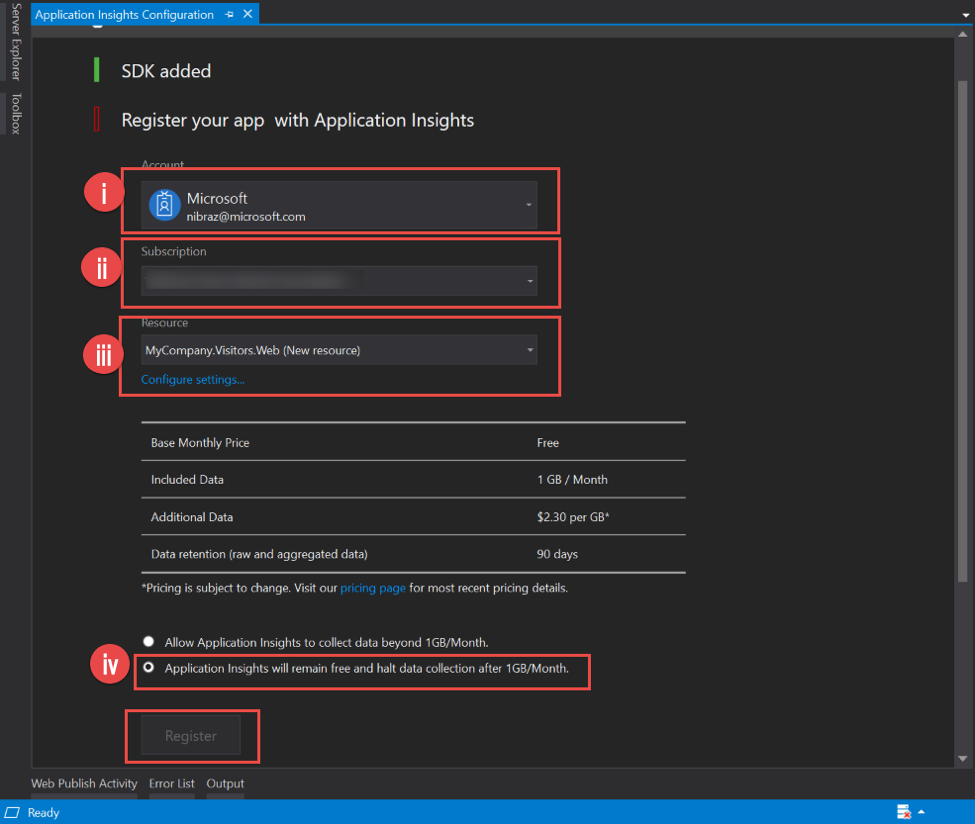

7. Once the resources are created in Azure, click the "Finish" button to dismiss the dialog
8. To complete the Application Insights configuration, click the "Update resource" button in the "Sending publish annotations to" section.

 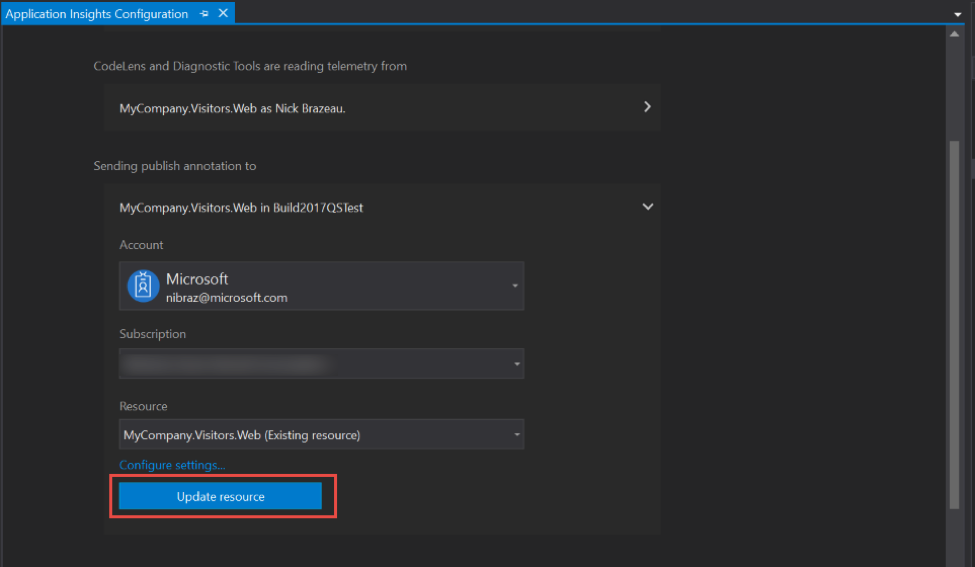

# Task 2: Publish the app

1. Right-click on the MyCompany.Visitors.Web project, and select the "Publish" option

 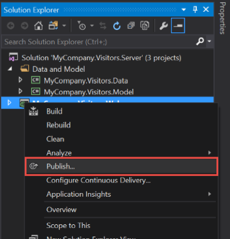

2. When you publish:
  a. Select a Microsoft Azure App service
  b. For the lab, we will create a new App Service
  c. And Publish

 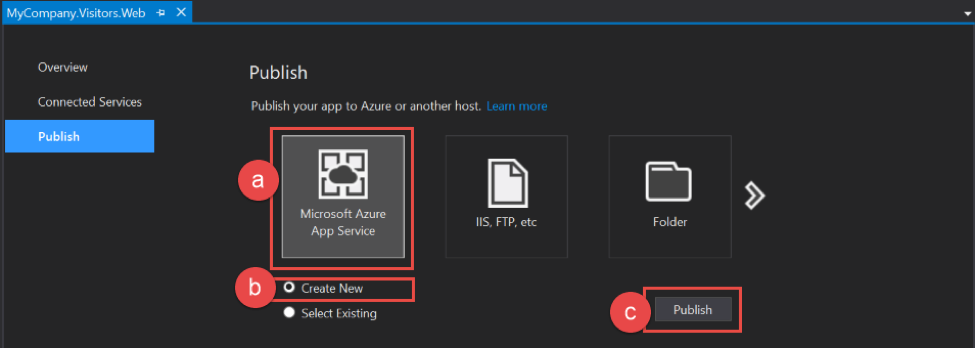

3. Configure your app service by
  a. Providing an app name
  b. Verifying you are deploying to the correct subscription
  c. Selecting the Resource Group you created when you configured Application Insights: azure-snapshot-lab
  d. Select the App Service Plan for the app

Before publishing, we need to add a database

 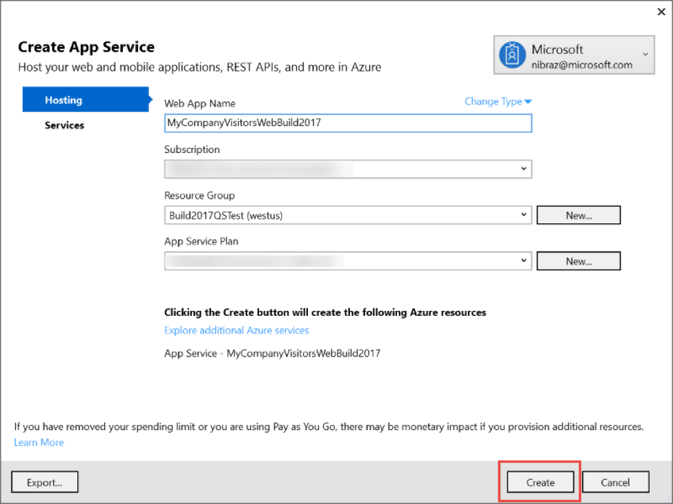

4. To add a database
  a. Click on the Services option on the left
  b. Click the plus button on the right next to SQL Database, and configure the database and server as needed
    i. Configure the SQL Server if needed

 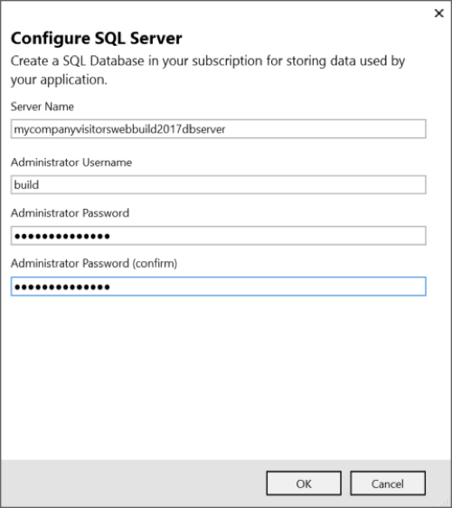

	ii. Configure the SQL Database, and be sure to set the Connection String Name to MyCompany.Visitors to update the connection string on publish

 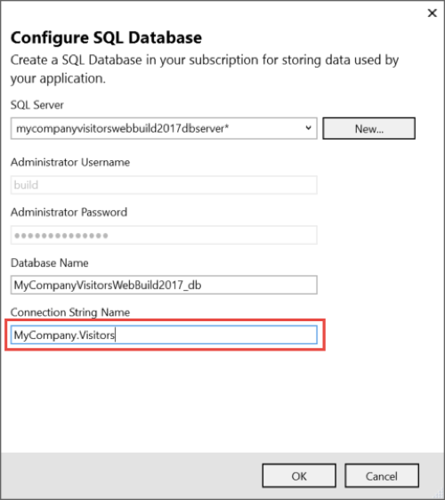 Then click OK to setup the creation of the Server and Database on publish

  c. Then click Create to create the App Service Plan, App Service, Database Server and Database; and publish the app to Azure

 

  d. If this is the first time that you've published you app, it will be automatically published after your resources are created.  Otherwise, click Publish to update your web app.

 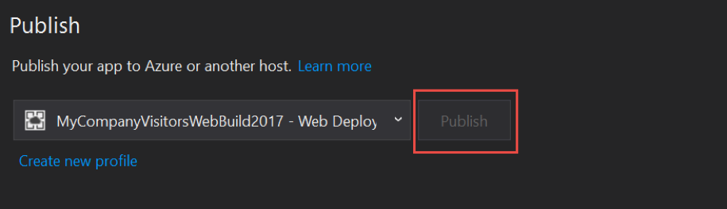

5. Wait for the resources to be created and the app to publish, and then we can move on to triggering SnapShots in a live app in Azure.

# Task 3: Debugging a running app with SnapShots

1. Once the application is deployed, we need to browse to the web app so we can begin to trigger some errors.  The site should open in a web browser automatically, but if that does not happen you can use the URL shown in Visual Studio to easily navigate to the website:

 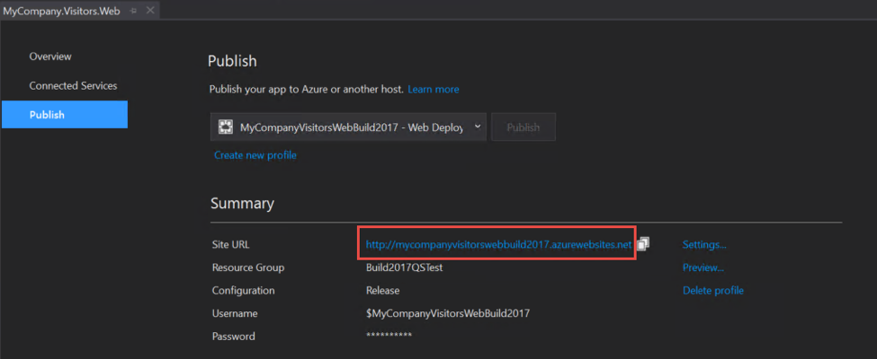

2. Next, we need to trigger some exceptions.  Once the website loads, click the "Visitors" tab of the website 5 or more times to simulate a recurring problem.
  a. Note that automatic SnapShots are generated in the background for problems that occur frequently.  A problem that occurs only once or rarely will not trigger an automatic SnapShot by default.

3. Now that we have triggered an error to be collected, we need to ensure you have permissions to view the SnapShots.  SnapShots can contain sensitive information as they are the full environmental and application state when the exception occurs, so Microsoft requires that explicit permissions be granted for viewing SnapShots.
  a. In the Azure portal, Use the left-hand navigation bar to navigate to the subscriptions blade and select the subscription where your Application Insights resource is running.

 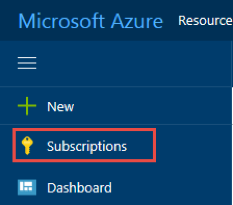

	i. If you do not see Subscriptions in the left-hand navigation, you can find it through More Services at the bottom of that navigation bar

  b. Select the "Access Control (IAM)" blade and select "Roles" at the top

 

  c. Switch the view to see all roles available in the subscription: 

4. Find the role "Application Insights Snapshot Debugger" role and
  i. Click on the role to open the blade to manage membership in the role
  ii. Click Add
  ii. Select your name from the list of users or simply start typing if you don't see your name
  iv. Click Select add yourself to the role and enable your account to view the SnapShots

 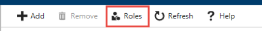

# Task 4: Debugging a running app with SnapShots

_Note: Depending on how quickly you have completed these steps the data may not yet be populated in your new Application Insights resource.  If this happens just wait a few minutes for the data to appear._

1. One of the best ways to see at a glance how your application is behaving is the App Map.  To go to the App Map, open the Application Insights resource where your application is sending its telemetry, if you used the default naming it will be named MyCompany.Visitors.Web.  select the App Map option

 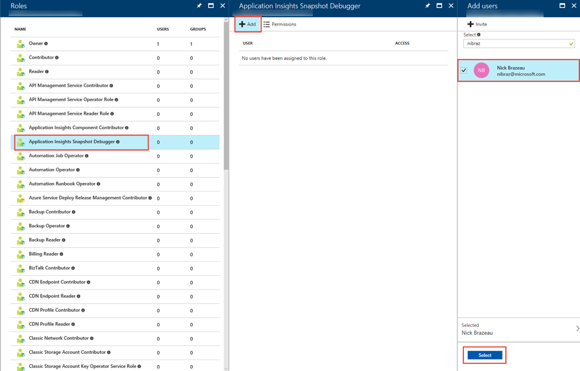

2. Notice that there are some exceptions on the MyCompany.Visitors.Web component in the App Map.  Select the server node to see the information about the node, including the failures.

 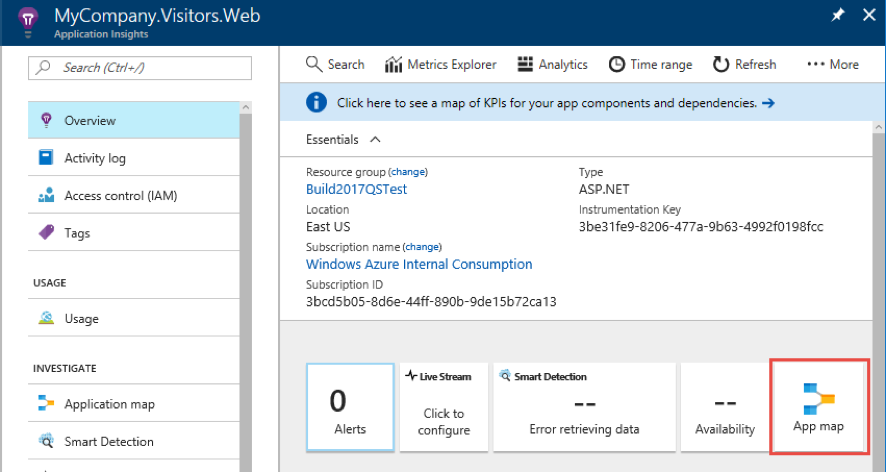

3. Notice that we have a System.InvalidOperationException – let's explore that exception by clicking on it and opening the Exception Properties blade.  You can immediately see a significant amount of detail about the exception.

 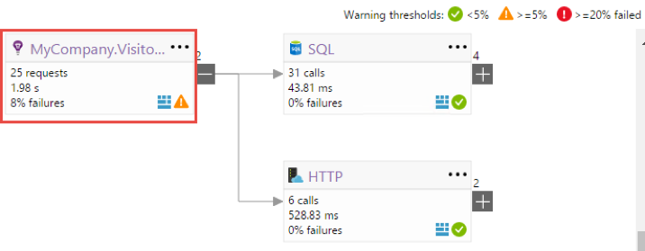

4. To open the Snapshot click on the Open Debug Snapshot link in the upper right to see a more detailed view of the exception, and the state of the application and environment when the exception occurred.

_If the exception you select does not contain a Snapshot, cycle to the next exception until you find one that does contain a Snapshot.  Recall that there is a configurable threshold that must be met before a snapshot will be generated.  Additionally, because snapshots are uploaded in the background to minimize impact on your side, it may take a few minutes for snapshots to appear._

 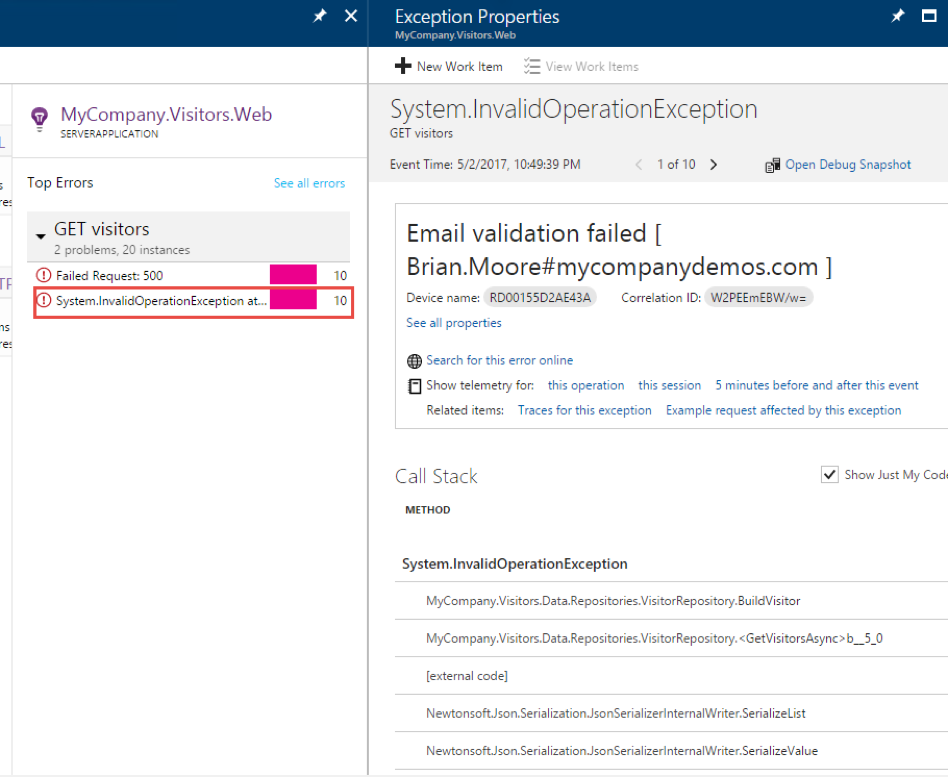

5. To get an even more in depth look at how the exception occurred, download the Snapshot and open it with Visual Studio Enterprise 2017 to walk through the application execution leading up to the exception
  a. Download the Snapshot. If you are using Microsoft Edge or Internet Explorer, these tools change the extension automatically to a zip file, you will need to change it to a .diagsession extension manually so the file will open in Visual Studio automatically.

 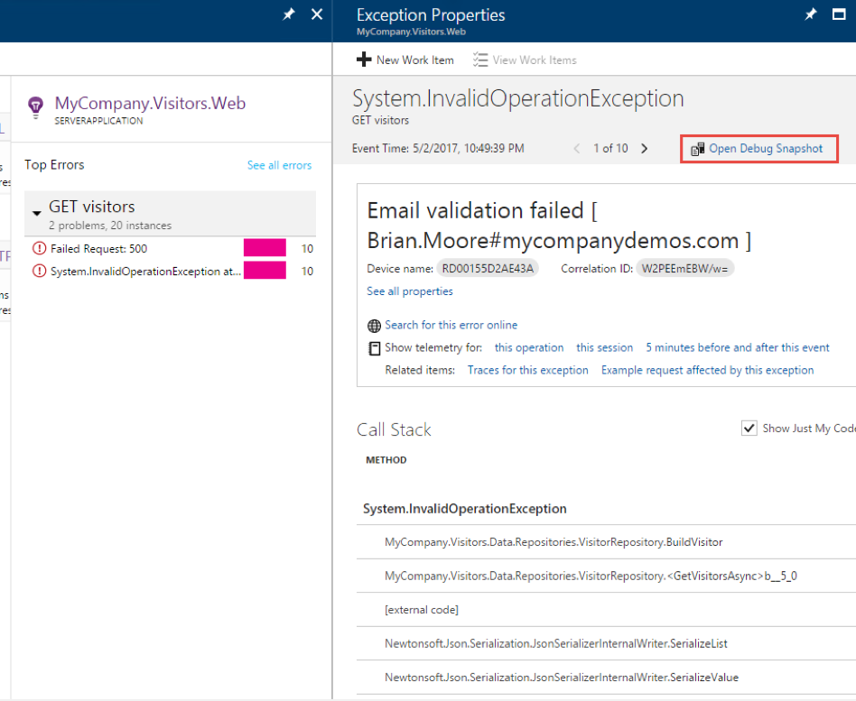

6. Once the Snapshot opens in Visual Studio, you can choose how to review the Snapshot.  In this case, select "Debug with Managed Only" 

7. You are now debugging a Snapshot from production that was provided for you by Application Insights, because a series of exceptions occurred.  You are taken to the exact line of code that caused the exception, with a Call Stack and Locals.

 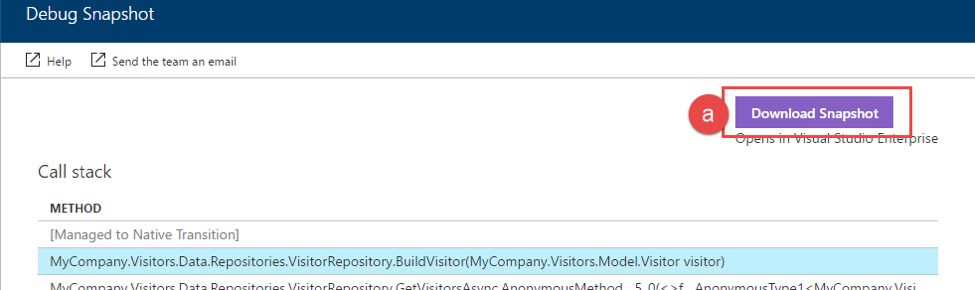

8. Before continuing to the next step, see if you can determine the problem given the information you have about line of code where the exception occurred, the outerMessage and the locals at the time of the exception.

9. Based on the information we have, we can see that we have a malformed email address (the email address contains # not @) – someone must have edited the production database directly, since our app has validation for these types of errors.  From here you could decide to fix the database as well as modify your code so that a single bad entry won't prevent the application from working completely.

10. Congratulations – you have quickly debugged an issue in production!  Please take some time to complete the survey and let us know what you think.
