# StorSimple Data Manager

# Overview

Microsoft Azure StorSimple meets the needs of performance- and capacity-centric applications while giving you a complete hybrid cloud storage solution for enterprises. In this quick start, you will learn how to use the StorSimple Data Manager to use the data that lies in your StorSimple device with Azure services in the cloud.

# Objectives

- Use data generated on premises and stored on StorSimple to be used in Azure by services there
- Learn to use Azure Automation to trigger jobs to orchestrate this flow

# Prerequisites

- Windows 10 with a browser
- Azure subscription (Sign up for a free account [here](https://azure.microsoft.com/free/). Needs a Microsoft account)
- StorSimple device, which has been set up at our office for the purposes of this lab
- StorSimple Data Manager, which we have provisioned for you in our subscription
- Credentials to access the Data Manager, which have been provided

# Intended Audience

This Quick Start Challenge is intended for developers who are familiar with Azure and who want to use Azure Automation to set up workflows to copy data from StorSimple devices.

# Task 1: Understand the underlying setup

We have set up a StorSimple device in our subscription. The volume (named buildvol) has been mounted on an on premises machine and the contents are as follows:

 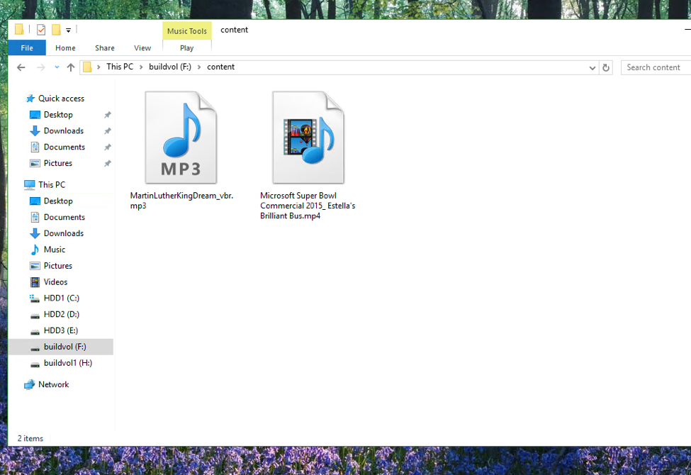

Our objective is to automate the process of copying the contents to a storage account so that these files can be used by a service like HDInsights or Azure Media Services for any desired analysis.

# Task 2: Create an automation service that copies data from StorSimple to a storage account

1. Log in to the Azure portal at [https://portal.azure.com](https://portal.azure.com).
2. Click the **New** button and search for **"automation"**.

 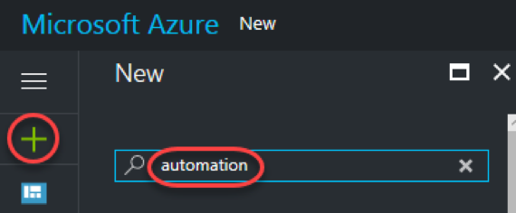

3. Click the **Automation** result.

 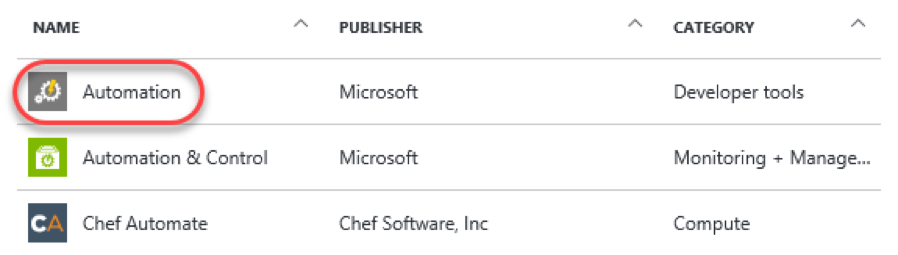

4. Click **Create**.

 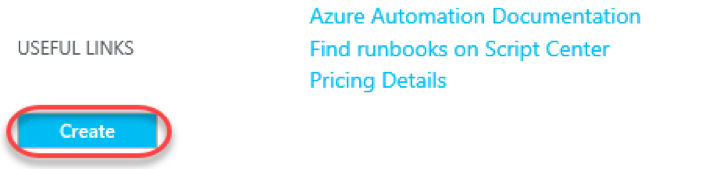

5. Enter **"buildautomation"** for the **Name** and **Resource group** fields and select **No** for **Create Azure Run As account**. Click **Create**.

 

6. You can follow the progress of the deployment using the **Notifications** button at the top. Once succeeded, click the **Deployments succeeded** item. You will also want to dismiss the notifications view to free up screen space.

 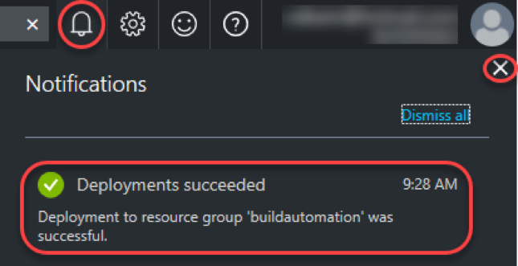

7. Click the **Assets** tile.

 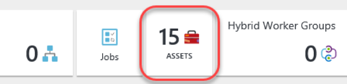

8. Click the **Modules** tile.

 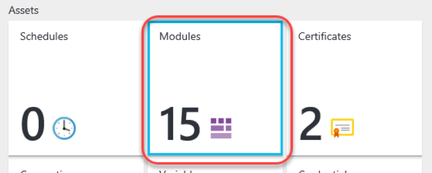

9. Click **Add a module**.

 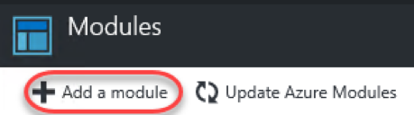

10. The module for this lab has been provided for you. Click the **Upload File** selector and select the file at **C:\Labs\AZR08 - StorSimple Data Manager\DataTransformationApp.zip**.

 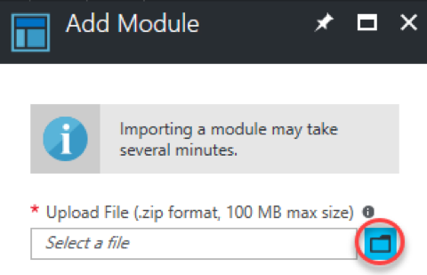

11. Click **OK** to add the module.
12. It will take a moment to upload and extract. Click the **Refresh** button every few seconds until the **Status** reads **Available**.

 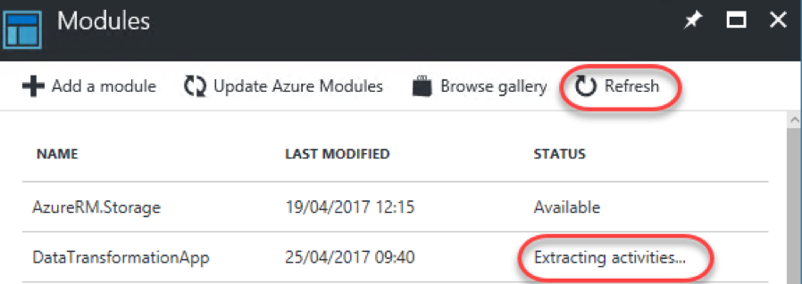

13. Return to the root of the service using the **buildautomation breadcrumb** link.

 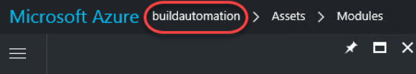

14. Click **Runbooks**.

 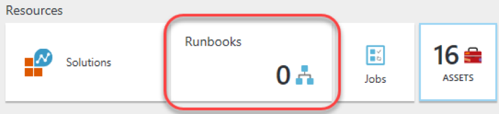

15. Click **Add a runbook**.

 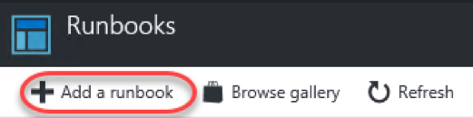

16. The runbook has been provided for this lab in the form of a PowerShell script. Click **Import an existing runbook**.

 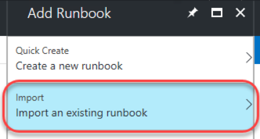

17. Use the file selector to select **C:\Labs\AZR08 - StorSimple Data Manager\Trigger-DataTransformation-Job.ps1** and click **Create**.

 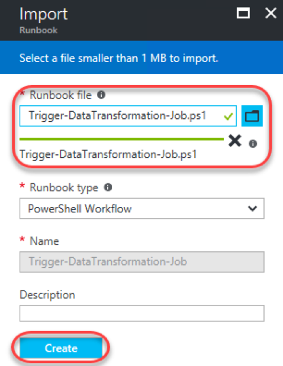

# Task 3: Publishing and running the job

1. Once created, click the new runbook.

 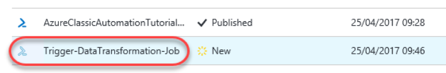

2. Before it can be used, the runbook needs to be published. Click **Edit**.

 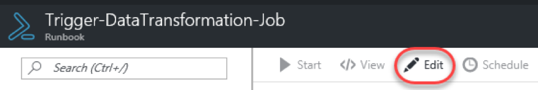

3. Click **Publish** and confirm **Yes**.

 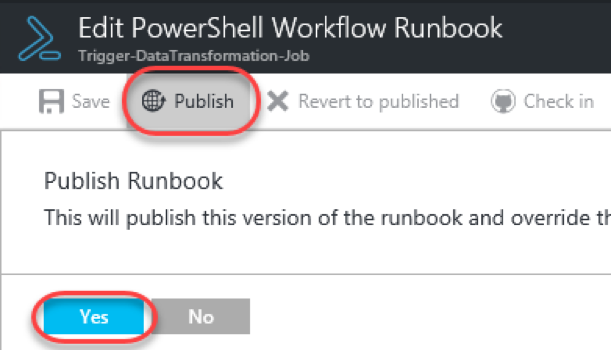

4. Once the runbook has been published you'll have the options to **Schedule** its execution or execute it via **Webhook**. For the purposes of this lab, you're just going to run it directly. Click **Start**.

 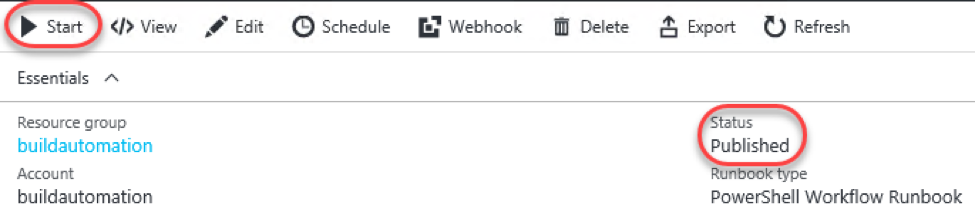

5. There are a lot of parameters required to run this job based on the configuration set up for this lab. Please use the following values.
6. SubscriptionID: **2f82e709-a8a5-4268-b6d5-939a377f570c**
7. TenantID: **3a2a7fea-7242-4b65-92f3-25a6e97343ad**
8. ClientID: **e7dafd57-4e19-493f-8cb5-aaf1667cf403**
9. ActiveDirectoryKey: **JscPJkh6vkimiIVw5fwSoMJcGvsV5idrkKkJouXWIPM=**
10. ResourceGroupName: **buildrg1**
11. DataManagerName: **build2017demo**
12. JobDefinitionName: **build2017jd**
13. EmailId: Use your email address (you will receive a message when the job completes)
14. Click **OK**.

 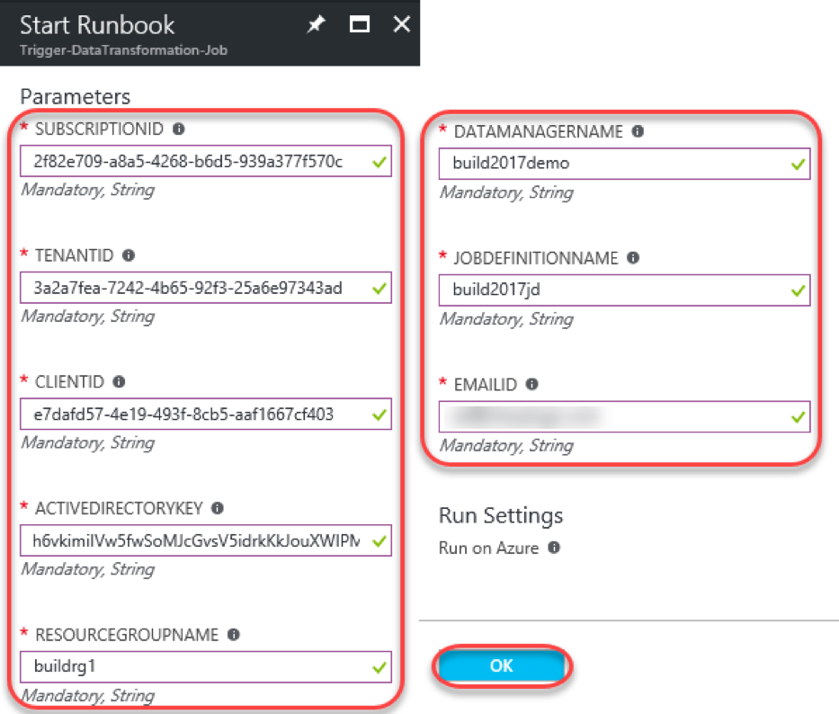

# Task 4: Reviewing the results

1. In the job overview blade, click **Output**.

 

2. The job is now running on Azure. It should take around 30 minutes to complete, after which you'll receive the results at the email address you provided in the configuration step.

 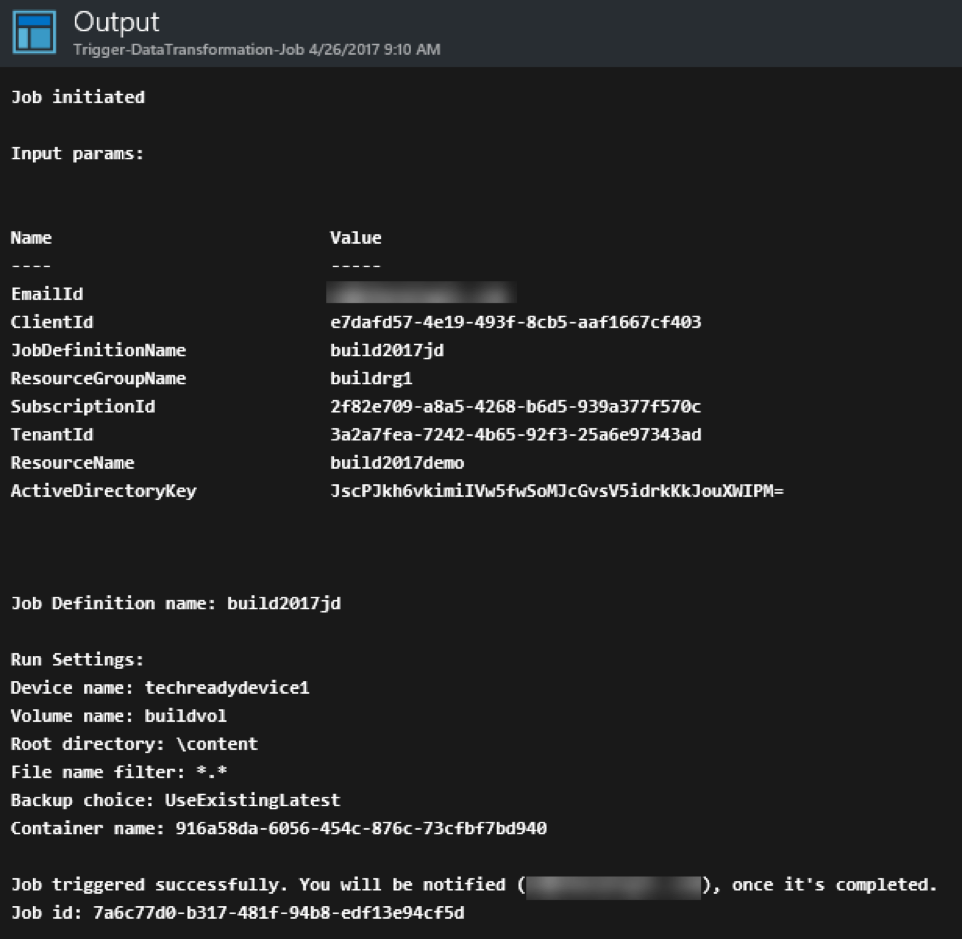

3. Your email will look something like this. Click **Job Output** to see the results.

 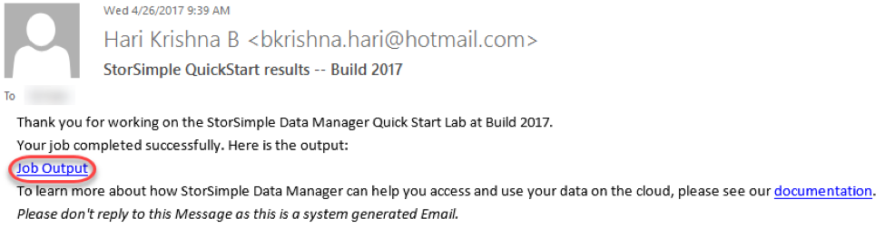

4. The results are delivered as an XML file similar to what you see below.

 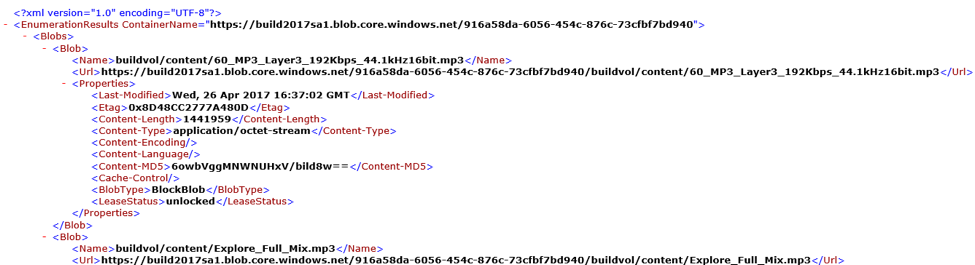

# Summary

Congratulations on completing this Quick Start Challenge! In this lab, you've learned how to automate workflows that copy StorSimple data to blob storage.

# Additional Resources

If you are interested in learning more about this topic, you can refer to the following resources:

**More information** : [https://docs.microsoft.com/en-us/azure/storsimple/storsimple-data-manager-overview](https://docs.microsoft.com/en-us/azure/storsimple/storsimple-data-manager-overview)
