# Use Mobile Center to quickly get the insights that your app users won't tell you

# Overview

Mobile Center brings together multiple services, commonly used by mobile developers, into a single, integrated product. You can build, test, distribute, and monitor your mobile apps and easily add backend cloud services to scale your app to millions of users on demand.

# Objectives

- Create a Xamarin Android project.
- Create a Mobile Center app.
- Integrate the Xamarin Android project with the Mobile Center app.
- Track app analytics and events to Mobile Center.

# Prerequisites

- Windows 10
- Visual Studio 2017
- A Mobile Center account ( [https://mobile.azure.com](https://mobile.azure.com))

# Intended Audience

This Quick Start Challenge is intended for developers who are familiar with C# and Xamarin development.

# Task 1: Create a Xamarin Android app

1. Open an instance of **Visual Studio 2017**.
2. Select **File | New | Project**.
3. Select the **Visual C# | Android** category and the **Blank App (Android)** template. Leave the default name and click **OK** to create the project.

 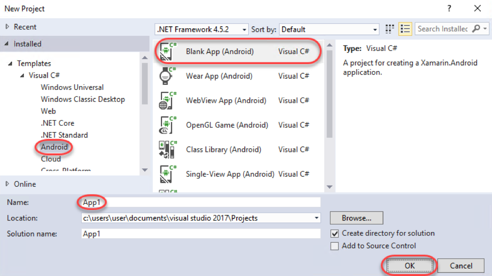

4. Select **Debug | Start Debugging** to build and run the app. This will involve launching the emulator, which can take a while. Continue on to the next task while it's loading.

# Task 2: Create the Mobile Center app

1. Log in to your Mobile Center account at [https://mobile.azure.com](https://mobile.azure.com).
2. From the top right corner, select **Add new | Add new app**.

 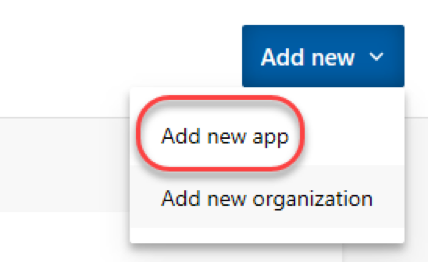

3. Enter a **Name** of **"Build App"** and set it to be for **Android** using **Xamarin**. Click **Add new app**.

 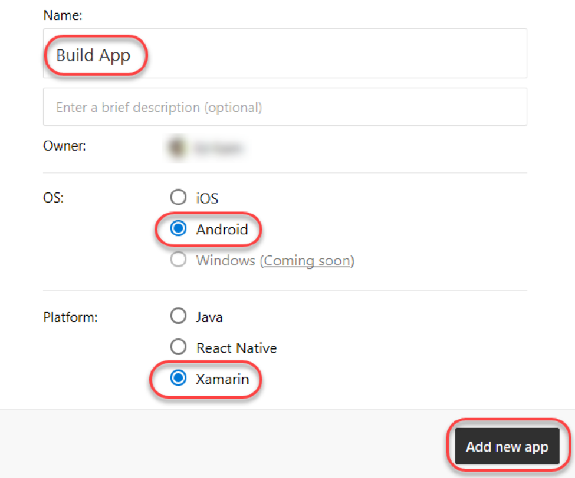

4. Once the new app has been created, there will be a set of instructions for integrating the app with Mobile Center. Note that the first step involves adding NuGet packages.

 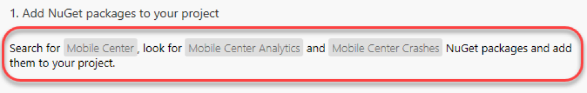

# Task 3: Integrate the Xamarin Android app with Mobile Center

1. Return to **Visual Studio**.
2. Wait for the application to load in the emulator if it has not already.
3. Select **Debug | Stop Debugging**.
4. From **Solution Explorer** , right-click the **References** node and select **Manage NuGet Packages**.

 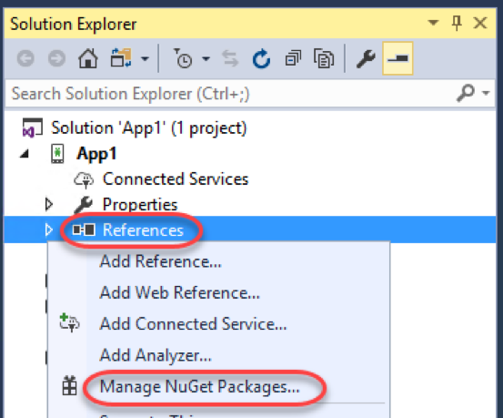

5. In the **NuGet Package Manager** , select the **Browse** tab and search for **"mobile center"**.

 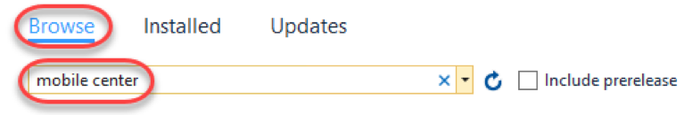

6. Select **Microsoft.Azure.Mobile** and click **Install**. Repeat the process for **Microsoft.Azure.Mobile.Crashes** and **Microsoft.Azure.Mobile.Analytics**.

 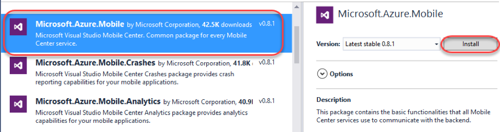

7. Return to the Mobile Center browser window and copy the three **using** statements to the clipboard.

 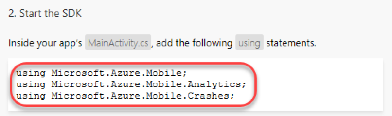

8. In **Visual Studio** , open **MainActivity.cs**.

 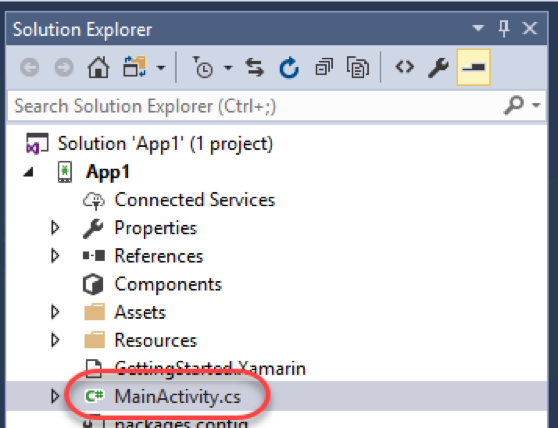

9. Paste the copied using statements to the top of the file, directly after the existing using statements. These will set up this class to have easy access to the APIs available in the NuGet packages previously added.

 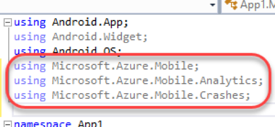

10. Return to the Mobile Center browser window and copy the **MobileCenter** line of code. This code has your application's ID embedded in it and should be run very early to initialize the analytics collection engine.

 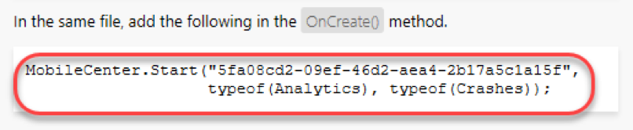

11. Paste the copied line of code in **OnCreate** , immediately after its call to the base class **OnCreate**.

 

12. Press **F5** to build and run the application. When the app loads, wait a few seconds and select **Debug | Stop Debugging**. We want the first session load to get recorded before we move on, but don't need to do anything else in the app.

# Task 4: Adding event tracking to the app

1. It may take a while for the analytics to begin to appear in Mobile Center, so we'll move on to the next task and add in some event tracking.
2. Immediately after the **MobileCenter** line of code added previously, add the line of code below. It's a relatively straightforward request to track a text event. Note that you could also add a dictionary parameter after the text name to provide a set of parameters to track along with the event itself.

```
Analytics.TrackEvent("Session was started");
```

3. Press **F5** to build and run the application again. Keep in mind that while we're using Mobile Center for an Android/Xamarin application, Mobile Center supports every major platform out there. As a result, you should check out the guidance for integrating other platform combinations with the Mobile Center events guidance at [https://docs.microsoft.com/en-us/mobile-center/analytics/understand-events](https://docs.microsoft.com/en-us/mobile-center/analytics/understand-events).
4. Return to the Mobile Center browser window. Select the **Analytics** tab.

 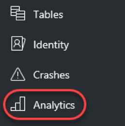

5. By now, the first user session should have been processed for display. If not, try refreshing the window every few seconds until it appears. Note that you can scroll down the page to get insight about the sessions, devices, geographies, and languages of your users, as well as reporting of the breakdown of devices per version.

 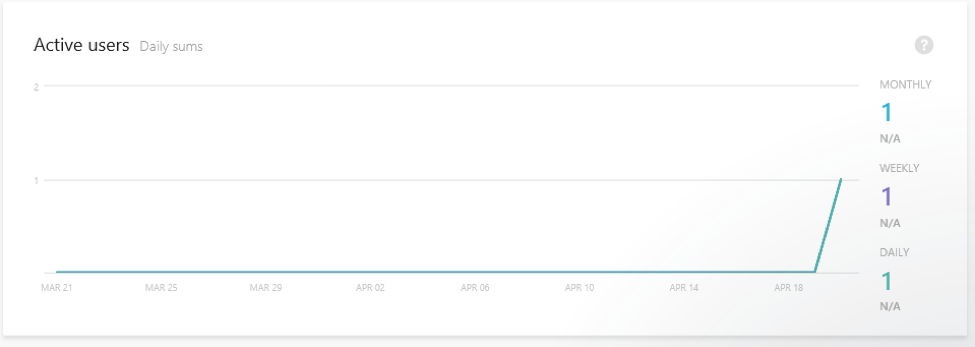

6. Select **Analytics | Events**.

 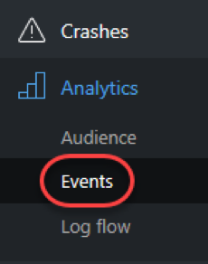

7. If the events haven't started showing up yet, try refreshing the browser. If you run the application multiple times, then the count should increment each time you do. (Want a free t-shirt? Take a screenshot of this page and follow the instructions at the end of the lab.)

 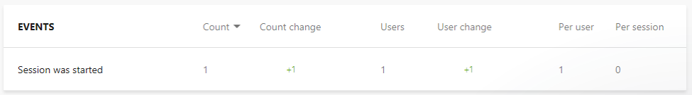

8. Select **Analytics | Log flow**.

 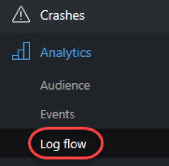

9. Log Flow will show you in real time what is being received by the backend. While the transmission may be delayed by a few seconds, this is a great place to get immediate notifications about sessions tarts, crashes, and events.

 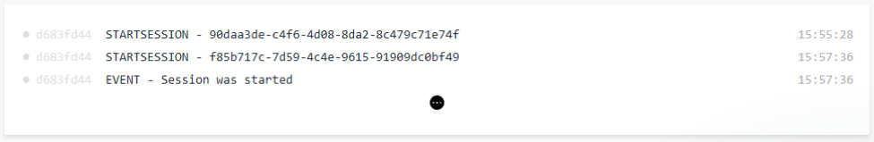

10. Want a sweet new **Mobile Center t-shirt**? Take a screen shot of your successful events page and tweet it out to **#build2017 @MobileCenter**. Then show the booth staff and they'll hook you up!

 

# Summary

Congratulations on completing this Quick Start Challenge! In this lab, you've learned how to use Mobile Center to instrument and monitor your mobile apps in development and production.

# Additional Resources

If you are interested in learning more about this topic, you can refer to the following resources:

**Documentation** : [https://docs.microsoft.com/en-us/mobile-center/](https://docs.microsoft.com/en-us/mobile-center/)

**GitHub SDK** : [https://github.com/Microsoft/mobile-center-sdk-dotnet](https://github.com/Microsoft/mobile-center-sdk-dotnet)

**Team blog** : [https://blogs.msdn.microsoft.com/visualstudio/tag/visual-studio-mobile-center/](https://blogs.msdn.microsoft.com/visualstudio/tag/visual-studio-mobile-center/)
